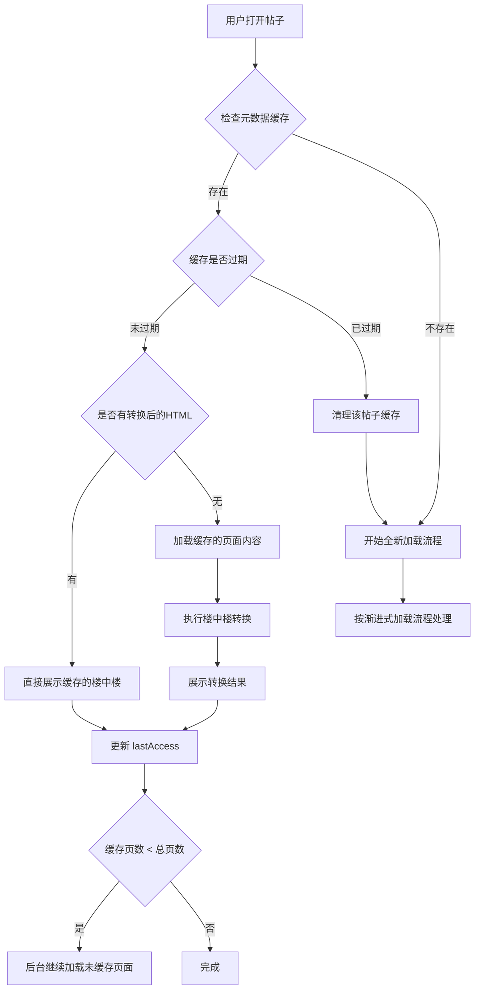
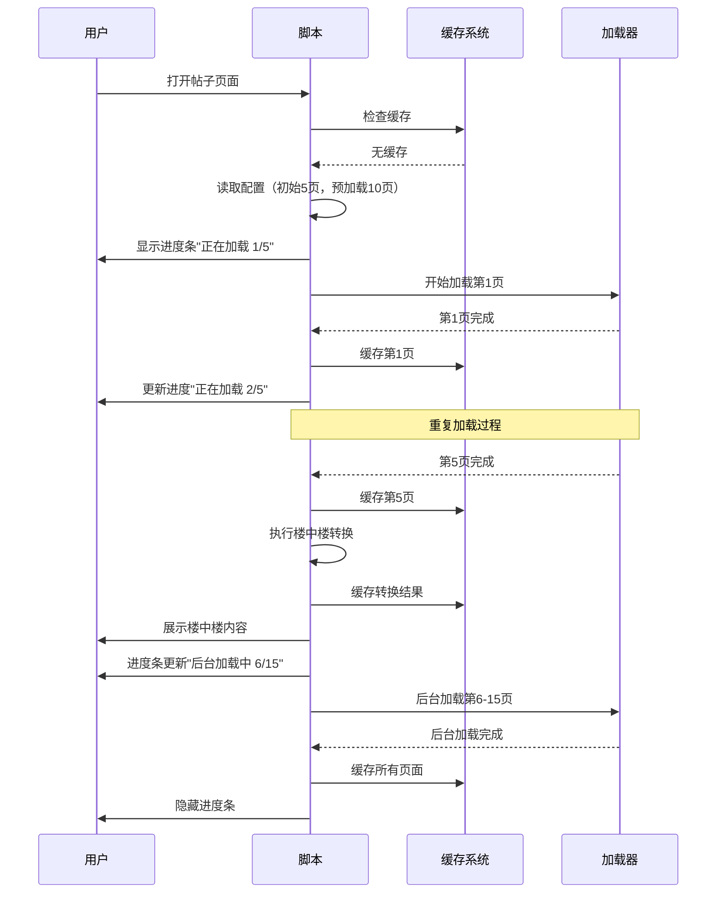
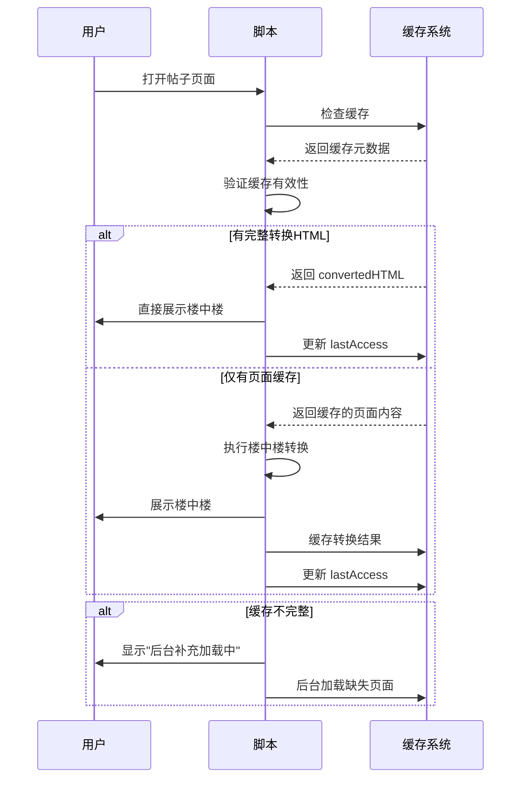
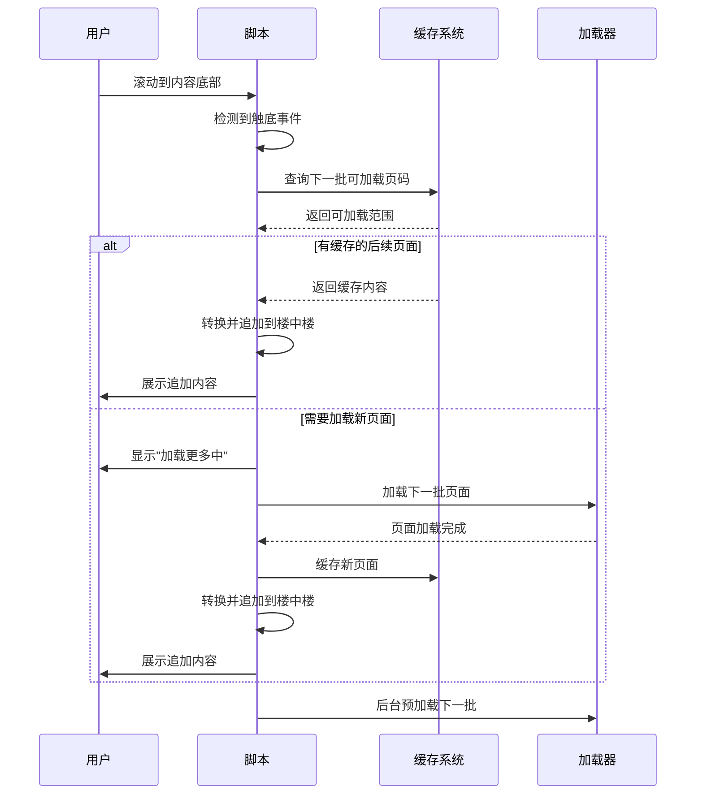
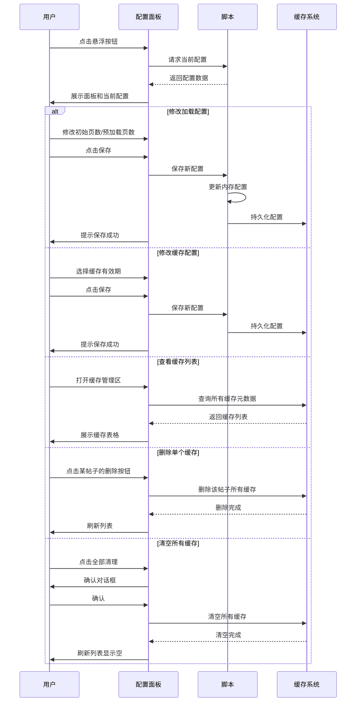
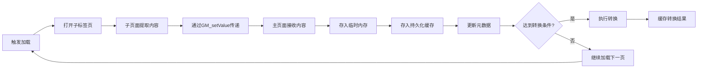
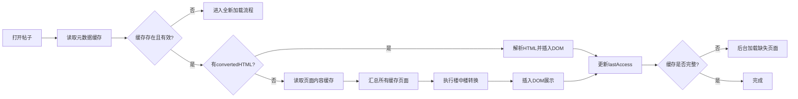
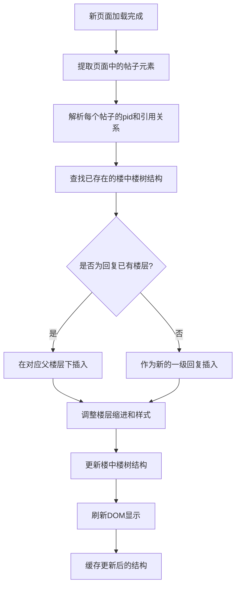

# NGA 楼中楼脚本优化设计

## 一、需求概述

当前脚本需要等待所有页面加载完成后才能进行楼中楼转换，导致用户等待时间过长。优化方案旨在实现以下目标：

- 支持渐进式加载：达到指定页数后立即开始转换展示，无需等待全部加载完成
- 后台持续缓存：用户阅读已转换内容时，后台继续预加载更多页面
- 持久化缓存：已转换的内容缓存至本地，避免重复加载和转换
- 配置管理面板：提供可视化界面管理各项参数和缓存数据

## 二、核心功能设计

### 2.1 渐进式加载与转换

#### 2.1.1 加载策略参数

| 参数名称     | 说明                         | 默认值 | 取值范围 |
| ------------ | ---------------------------- | ------ | -------- |
| 初始加载页数 | 达到该页数后立即开始转换展示 | 5      | 1-50     |
| 预加载页数   | 后台继续缓存的额外页数       | 10     | 0-100    |

#### 2.1.2 工作流程

**阶段一：快速展示**

- 脚本启动后开始加载页面
- 当已加载页数达到"初始加载页数"时触发转换
- 将已加载的页面内容进行楼中楼转换并展示给用户
- 展示完成后不移除进度提示，而是更新为"后台加载中"状态

**阶段二：后台预加载**

- 转换展示完成后，继续在后台加载额外页面
- 后台加载的总页数 = 初始加载页数 + 预加载页数
- 进度提示显示当前后台加载进度
- 所有预加载页面完成后，进度提示自动消失

**阶段三：按需追加**

- 用户滚动到已加载内容底部时触发追加加载
- 每次追加加载相当于"初始加载页数"的页面量
- 追加内容经转换后动态插入到现有楼中楼结构中
- 同时后台继续预加载"预加载页数"的额外页面

#### 2.1.3 转换时机判断

脚本需要根据以下条件决定是否执行转换：

| 条件                         | 行为                       |
| ---------------------------- | -------------------------- |
| 已加载页数 >= 初始加载页数   | 执行首次转换展示           |
| 用户滚动到底部且有未展示缓存 | 执行追加转换               |
| 所有页面已加载完成           | 标记加载完成，不再触发加载 |

### 2.2 缓存系统设计

#### 2.2.1 缓存数据结构

**帖子元数据缓存**

存储键：`NGA_THREAD_META_{tid}`

| 字段名             | 类型      | 说明                            |
| ------------------ | --------- | ------------------------------- |
| tid                | string    | 帖子唯一标识                    |
| totalPages         | number    | 帖子总页数                      |
| cachedPages        | number[]  | 已缓存的页码数组                |
| lastAccess         | timestamp | 最后访问时间戳（毫秒）          |
| cacheTime          | timestamp | 缓存创建时间戳（毫秒）          |
| convertedHTML      | string    | 已转换的楼中楼HTML结构          |
| convertedPageRange | object    | 已转换内容的页码范围 {from, to} |

**页面内容缓存**

存储键：`NGA_PAGE_CONTENT_{tid}_{page}`

| 字段名    | 类型      | 说明               |
| --------- | --------- | ------------------ |
| page      | number    | 页码               |
| rawHTML   | string    | 原始页面HTML内容   |
| timestamp | timestamp | 缓存时间戳（毫秒） |

#### 2.2.2 缓存生命周期管理

**缓存清理策略**

| 清理条件   | 触发时机           | 清理对象                            |
| ---------- | ------------------ | ----------------------------------- |
| 超过有效期 | 脚本启动时         | lastAccess 距今超过缓存有效期的帖子 |
| 手动清理   | 用户在管理面板操作 | 指定的帖子缓存                      |
| 全部清理   | 用户在管理面板操作 | 所有帖子缓存                        |

**缓存更新时机**

| 场景           | 更新内容                                 |
| -------------- | ---------------------------------------- |
| 用户打开帖子   | 更新 lastAccess 为当前时间               |
| 新页面加载完成 | 添加页码到 cachedPages，存储页面内容     |
| 完成楼中楼转换 | 更新 convertedHTML 和 convertedPageRange |

#### 2.2.3 缓存使用流程

**打开帖子时的缓存判断流程**

**缓存命中优化策略**

- 优先使用 convertedHTML：如果存在完整转换后的内容，直接插入DOM
- 部分缓存利用：如果有部分页面缓存，先展示缓存部分，再加载缺失部分
- 增量转换：新加载的页面仅转换新内容，追加到已转换结构中

### 2.3 配置管理面板

#### 2.3.1 面板功能布局

**入口设计**

- 在NGA页面右下角固定位置添加悬浮按钮
- 按钮图标表示脚本状态（空闲/加载中/后台加载）
- 点击按钮展开配置面板

**面板结构**

| 区域       | 功能           | 元素                                                             |
| ---------- | -------------- | ---------------------------------------------------------------- |
| 加载配置区 | 设置加载参数   | 初始加载页数输入框、预加载页数输入框、保存按钮                   |
| 缓存配置区 | 设置缓存策略   | 缓存有效期选择器（选项：1小时/12小时/24小时/7天/永久）、保存按钮 |
| 缓存管理区 | 查看和管理缓存 | 缓存列表表格、单项删除按钮、全部清理按钮、刷新按钮               |
| 统计信息区 | 显示缓存占用   | 总缓存数量、总占用空间估算                                       |

#### 2.3.2 缓存列表表格结构

| 列名     | 内容                        | 宽度 |
| -------- | --------------------------- | ---- |
| 帖子ID   | 显示tid，可点击跳转         | 20%  |
| 缓存页数 | 已缓存页数/总页数           | 15%  |
| 最后访问 | 相对时间显示（如：2小时前） | 20%  |
| 缓存大小 | 估算的占用空间（KB）        | 15%  |
| 状态     | 有效/已过期                 | 10%  |
| 操作     | 删除按钮                    | 20%  |

#### 2.3.3 配置持久化

**配置数据存储**

存储键：`NGA_THREAD_CONFIG`

| 配置项           | 类型   | 默认值                   |
| ---------------- | ------ | ------------------------ |
| initialLoadPages | number | 5                        |
| preloadPages     | number | 10                       |
| cacheExpireTime  | number | 86400000（24小时，毫秒） |

**配置加载与保存**

- 脚本启动时从存储中读取配置，若不存在则使用默认值
- 用户修改配置后点击保存，立即写入存储
- 配置变更后对新加载的帖子立即生效，当前帖子不受影响

## 三、交互流程设计

### 3.1 首次访问帖子流程

### 3.2 缓存命中流程

### 3.3 滚动追加加载流程

### 3.4 配置面板操作流程

## 四、数据流转设计

### 4.1 页面加载与缓存流程

### 4.2 缓存读取与展示流程

### 4.3 增量追加转换流程

## 五、技术要点说明

### 5.1 GM存储使用策略

**短期通信存储**

- 用途：子标签页向主页面传递页面内容
- 存储键格式：`POSTS_{page}`
- 生命周期：读取后立即清空
- 数据量：单页HTML内容（预计几十到几百KB）

**持久化缓存存储**

- 用途：跨会话保存帖子缓存和配置
- 存储键格式：`NGA_THREAD_META_{tid}`、`NGA_PAGE_CONTENT_{tid}_{page}`、`NGA_THREAD_CONFIG`
- 生命周期：根据缓存配置决定
- 数据量：可能累积数MB，需监控和管理

**存储空间管理**

- 定期检查总存储占用
- 当接近限制时优先清理最久未访问的帖子
- 提供手动清理入口

### 5.2 楼中楼增量转换算法

**核心挑战**

- 新增帖子可能引用已展示的楼层，需正确插入到树结构中
- 新增帖子可能引用尚未加载的楼层，需建立临时关系待后续调整
- 需高效更新DOM，避免重新渲染全部内容

**解决方案**

- 维护全局的 `pidToFloor` 和 `floorToPost` 映射
- 新页面加载后，先解析所有帖子的pid和引用关系
- 遍历新帖子，根据引用关系插入到现有树结构中
- 对于引用尚未加载楼层的情况，暂时作为一级回复处理
- 所有页面加载完成后，执行一次全量重排确保结构正确

**DOM更新优化**

- 使用 DocumentFragment 批量插入新元素
- 仅对新增部分执行样式调整，已有部分保持不变
- 利用 requestAnimationFrame 优化渲染性能

### 5.3 滚动检测与懒加载

**触底检测策略**

- 监听 `scroll` 事件，使用防抖函数限制触发频率
- 计算公式：`scrollTop + clientHeight >= scrollHeight - threshold`
- 阈值设定：提前2屏距离触发，确保用户无感加载

**加载状态管理**

- 设置加载锁，防止重复触发
- 显示"加载更多"提示，避免用户误以为已结束
- 加载失败时提供重试按钮

**结束判断**

- 所有页面已加载且已展示时，移除滚动监听
- 在底部显示"已加载全部内容"提示

### 5.4 缓存过期判断逻辑

**过期检查时机**

- 脚本启动时执行一次全局检查
- 打开具体帖子时检查该帖缓存

**判断逻辑**

| 场景             | 判断条件                                | 处理方式           |
| ---------------- | --------------------------------------- | ------------------ |
| 缓存有效期非永久 | 当前时间 - lastAccess > cacheExpireTime | 删除该帖子所有缓存 |
| 缓存有效期为永久 | 无条件                                  | 保留缓存           |
| 缓存数据损坏     | 读取异常或结构不完整                    | 删除该帖子所有缓存 |

**过期清理操作**

- 删除元数据缓存：`GM_setValue('NGA_THREAD_META_{tid}', null)`
- 删除所有页面内容缓存：遍历 cachedPages 数组，逐个删除
- 记录清理日志便于调试

### 5.5 配置面板UI实现

**面板样式定位**

- 使用固定定位（position: fixed）覆盖在页面上层
- Z-index 设置高值确保不被遮挡
- 添加半透明背景遮罩增强视觉焦点

**面板显示隐藏动画**

- 使用 CSS transition 实现淡入淡出效果
- 面板从右侧滑入，关闭时滑出
- 动画时长 300ms，使用 ease-in-out 缓动

**表单交互**

- 输入框添加实时验证，确保数值在合理范围内
- 保存按钮点击后禁用，防止重复提交
- 操作成功后显示 Toast 提示，3秒后自动消失

**缓存列表渲染**

- 使用虚拟滚动优化大量数据展示（若缓存帖子超过100个）
- 提供排序功能（按访问时间、缓存大小排序）
- 搜索功能：根据帖子ID过滤列表

## 六、异常处理与边界情况

### 6.1 加载失败处理

| 异常场景     | 检测方式                     | 处理策略                               |
| ------------ | ---------------------------- | -------------------------------------- |
| 页面加载超时 | 30秒未收到子页面数据         | 跳过该页继续加载下一页，记录失败日志   |
| 反爬虫拦截   | 检测到"访客不能直接访问"标识 | 执行现有的Cookie设置和跳转逻辑         |
| 网络错误     | 子标签页无法打开             | 显示错误提示，提供重试按钮             |
| 存储写入失败 | GM_setValue 抛出异常         | 降级为仅内存缓存，提示用户存储空间不足 |

### 6.2 数据一致性保障

**元数据与页面内容不一致**

- 读取页面内容时验证是否存在，不存在则从元数据中移除该页码
- 定期执行一致性检查，清理孤立的页面缓存

**转换结果与页面缓存不匹配**

- convertedPageRange 记录转换所用的页码范围
- 读取时比对 cachedPages，若不匹配则重新转换

**并发访问冲突**

- 同一帖子在多个标签页打开时，使用时间戳判断最新更新
- 避免同时写入同一缓存键

### 6.3 性能边界保护

**大型帖子处理**

- 单个帖子页数超过100页时，建议用户增加初始加载页数
- 缓存大小超过5MB时警告用户并提供清理建议

**DOM节点数量控制**

- 单次追加转换限制在500个帖子节点以内
- 超大楼层（回复数超过100）折叠显示，点击展开

**内存占用优化**

- 展示时仅保留DOM结构，原始HTML可从缓存按需读取
- 未展示的页面内容保持在缓存中，不加载到内存

### 6.4 兼容性考虑

**现有功能兼容**

- 保留现有的折叠内容展开逻辑
- 保留反爬虫处理逻辑
- 保留楼中楼转换和渲染逻辑

**浏览器API兼容**

- 确保 GM_setValue/GM_getValue 在不同脚本管理器中正常工作
- 测试 Tampermonkey、Violentmonkey、Greasemonkey 的兼容性

**NGA页面结构变化**

- 选择器失效时提供降级方案
- 记录错误日志便于快速定位问题

## 七、验收标准

### 7.1 功能验收

| 功能点     | 验收标准                                         |
| ---------- | ------------------------------------------------ |
| 渐进式加载 | 达到初始页数后3秒内完成转换展示                  |
| 后台预加载 | 用户阅读时不影响页面性能，后台加载完成后提示消失 |
| 缓存命中   | 24小时内重复打开帖子，1秒内展示缓存内容          |
| 滚动追加   | 滚动到底部后2秒内加载下一批内容                  |
| 配置保存   | 修改配置后刷新页面，配置生效                     |
| 缓存管理   | 删除缓存后重新打开帖子，重新加载内容             |

### 7.2 性能验收

| 指标             | 目标值                        |
| ---------------- | ----------------------------- |
| 首次展示时间     | 5页内容在15秒内完成加载和转换 |
| 缓存命中展示时间 | 小于1秒                       |
| 内存占用增长     | 每100页内容不超过50MB         |
| 存储占用         | 10个帖子缓存不超过20MB        |
| 滚动流畅度       | 追加内容时FPS不低于30         |

### 7.3 稳定性验收

| 场景               | 预期表现                       |
| ------------------ | ------------------------------ |
| 网络异常           | 显示友好错误提示，提供重试选项 |
| 存储满             | 降级为无缓存模式，功能正常     |
| 超大帖子（500+页） | 正常分批加载，不卡死           |
| 长时间运行         | 无内存泄漏，无异常崩溃         |
| 多标签页同时使用   | 缓存读写正常，无冲突错误       |

## 八、实施优先级

### 第一阶段：核心优化（高优先级）

1. 实现渐进式加载机制
2. 实现基础缓存系统（元数据和页面内容缓存）
3. 实现缓存读取和展示逻辑
4. 实现后台预加载

### 第二阶段：增强功能（中优先级）

1. 实现配置管理面板UI
2. 实现缓存有效期管理
3. 实现滚动追加加载
4. 实现增量转换算法

### 第三阶段：完善优化（低优先级）

1. 实现缓存列表查看和管理
2. 实现缓存空间占用统计
3. 优化DOM更新性能
4. 完善异常处理和边界情况
