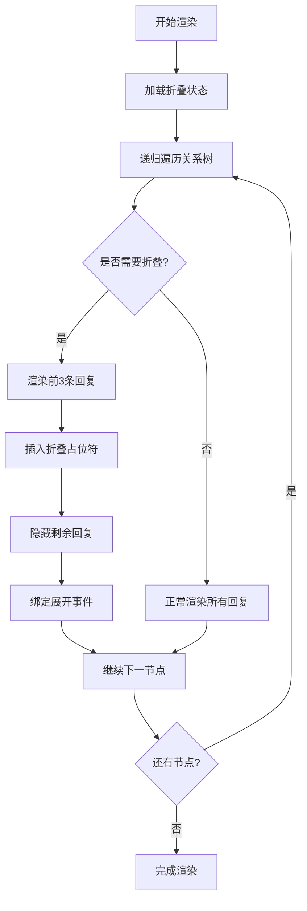
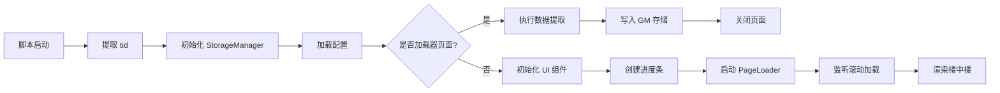
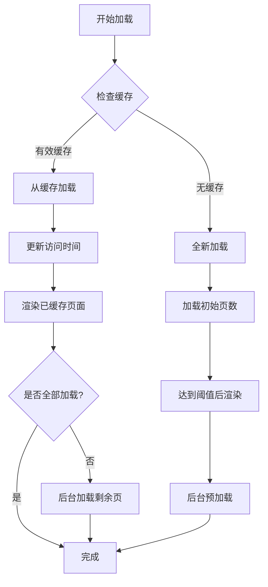
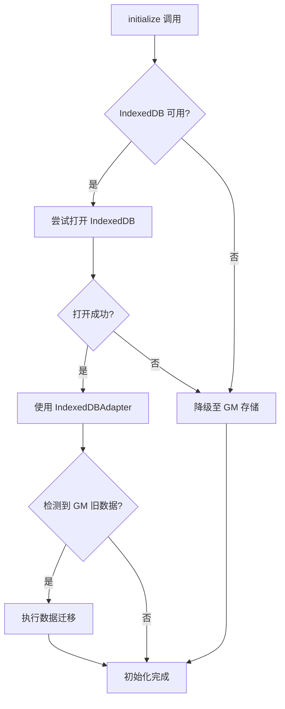
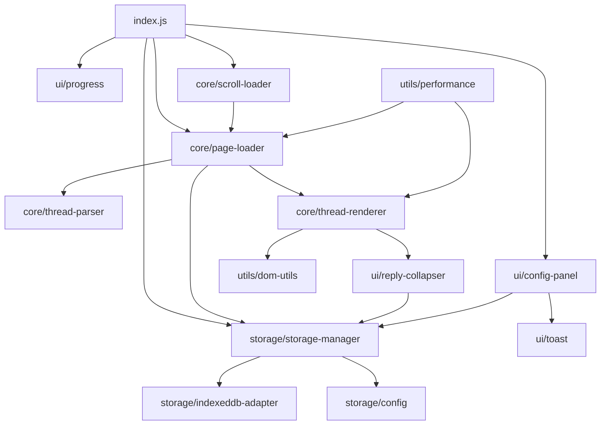

# NGA 楼中楼项目重构与优化设计文档

## 一、重构目标

本次重构旨在解决以下四个核心问题：

1. **存储层升级**：将数据存储从 GM_setValue/GM_getValue 迁移至 IndexedDB
2. **性能优化**：优化楼中楼构建过程的性能表现
3. **交互增强**：实现楼中楼折叠功能，默认显示前三条，支持展开查看全部
4. **架构优化**：重构 index.js 文件，将上千行代码拆分为清晰的模块化结构

## 二、整体架构设计

### 2.1 新目录结构

```
src/
├── core/                      # 核心业务逻辑
│   ├── thread-parser.js       # 帖子解析器
│   ├── thread-renderer.js     # 楼中楼渲染器
│   ├── page-loader.js         # 页面加载器
│   └── scroll-loader.js       # 滚动加载管理器
├── storage/                   # 存储层
│   ├── indexeddb-adapter.js   # IndexedDB 适配器
│   ├── storage-manager.js     # 存储管理器（统一接口）
│   └── config.js              # 配置管理（保持现有）
├── ui/                        # UI 组件
│   ├── progress.js            # 进度条（保持现有）
│   ├── config-panel.js        # 配置面板
│   ├── reply-collapser.js     # 楼中楼折叠组件
│   └── toast.js               # 提示消息组件
├── utils/                     # 工具函数
│   ├── helpers.js             # 通用工具（保持现有）
│   ├── dom-utils.js           # DOM 操作工具
│   └── performance.js         # 性能优化工具
└── index.js                   # 入口文件（精简，只负责初始化和协调）
```

### 2.2 模块职责划分

| 模块 | 职责 | 输入 | 输出 |
|------|------|------|------|
| thread-parser | 解析帖子结构，构建楼中楼关系树 | HTML 内容 | 帖子关系树数据结构 |
| thread-renderer | 渲染楼中楼视图，应用样式和折叠逻辑 | 帖子关系树 | 渲染后的 DOM 结构 |
| page-loader | 管理多页面加载策略和缓存 | tid、页码范围 | 页面 HTML 内容 |
| scroll-loader | 监听滚动事件，触发懒加载 | 滚动位置、加载状态 | 加载指令 |
| indexeddb-adapter | 封装 IndexedDB 操作，提供统一接口 | 数据存储/读取请求 | Promise 结果 |
| storage-manager | 统一存储层接口，兼容 GM 和 IndexedDB | 存储操作指令 | 数据结果 |
| reply-collapser | 管理楼中楼折叠/展开状态 | 楼中楼节点、配置 | 折叠后的视图 |

## 三、存储层迁移至 IndexedDB

### 3.1 迁移策略

#### 3.1.1 数据库设计

**数据库名称**：`NGA_Thread_Cache`  
**版本号**：1

**Object Store 设计**：

| Store 名称 | keyPath | 索引 | 用途 |
|-----------|---------|------|------|
| thread_meta | tid | lastAccess, cacheTime | 存储帖子元数据（总页数、标题等） |
| page_content | [tid, page] | tid, timestamp | 存储分页内容 |
| config | key | - | 存储用户配置 |

**thread_meta 结构**：
```
{
  tid: string,
  title: string,
  totalPages: number,
  cachedPages: number[],
  lastAccess: timestamp,
  cacheTime: timestamp
}
```

**page_content 结构**：
```
{
  tid: string,
  page: number,
  rawHTML: string,
  timestamp: timestamp
}
```

**config 结构**：
```
{
  key: string,
  value: any
}
```

#### 3.1.2 兼容性保障

采用渐进式迁移策略，保证旧版本用户数据平滑过渡：

| 阶段 | 操作 | 目标 |
|------|------|------|
| 第一次启动 | 检测 GM 存储中是否有旧数据 | 识别是否需要迁移 |
| 数据迁移 | 读取 GM 存储数据并写入 IndexedDB | 完成数据转移 |
| 双写模式 | 同时写入 IndexedDB 和 GM（可选） | 提供回退能力 |
| 清理阶段 | 迁移完成后清理 GM 存储（用户可选） | 释放存储空间 |

#### 3.1.3 降级方案

当 IndexedDB 不可用时（如隐私模式、浏览器限制），自动降级至 GM 存储：

**降级触发条件**：
- IndexedDB API 不存在
- 数据库打开失败
- 写入操作报错（超出配额等）

**降级处理流程**：
1. 捕获 IndexedDB 错误
2. 标记降级状态
3. 切换至 GM 存储适配器
4. 提示用户当前使用降级模式

### 3.2 存储接口设计

#### 3.2.1 StorageManager 统一接口

StorageManager 作为存储层抽象，对外提供统一的数据操作接口，内部根据环境选择 IndexedDB 或 GM 存储。

**核心方法**：

| 方法名 | 参数 | 返回值 | 功能 |
|-------|------|--------|------|
| initialize | 无 | Promise&lt;void&gt; | 初始化存储层，选择适配器 |
| getThreadMeta | tid: string | Promise&lt;ThreadMeta&gt; | 获取帖子元数据 |
| saveThreadMeta | tid, meta | Promise&lt;void&gt; | 保存帖子元数据 |
| getPageContent | tid, page | Promise&lt;PageContent&gt; | 获取分页内容 |
| savePageContent | tid, page, html | Promise&lt;void&gt; | 保存分页内容 |
| clearThreadCache | tid | Promise&lt;void&gt; | 清除指定帖子缓存 |
| getAllCachedThreads | 无 | Promise&lt;ThreadMeta[]&gt; | 获取所有缓存帖子列表 |
| getCacheSize | 无 | Promise&lt;number&gt; | 获取缓存总大小 |
| cleanOldCache | maxSize | Promise&lt;void&gt; | 清理旧缓存至指定大小 |
| getConfig | key | Promise&lt;any&gt; | 获取配置项 |
| saveConfig | key, value | Promise&lt;void&gt; | 保存配置项 |

#### 3.2.2 IndexedDBAdapter 实现

**数据库操作封装**：

| 功能 | 实现要点 |
|------|----------|
| 数据库初始化 | 使用 indexedDB.open 创建数据库和对象存储，处理版本升级 |
| 事务管理 | 封装只读/读写事务，自动处理事务完成和错误 |
| CRUD 操作 | 提供 add、get、put、delete、getAll、getAllKeys 等基础操作 |
| 索引查询 | 支持按索引查询，如按 lastAccess 排序获取旧缓存 |
| 错误处理 | 统一捕获和转换 IndexedDB 错误为 Promise rejection |
| 容量管理 | 估算存储大小，支持清理策略 |

**并发控制**：
- 使用事务保证数据一致性
- 避免同时进行多个写操作导致的冲突
- 对高频操作（如进度更新）进行节流处理

### 3.3 性能优化措施

| 优化项 | 实现方式 | 预期效果 |
|-------|----------|----------|
| 批量写入 | 将多页内容在一个事务中写入 | 减少事务开销，提升写入速度 |
| 懒加载索引 | 仅在需要排序时使用索引查询 | 降低查询复杂度 |
| 缓存热数据 | 在内存中缓存当前帖子元数据 | 减少数据库访问次数 |
| 异步非阻塞 | 所有存储操作均为异步 | 不阻塞主线程渲染 |

## 四、楼中楼构建性能优化

### 4.1 性能瓶颈分析

当前实现的主要性能瓶颈：

| 瓶颈点 | 位置 | 影响 |
|-------|------|------|
| DOM 频繁操作 | renderThreadedView 中逐个插入节点 | 触发多次重排重绘 |
| 全量解析 | enableThreadedView 解析所有帖子 | 大帖子（>500 条）解析耗时长 |
| 样式计算 | 动态设置内联样式 | 增加样式计算开销 |
| 递归渲染 | render 函数递归调用 | 深层楼中楼时栈压力大 |

### 4.2 优化方案

#### 4.2.1 虚拟 DOM 批量渲染

**核心思路**：先在内存中构建完整的 DOM 树，再一次性插入到页面。

**实现流程**：
1. 创建 DocumentFragment 作为临时容器
2. 在 Fragment 中递归构建完整的楼中楼结构
3. 使用 container.appendChild(fragment) 一次性插入
4. 浏览器仅触发一次重排重绘

**预期收益**：
- 减少重排重绘次数：从 N 次降为 1 次（N 为帖子数量）
- 提升大帖子渲染速度：预计 50% 以上

#### 4.2.2 增量解析与渲染

**核心思路**：不等待所有页面加载完成，边加载边解析边渲染。

**分批策略**：

| 批次 | 触发条件 | 渲染范围 |
|------|----------|----------|
| 首批 | 初始加载完成（默认 5 页） | 立即渲染已加载内容 |
| 增量批次 | 每新增 N 页（可配置，默认 3 页） | 仅解析和渲染新增部分 |
| 最终批次 | 所有页面加载完成 | 补全剩余内容 |

**增量渲染实现**：
1. 维护已渲染的最大楼层号
2. 新增内容仅解析未渲染的帖子
3. 将新帖子插入到正确的父节点下
4. 更新楼中楼关系树

**预期收益**：
- 首次可交互时间（TTI）提前 60% 以上
- 用户感知加载速度显著提升

#### 4.2.3 样式优化

**CSS 类替代内联样式**：

| 当前实现 | 优化后 | 优势 |
|---------|--------|------|
| 动态设置 style 属性 | 预定义 CSS 类，动态添加 className | 减少样式计算，利用浏览器缓存 |
| 每个节点设置多个样式 | 单一类名控制样式组 | 减少 DOM 属性操作 |

**样式类设计**：

| 类名 | 用途 | 样式内容 |
|------|------|----------|
| nga-reply-level-0 | 主楼层级 | 无缩进，完整显示 |
| nga-reply-level-1 | 一级回复 | 20px 左边距，简化头像 |
| nga-reply-level-2 | 二级回复 | 40px 左边距，进一步简化 |
| nga-reply-level-n | N 级回复（n>2） | 动态计算边距，最大限制 |
| nga-reply-collapsed | 折叠状态 | 高度限制，溢出隐藏 |
| nga-reply-expanded | 展开状态 | 完整高度显示 |

#### 4.2.4 Web Worker 异步解析

**适用场景**：超大帖子（>1000 条回复）的解析工作。

**实现方案**：
1. 将帖子 HTML 内容发送到 Web Worker
2. Worker 中执行解析逻辑，构建关系树
3. 主线程接收解析结果，执行渲染

**限制条件**：
- Web Worker 无法直接操作 DOM
- 数据传输需要序列化（避免传输大对象）
- 仅在帖子超过阈值时启用（默认 800 条）

**预期收益**：
- 解析过程不阻塞主线程
- 页面保持响应，不出现卡顿

### 4.3 性能监控

在关键节点插入性能测量：

| 测量点 | 度量指标 | 用途 |
|-------|----------|------|
| 解析开始 | performance.mark('parse-start') | 记录解析开始时间 |
| 解析完成 | performance.measure('parse-duration') | 计算解析耗时 |
| 渲染开始 | performance.mark('render-start') | 记录渲染开始时间 |
| 渲染完成 | performance.measure('render-duration') | 计算渲染耗时 |
| 总耗时 | 从加载到完成的总时间 | 评估整体性能 |

## 五、楼中楼折叠功能设计

### 5.1 折叠策略

#### 5.1.1 默认显示规则

| 层级 | 默认显示数量 | 折叠条件 | 说明 |
|------|-------------|---------|------|
| 主楼（0 级） | 全部 | 永不折叠 | 主楼始终完整显示 |
| 一级回复 | 全部 | 永不折叠 | 直接回复主楼的内容全部显示 |
| 二级及以上回复 | 前 3 条 | 超过 3 条时折叠 | 楼中楼超过 3 条则折叠多余部分 |

#### 5.1.2 折叠状态表示

**折叠占位符设计**：

当楼中楼被折叠时，显示一个占位元素：

**视觉样式**：
- 背景色：浅灰色（#F5F5F5）
- 边框：1px 虚线（#CCCCCC）
- 内边距：8px 12px
- 圆角：4px
- 鼠标悬停：背景色加深，出现手型光标

**显示内容**：
```
📦 还有 X 条回复被折叠 [点击展开]
```

### 5.2 交互设计

#### 5.2.1 展开/折叠操作

| 操作 | 触发方式 | 响应 | 动画效果 |
|------|---------|------|----------|
| 展开 | 点击折叠占位符 | 显示所有隐藏的楼中楼 | 300ms 淡入 + 高度展开动画 |
| 折叠 | 点击"收起"按钮 | 隐藏超出 3 条的楼中楼 | 200ms 淡出 + 高度收起动画 |
| 全部展开 | 点击顶部"全部展开"按钮 | 展开所有折叠的楼中楼 | 批量展开，无动画 |
| 全部折叠 | 点击顶部"全部折叠"按钮 | 折叠所有可折叠的楼中楼 | 批量折叠，无动画 |

#### 5.2.2 状态持久化

**存储方案**：
- 使用 IndexedDB 存储每个帖子的折叠状态
- 存储格式：`{ tid: string, expandedFloors: Set<number> }`
- expandedFloors 存储用户手动展开的楼层号

**恢复策略**：
- 进入帖子时，读取该 tid 的折叠状态
- 默认按规则折叠，但 expandedFloors 中的楼层保持展开
- 用户操作后实时更新存储

### 5.3 组件实现

#### 5.3.1 ReplyCollapser 组件

**组件职责**：
- 判断哪些楼中楼需要折叠
- 渲染折叠占位符
- 处理展开/折叠交互
- 管理折叠状态

**核心方法**：

| 方法名 | 参数 | 功能 |
|-------|------|------|
| shouldCollapse | parentNode, replyCount | 判断是否需要折叠 |
| createCollapsePlaceholder | hiddenCount, onExpand | 创建折叠占位符元素 |
| expandReplies | parentNode | 展开指定节点下的所有回复 |
| collapseReplies | parentNode | 折叠指定节点下的多余回复 |
| saveCollapseState | tid, expandedFloors | 保存折叠状态到存储 |
| loadCollapseState | tid | 加载折叠状态 |

#### 5.3.2 渲染流程集成

**修改后的 renderThreadedView 流程**：



## 六、文件架构重构

### 6.1 index.js 精简设计

精简后的 index.js 仅保留核心初始化逻辑，目标控制在 200 行以内。

**主要职责**：
1. 检测运行环境（主页面 or 加载器页面）
2. 初始化存储层
3. 初始化各个模块
4. 注册事件监听器
5. 启动加载流程

**执行流程**：



### 6.2 模块划分详解

#### 6.2.1 core/thread-parser.js

**职责**：解析帖子 HTML，构建楼中楼关系树。

**输入**：
- HTML 字符串或 DOM 容器
- 已加载的页面范围

**输出**：
- 关系树数据结构
- pidToFloor 映射表
- floorToPost 映射表

**核心方法**：

| 方法名 | 功能 |
|-------|------|
| parseThreadStructure | 解析所有帖子，提取 pid、floor、引用关系 |
| buildRelationTree | 构建父子关系树 |
| detectReplyParent | 从 quote 中检测回复的父楼层 |
| sortReplies | 按楼层号排序回复 |

**性能优化点**：
- 使用 querySelectorAll 批量查询，减少 DOM 访问
- 提取数据后立即释放临时 DOM
- 使用 Map 代替对象存储映射关系（性能更好）

#### 6.2.2 core/thread-renderer.js

**职责**：将关系树渲染为楼中楼视图，应用样式和折叠逻辑。

**输入**：
- thread-parser 生成的关系树
- 渲染配置（折叠规则、样式主题等）

**输出**：
- 渲染后的 DOM 结构
- 插入到指定容器

**核心方法**：

| 方法名 | 功能 |
|-------|------|
| render | 主渲染入口，协调各子模块 |
| renderNode | 递归渲染单个节点及其子节点 |
| applyStyles | 应用样式类 |
| applyCollapse | 应用折叠逻辑 |
| cleanupQuotes | 移除冗余引用块 |
| optimizeLayout | 优化楼中楼布局（简化头像、隐藏元素等） |

**优化实现**：
- 使用 DocumentFragment 批量插入
- 预定义 CSS 类，避免内联样式
- 延迟非关键渲染（如头像加载）

#### 6.2.3 core/page-loader.js

**职责**：管理多页面加载策略、缓存读取、后台预加载。

**核心流程**：



**核心方法**：

| 方法名 | 功能 |
|-------|------|
| initialize | 初始化加载器，检测缓存 |
| loadFromCache | 从缓存加载帖子 |
| loadFreshPages | 全新加载页面 |
| loadPageRange | 加载指定范围的页面 |
| preloadPages | 后台预加载 |
| onPageLoaded | 单页加载完成回调 |
| shouldTriggerRender | 判断是否触发渲染 |

**加载策略**：

| 阶段 | 页数 | 行为 |
|------|------|------|
| 初始加载 | 配置的 initialLoadPages（默认 5） | 顺序加载，完成后立即渲染 |
| 后台预加载 | 配置的 preloadPages（默认 10） | 异步加载，不阻塞渲染 |
| 滚动加载 | 每次 initialLoadPages 页 | 触发后加载，渲染到页面 |

#### 6.2.4 core/scroll-loader.js

**职责**：监听滚动事件，触发懒加载更多内容。

**核心逻辑**：

| 参数 | 值 | 说明 |
|------|-----|------|
| 触发阈值 | 距底部 2 个屏幕高度 | 提前加载，避免等待 |
| 防抖延迟 | 200ms | 避免滚动过程中频繁触发 |
| 加载锁 | isLoadingMore 标志 | 防止并发加载 |

**核心方法**：

| 方法名 | 功能 |
|-------|------|
| initialize | 注册滚动监听器 |
| handleScroll | 滚动事件处理（带防抖） |
| checkLoadMore | 检查是否需要加载更多 |
| triggerLoadMore | 触发加载更多页面 |
| destroy | 移除监听器，释放资源 |

**与 PageLoader 协作**：
- ScrollLoader 检测到触发条件后调用 PageLoader.loadMorePages
- PageLoader 执行加载，完成后通知 ScrollLoader 解锁
- 渲染完成后，ScrollLoader 继续监听

#### 6.2.5 storage/indexeddb-adapter.js

**职责**：封装 IndexedDB 底层操作，提供 Promise 风格的 API。

**核心方法**：

| 方法名 | 功能 |
|-------|------|
| openDatabase | 打开数据库，处理版本升级 |
| createObjectStores | 创建对象存储和索引 |
| transaction | 创建事务，自动处理完成/错误 |
| get | 按主键获取单条记录 |
| getAll | 获取所有记录或按索引查询 |
| add | 新增记录 |
| put | 更新或新增记录 |
| delete | 删除记录 |
| clear | 清空对象存储 |
| count | 统计记录数 |

**错误处理**：
- 所有操作返回 Promise
- 统一捕获 IndexedDB 错误并转换为可读错误信息
- 区分不同错误类型（QuotaExceededError、NotFoundError 等）

#### 6.2.6 storage/storage-manager.js

**职责**：统一存储接口，自动选择 IndexedDB 或 GM 存储。

**初始化流程**：



**数据迁移逻辑**：

| 步骤 | 操作 | 处理 |
|------|------|------|
| 检测 | 检查 GM 中是否存在 NGA_CACHE_INDEX | 判断是否有旧数据 |
| 读取 | 读取所有 tid 列表 | 遍历每个 tid |
| 转换 | 将 GM 数据转换为 IndexedDB 格式 | 批量写入 |
| 验证 | 验证迁移后数据完整性 | 确保无遗漏 |
| 清理 | 提示用户是否清理 GM 数据 | 用户确认后清理 |

#### 6.2.7 ui/reply-collapser.js

**职责**：管理楼中楼折叠和展开逻辑。

**核心方法**：

| 方法名 | 功能 |
|-------|------|
| applyCollapseRules | 对关系树应用折叠规则 |
| createToggleButton | 创建展开/折叠按钮 |
| handleToggle | 处理按钮点击事件 |
| expandNode | 展开指定节点 |
| collapseNode | 折叠指定节点 |
| saveState | 保存折叠状态 |
| restoreState | 恢复折叠状态 |

**折叠状态管理**：
- 每个帖子独立存储折叠状态
- 使用 Set 存储已展开的节点 ID
- 定期同步到 IndexedDB

#### 6.2.8 ui/config-panel.js

**职责**：配置面板 UI，从 index.js 中提取出来。

**拆分内容**：
- ConfigPanel 类定义
- 面板 HTML 生成
- 事件处理逻辑
- 缓存列表管理

**与 index.js 交互**：
- index.js 负责实例化 ConfigPanel
- 传入 ConfigManager 和 StorageManager 实例
- 配置变更后通知 index.js 更新

#### 6.2.9 ui/toast.js

**职责**：提示消息组件，从 ConfigPanel 中提取。

**核心方法**：

| 方法名 | 功能 |
|-------|------|
| show | 显示提示消息 |
| success | 显示成功消息 |
| error | 显示错误消息 |
| info | 显示信息消息 |
| warning | 显示警告消息 |

**使用方式**：
```
Toast.success('保存成功');
Toast.error('加载失败');
```

#### 6.2.10 utils/dom-utils.js

**职责**：封装常用的 DOM 操作。

**核心方法**：

| 方法名 | 功能 |
|-------|------|
| createElement | 创建带属性和样式的元素 |
| createFragment | 创建文档片段 |
| batchAppend | 批量添加子元素 |
| removeElement | 安全移除元素 |
| addClass | 添加 CSS 类 |
| removeClass | 移除 CSS 类 |
| toggleClass | 切换 CSS 类 |
| setStyles | 批量设置样式 |

#### 6.2.11 utils/performance.js

**职责**：性能监控和优化工具。

**核心方法**：

| 方法名 | 功能 |
|-------|------|
| measure | 测量代码执行时间 |
| debounce | 防抖函数 |
| throttle | 节流函数 |
| requestIdleCallback | 空闲时执行任务（polyfill） |
| batchProcess | 分批处理大数据集 |

### 6.3 模块依赖关系



## 七、实施计划

### 7.1 分阶段实施

| 阶段 | 任务 | 预计工作量 | 风险 |
|------|------|-----------|------|
| 阶段 1 | IndexedDB 适配器开发与测试 | 2-3 天 | 浏览器兼容性问题 |
| 阶段 2 | StorageManager 封装与数据迁移 | 1-2 天 | 数据迁移可靠性 |
| 阶段 3 | 文件架构重构（拆分 index.js） | 2-3 天 | 模块间依赖处理 |
| 阶段 4 | 性能优化（批量渲染、增量解析） | 2 天 | 兼容现有逻辑 |
| 阶段 5 | 楼中楼折叠功能实现 | 2 天 | UI 交互细节 |
| 阶段 6 | 集成测试与 Bug 修复 | 2-3 天 | 功能回归测试 |
| 阶段 7 | 性能测试与调优 | 1 天 | 性能目标达成 |

**总计**：12-16 天

### 7.2 兼容性保障

| 措施 | 目的 |
|------|------|
| 保留降级方案 | IndexedDB 不可用时自动使用 GM 存储 |
| 数据迁移脚本 | 旧版用户数据平滑过渡 |
| 版本检测 | 检测用户脚本版本，提示升级 |
| 回滚机制 | 出现严重问题时允许回退到旧版 |

### 7.3 测试策略

| 测试类型 | 覆盖内容 |
|---------|----------|
| 单元测试 | 各模块核心方法的功能正确性 |
| 集成测试 | 模块间协作流程是否正常 |
| 性能测试 | 不同规模帖子（100/500/1000 条）的加载和渲染性能 |
| 兼容性测试 | Chrome、Firefox、Edge 三大浏览器 |
| 降级测试 | IndexedDB 不可用时的降级表现 |
| 数据迁移测试 | 旧版数据迁移的完整性和正确性 |
| 用户体验测试 | 折叠功能、滚动加载、进度反馈的流畅性 |

## 八、风险与应对

| 风险 | 影响 | 概率 | 应对措施 |
|------|------|------|----------|
| IndexedDB 配额限制 | 大量数据无法存储 | 中 | 实现清理策略，提示用户配额不足 |
| 数据迁移失败 | 旧用户数据丢失 | 低 | 迁移前备份，失败时保留 GM 数据 |
| 性能优化无效 | 大帖子仍然卡顿 | 低 | 进一步优化，增加虚拟滚动 |
| 模块拆分引入 Bug | 功能异常 | 中 | 充分测试，保留旧版代码备份 |
| 浏览器兼容性问题 | 部分用户无法使用 | 低 | 降级方案，提示浏览器升级 |
| 用户不适应新交互 | 折叠功能引起困扰 | 低 | 提供配置选项关闭折叠 |

## 九、后续优化方向

| 方向 | 说明 | 优先级 |
|------|------|--------|
| 虚拟滚动 | 对超长帖子（>2000 条）实现虚拟滚动，仅渲染可见区域 | 中 |
| 离线缓存 | 利用 Service Worker 实现完全离线访问 | 低 |
| 搜索功能 | 在已加载内容中搜索关键词 | 中 |
| 楼层跳转 | 快速跳转到指定楼层 | 低 |
| 主题定制 | 允许用户自定义楼中楼样式 | 低 |
| 数据导出 | 导出帖子为 HTML/Markdown | 低 |

## 十、配置项扩展

在现有配置基础上，新增以下配置项：

| 配置项 | 类型 | 默认值 | 说明 |
|-------|------|--------|------|
| useIndexedDB | boolean | true | 是否启用 IndexedDB（降级时自动关闭） |
| replyCollapseThreshold | number | 3 | 楼中楼折叠阈值，超过此数量才折叠 |
| enableReplyCollapse | boolean | true | 是否启用楼中楼折叠功能 |
| incrementalRenderBatch | number | 3 | 增量渲染的批次大小（页数） |
| enableWebWorkerParse | boolean | false | 是否启用 Web Worker 解析（实验性） |
| webWorkerParseThreshold | number | 800 | 启用 Web Worker 的帖子数量阈值 |
| enablePerformanceLog | boolean | false | 是否启用性能日志（调试用） |
