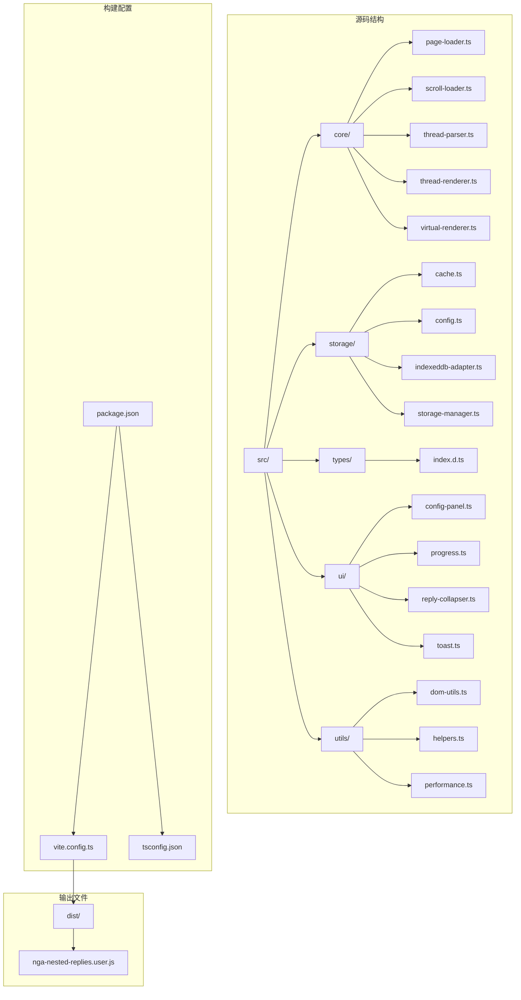
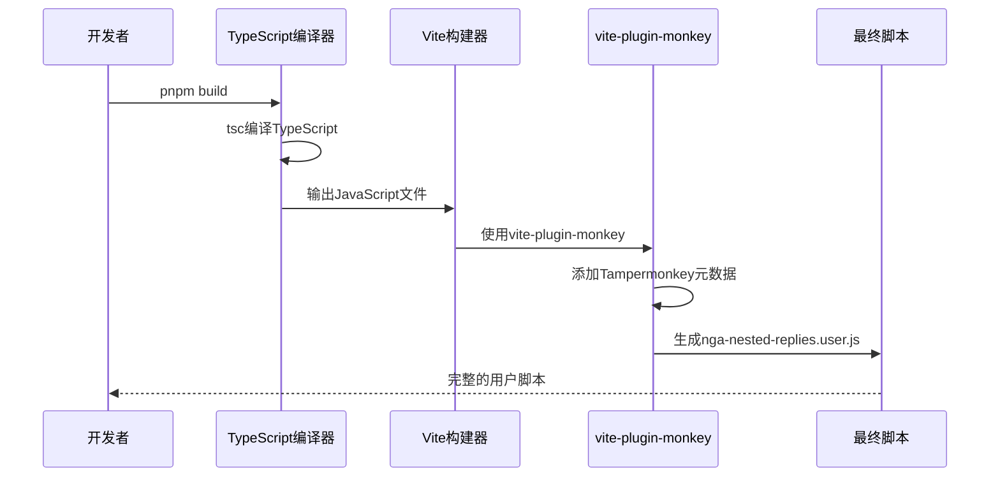
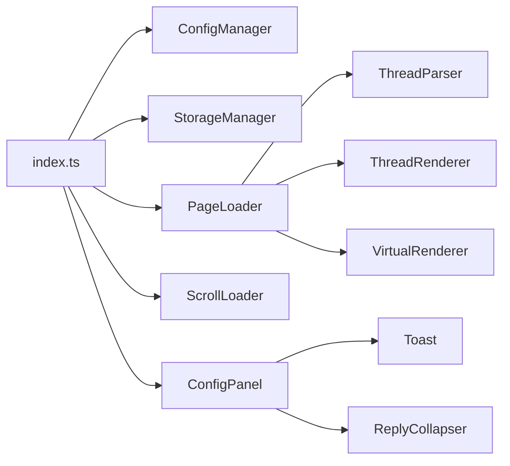
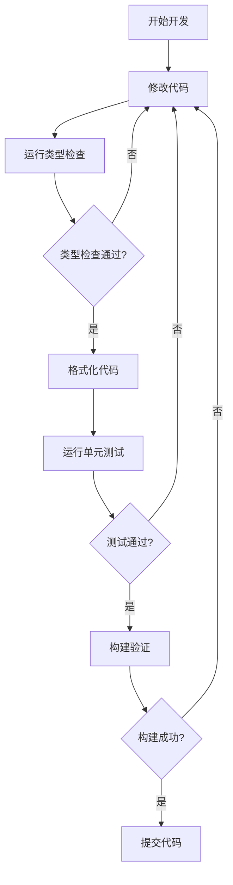

# 开发指南

<cite>
**本文档中引用的文件**
- [package.json](file://package.json)
- [vite.config.ts](file://vite.config.ts)
- [tsconfig.json](file://tsconfig.json)
- [CLAUDE.md](file://CLAUDE.md)
- [README.md](file://README.md)
- [src/index.ts](file://src/index.ts)
- [src/types/index.d.ts](file://src/types/index.d.ts)
- [src/core/page-loader.ts](file://src/core/page-loader.ts)
- [src/storage/config.ts](file://src/storage/config.ts)
- [src/ui/config-panel.ts](file://src/ui/config-panel.ts)
</cite>

## 目录
1. [项目概述](#项目概述)
2. [开发环境设置](#开发环境设置)
3. [项目结构](#项目结构)
4. [构建系统详解](#构建系统详解)
5. [pnpm脚本详解](#pnpm脚本详解)
6. [代码格式化与类型检查](#代码格式化与类型检查)
7. [关键实现说明](#关键实现说明)
8. [开发工作流程](#开发工作流程)
9. [故障排除](#故障排除)

## 项目概述

NGA楼中楼脚本是一个基于TypeScript的Tampermonkey用户脚本，专为NGA论坛设计，将传统的平面主题结构转换为嵌套回复（楼中楼）形式。该项目采用现代化的开发工具链，包括Vite构建系统和TypeScript类型检查，提供了渐进式加载、智能缓存、虚拟滚动和配置管理等核心功能。

### 核心特性
- **渐进式加载**：快速展示指定页数后立即转换显示
- **智能缓存系统**：自动缓存已加载页面，支持多种缓存有效期
- **虚拟滚动**：对大型帖子自动启用，提升性能
- **可视化配置面板**：悬浮入口，支持实时配置管理

**章节来源**
- [README.md](file://README.md#L1-L50)
- [CLAUDE.md](file://CLAUDE.md#L1-L30)

## 开发环境设置

### 必需工具

#### 1. Node.js 和 pnpm
项目使用pnpm作为包管理器，确保安装以下工具：

```bash
# 推荐使用 Node.js 18+ 或 20+
# 安装 pnpm（如果尚未安装）
npm install -g pnpm

# 验证安装
pnpm --version
node --version
```

#### 2. 开发依赖
项目的主要开发依赖包括：
- **TypeScript**：5.9.3+ - 类型安全的JavaScript
- **Vite**：7.2.2+ - 现代构建工具
- **vite-plugin-monkey**：7.1.5+ - Tampermonkey插件
- **Prettier**：3.6.2+ - 代码格式化工具

### 环境配置

#### 1. 克隆项目
```bash
git clone <repository-url>
cd nga-nested-replies
```

#### 2. 安装依赖
```bash
pnpm install
```

#### 3. 验证环境
```bash
# 检查依赖安装
pnpm list

# 验证TypeScript配置
pnpm type-check
```

**章节来源**
- [package.json](file://package.json#L24-L31)
- [tsconfig.json](file://tsconfig.json#L1-L32)

## 项目结构



**图表来源**
- [package.json](file://package.json#L1-L33)
- [vite.config.ts](file://vite.config.ts#L1-L45)

### 核心目录说明

#### `/src/core/` - 核心业务逻辑
- **page-loader.ts**：管理多页面加载策略和缓存
- **scroll-loader.ts**：处理滚动触发的惰性加载
- **thread-parser.ts**：解析HTML构建回复树结构
- **thread-renderer.ts**：标准DOM渲染实现
- **virtual-renderer.ts**：大主题的虚拟滚动实现

#### `/src/storage/` - 数据存储层
- **storage-manager.ts**：统一存储接口
- **indexeddb-adapter.ts**：IndexedDB存储实现
- **cache.ts**：主题元数据和页面内容缓存
- **config.ts**：用户配置管理

#### `/src/ui/` - 用户界面组件
- **config-panel.ts**：设置和缓存管理界面
- **toast.ts**：通知系统
- **reply-collapser.ts**：回复折叠功能
- **progress.ts**：加载进度显示

**章节来源**
- [CLAUDE.md](file://CLAUDE.md#L30-L67)

## 构建系统详解

### 构建流程架构



**图表来源**
- [package.json](file://package.json#L7-L13)
- [vite.config.ts](file://vite.config.ts#L1-L45)

### TypeScript编译配置

项目使用严格的TypeScript配置，支持现代ES特性：

#### 编译目标
- **目标版本**：ES2020
- **模块系统**：ESNext
- **模块解析**：Bundler模式

#### 关键配置项
- **严格模式**：启用所有严格检查
- **路径映射**：`@/*` → `src/*`
- **类型定义**：包含Node.js类型

### Vite构建配置

#### 核心配置要点

1. **入口文件**：`src/index.ts`
2. **输出文件名**：`nga-nested-replies.user.js`
3. **构建目标**：ESNext
4. **禁用压缩**：保持代码可读性
5. **禁用Tree-shaking**：确保所有代码被打包

#### Tampermonkey API声明

vite.config.ts中声明了必需的GM API：

```typescript
grant: [
  'GM_openInTab',      // 后台页面加载
  'GM_setValue',       // 存储设置
  'GM_getValue',       // 存储获取
  'GM_registerMenuCommand' // 菜单命令注册
]
```

**章节来源**
- [vite.config.ts](file://vite.config.ts#L1-L45)
- [tsconfig.json](file://tsconfig.json#L1-L32)

## pnpm脚本详解

### 构建脚本

#### 1. `pnpm build`
**用途**：完整的构建流程
**执行顺序**：`tsc && vite build`
**说明**：
- 首先使用TypeScript编译器编译所有`.ts`文件
- 然后使用Vite和vite-plugin-monkey打包成最终的用户脚本

#### 2. `pnpm build:dev`
**用途**：开发构建（仅Vite）
**说明**：跳过TypeScript编译，直接使用Vite构建，适用于快速开发测试

#### 3. `pnpm build:old`
**用途**：传统构建方式
**说明**：使用Node.js脚本进行构建，可能用于向后兼容

### 开发辅助脚本

#### 1. `pnpm dev`
**用途**：启动开发服务器
**说明**：使用Vite的热重载功能，支持实时开发

#### 2. `pnpm type-check`
**用途**：TypeScript类型检查
**执行**：`tsc --noEmit`
**说明**：验证类型定义，但不生成输出文件

### 代码质量脚本

#### 1. `pnpm format`
**用途**：格式化所有代码
**执行**：`prettier --write .`
**说明**：自动格式化项目中的所有文件

#### 2. `pnpm format:check`
**用途**：检查代码格式
**执行**：`prettier --check .`
**说明**：验证代码是否符合Prettier规范

**章节来源**
- [package.json](file://package.json#L7-L13)
- [CLAUDE.md](file://CLAUDE.md#L10-L26)

## 代码格式化与类型检查

### Prettier配置

项目使用Prettier进行代码格式化，确保团队代码风格一致。

#### 格式化命令
```bash
# 自动格式化所有文件
pnpm format

# 检查格式化状态
pnpm format:check
```

#### 格式化规则
- **缩进**：2个空格
- **引号**：单引号优先
- **分号**：省略分号
- **尾随逗号**：使用

### TypeScript类型检查

#### 类型检查流程
```bash
# 运行类型检查
pnpm type-check

# 类型检查会：
# 1. 检查类型定义
# 2. 验证类型安全
# 3. 发现潜在的类型错误
```

#### 类型系统特点
- **严格模式**：启用所有严格检查选项
- **模块化类型**：支持ES模块导入导出
- **路径别名**：使用`@/`作为`src/`的别名

### 开发最佳实践

#### 1. 代码提交前检查
```bash
# 检查格式
pnpm format:check

# 运行类型检查
pnpm type-check

# 构建验证
pnpm build
```

#### 2. IDE集成
- 安装Prettier VS Code扩展
- 配置VS Code自动格式化
- 启用TypeScript语言服务

**章节来源**
- [package.json](file://package.json#L11-L13)
- [tsconfig.json](file://tsconfig.json#L16-L20)

## 关键实现说明

### 必须使用GM_openInTab(false)进行后台加载

在项目中，所有后台页面加载都必须使用`GM_openInTab(false)`：

```typescript
// 正确的后台加载方式
GM_openInTab(url, false);

// 错误的方式（可能导致前台打开）
GM_openInTab(url); // 默认值为true，会打开新标签页
```

这种实现确保：
- 页面在后台加载，不影响用户体验
- 符合Tampermonkey API的最佳实践
- 避免不必要的标签页创建

### 核心类导入规则

#### 1. 禁止使用`declare class`
项目要求所有核心类必须通过实际导入而非声明导入：

```typescript
// ✅ 正确：实际导入
import ConfigManager from './storage/config.js';

// ❌ 错误：使用declare class
declare class ConfigManager {
  // ...
}
```

#### 2. 明确的模块依赖
关键模块间的导入关系：



**图表来源**
- [src/index.ts](file://src/index.ts#L1-L10)
- [src/core/page-loader.ts](file://src/core/page-loader.ts#L1-L10)

#### 3. 禁用Tree-shaking的重要性
vite.config.ts中禁用了Tree-shaking：

```typescript
rollupOptions: {
  treeshake: false, // 确保所有模块都被打包
}
```

**原因**：
- Tampermonkey脚本需要完整的模块结构
- 避免因Tree-shaking导致的功能缺失
- 确保所有API调用都能正常工作

### 存储系统架构

#### 缓存键命名规范
- **主题元数据**：`NGA_THREAD_META_{tid}`
- **页面内容**：`NGA_PAGE_CONTENT_{tid}_{page}`
- **用户配置**：`NGA_THREAD_CONFIG`
- **折叠状态**：`NGA_COLLAPSE_STATE_{tid}`

#### 数据结构示例
```typescript
// 主题元数据结构
interface ThreadMeta {
  tid: string;
  title?: string;
  totalPages?: number;
  cachedPages?: number[];
  lastAccess: number;
  cacheTime: number;
}
```

**章节来源**
- [CLAUDE.md](file://CLAUDE.md#L61-L98)
- [vite.config.ts](file://vite.config.ts#L41-L43)

## 开发工作流程

### 日常开发流程



### 开发环境配置

#### 1. 启动开发服务器
```bash
# 启动热重载开发服务器
pnpm dev
```

#### 2. 构建验证
```bash
# 生产环境构建
pnpm build

# 检查构建产物
ls dist/
```

#### 3. 代码质量保证
```bash
# 运行所有检查
pnpm format:check
pnpm type-check
```

### 调试技巧

#### 1. 浏览器控制台调试
- 使用`console.log`输出调试信息
- 利用浏览器开发者工具
- 检查网络请求和Tampermonkey API调用

#### 2. 性能监控
- 启用性能日志：`enablePerformanceLog: true`
- 监控内存使用情况
- 分析加载时间指标

**章节来源**
- [src/index.ts](file://src/index.ts#L373-L381)
- [src/storage/config.ts](file://src/storage/config.ts#L31-L43)

## 故障排除

### 常见构建问题

#### 1. TypeScript编译错误
**症状**：`pnpm build`失败，TypeScript报错
**解决方法**：
```bash
# 1. 检查类型错误
pnpm type-check

# 2. 修复类型问题
# 3. 重新构建
pnpm build
```

#### 2. Vite构建失败
**症状**：`vite build`报错
**解决方法**：
```bash
# 1. 清理构建缓存
rm -rf dist/

# 2. 重新安装依赖
pnpm install

# 3. 重新构建
pnpm build
```

#### 3. Tree-shaking问题
**症状**：某些功能无法正常工作
**解决方法**：
检查vite.config.ts中的`treeshake: false`配置是否正确设置。

### 开发环境问题

#### 1. 热重载不工作
**症状**：修改代码后页面不自动刷新
**解决方法**：
```bash
# 1. 检查开发服务器状态
pnpm dev

# 2. 检查端口占用
lsof -i :5173

# 3. 重启开发服务器
```

#### 2. 类型定义问题
**症状**：IDE报告类型错误，但实际运行正常
**解决方法**：
```bash
# 1. 清理TypeScript缓存
rm -rf node_modules/.cache/

# 2. 重新生成类型定义
pnpm type-check
```

### 运行时问题

#### 1. Tampermonkey API调用失败
**症状**：GM_* API调用返回undefined
**解决方法**：
- 检查Tampermonkey版本兼容性
- 验证vite.config.ts中的grant配置
- 确认脚本权限设置

#### 2. 缓存问题
**症状**：页面加载异常或数据不一致
**解决方法**：
```bash
# 清理浏览器缓存
# 清理Tampermonkey缓存
# 重置用户配置
```

### 性能优化建议

#### 1. 大型帖子处理
- 启用虚拟滚动：`useVirtualScroll: true`
- 调整缓冲区大小：`virtualScrollBufferSize: 10`
- 优化页面加载间隔：`pageLoadInterval: 1000`

#### 2. 内存管理
- 设置合理的缓存大小限制
- 定期清理过期缓存
- 监控内存使用情况

**章节来源**
- [src/storage/config.ts](file://src/storage/config.ts#L27-L43)
- [src/core/page-loader.ts](file://src/core/page-loader.ts#L48-L57)