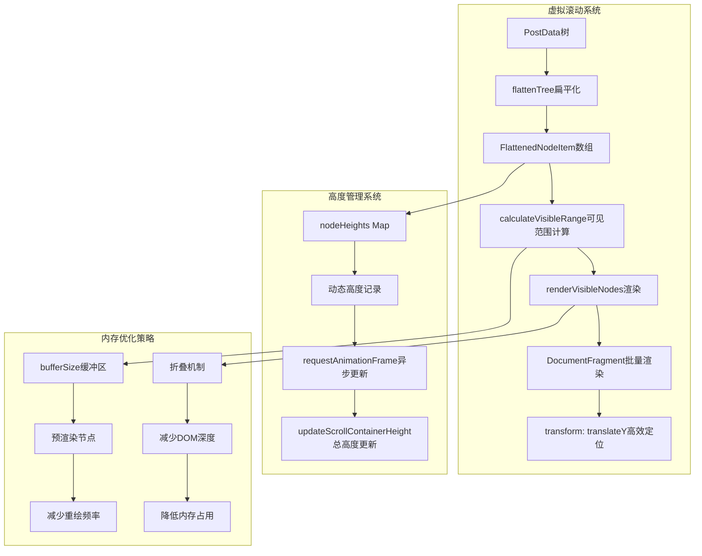
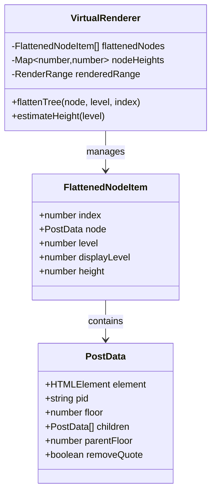
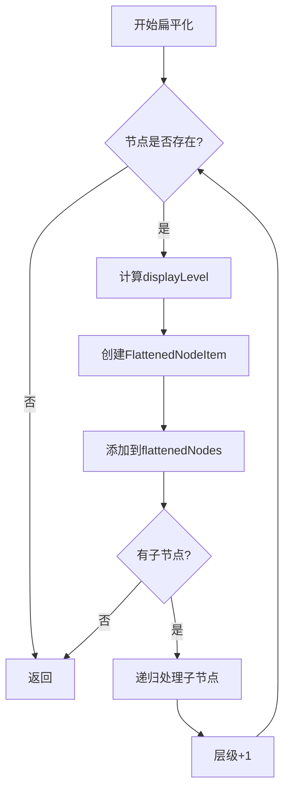
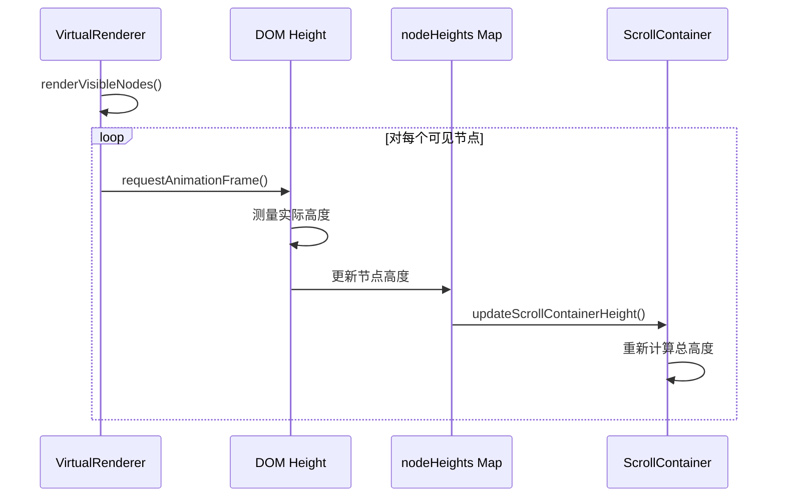
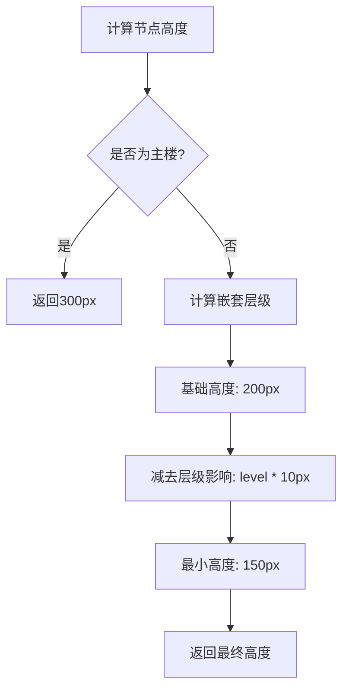
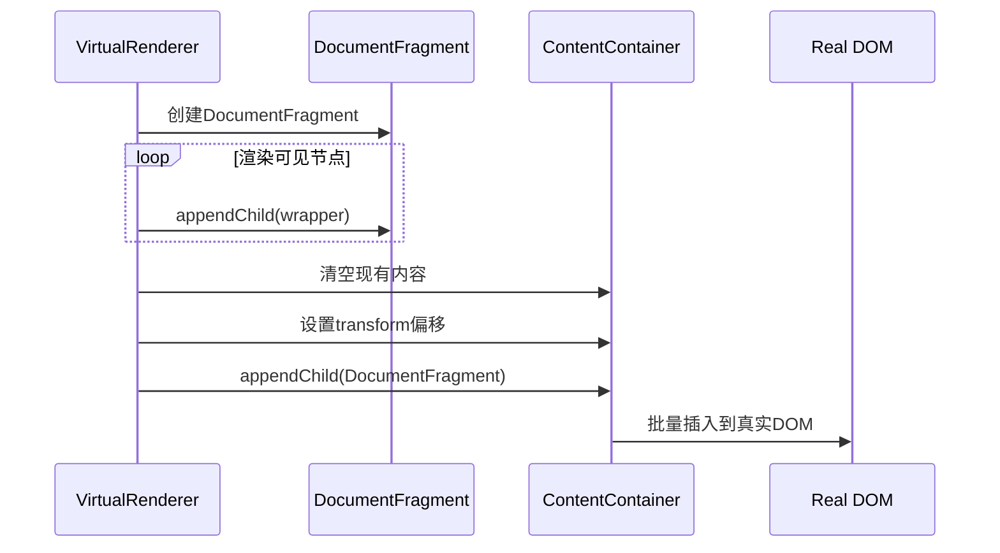
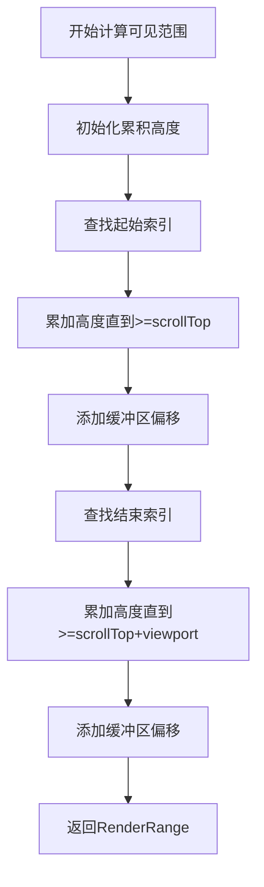
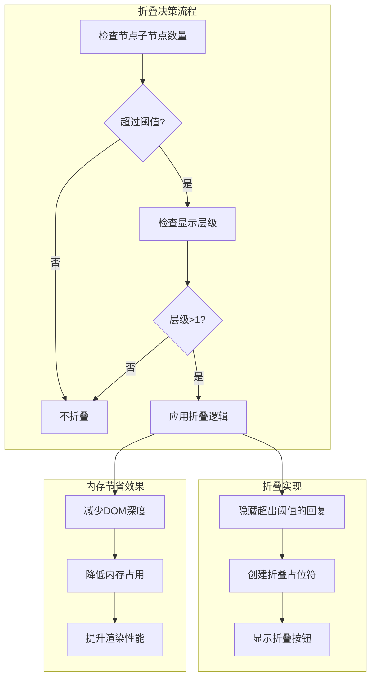
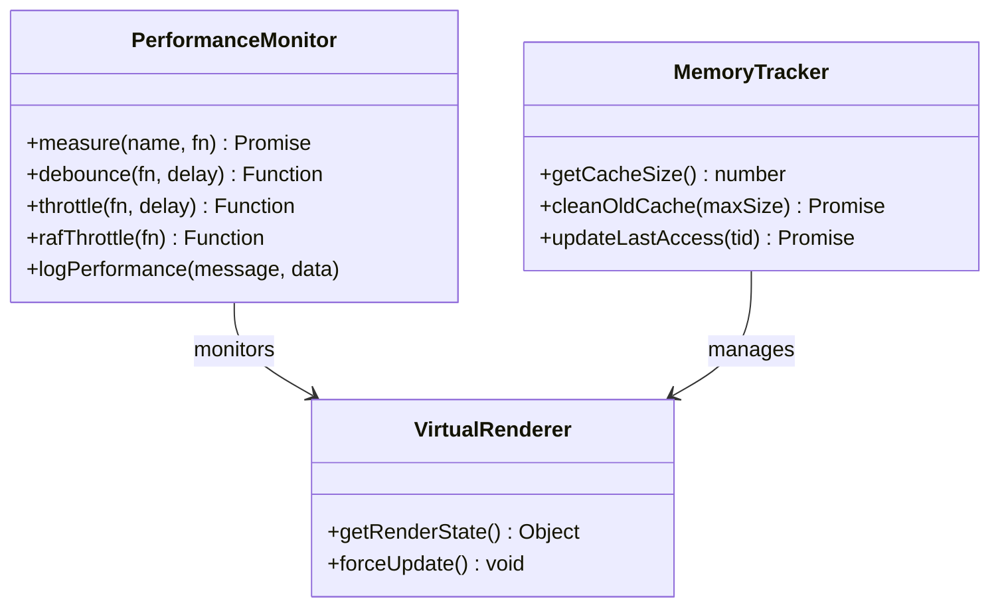
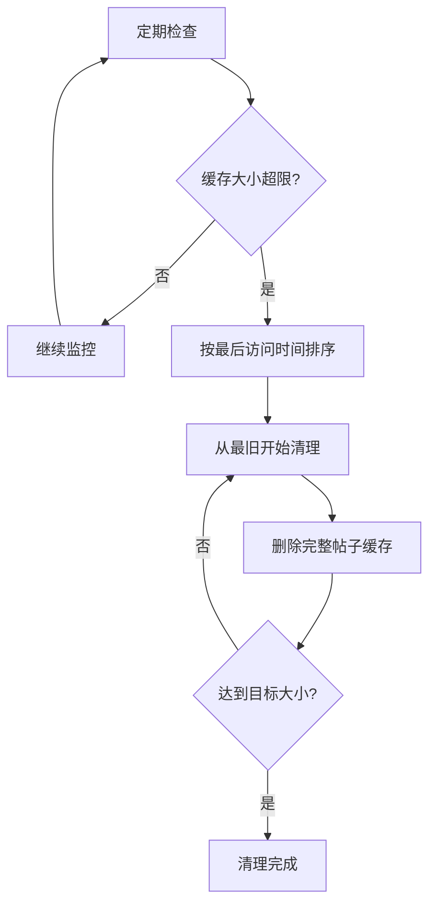

# 内存管理

<cite>
**本文档中引用的文件**
- [virtual-renderer.ts](file://src/core/virtual-renderer.ts)
- [thread-renderer.ts](file://src/core/thread-renderer.ts)
- [dom-utils.ts](file://src/utils/dom-utils.ts)
- [performance.ts](file://src/utils/performance.ts)
- [index.d.ts](file://src/types/index.d.ts)
- [reply-collapser.ts](file://src/ui/reply-collapser.ts)
- [storage-manager.ts](file://src/storage/storage-manager.ts)
- [config-panel.ts](file://src/ui/config-panel.ts)
</cite>

## 目录
1. [概述](#概述)
2. [虚拟滚动架构](#虚拟滚动架构)
3. [扁平化节点管理](#扁平化节点管理)
4. [高度计算与动态更新](#高度计算与动态更新)
5. [高效渲染机制](#高效渲染机制)
6. [内存优化策略](#内存优化策略)
7. [性能监控与调优](#性能监控与调优)
8. [开发者优化指南](#开发者优化指南)
9. [最佳实践建议](#最佳实践建议)

## 概述

NGA楼中楼系统采用了一套精密的内存管理系统，通过虚拟滚动技术大幅降低了长篇帖子的内存占用。该系统的核心思想是只渲染用户可见区域内的节点，同时维护一个高效的节点高度管理系统，确保滚动体验的流畅性和内存使用的经济性。

### 核心设计理念

- **按需渲染**：只渲染视口内可见的节点，大幅减少DOM节点数量
- **动态高度管理**：实时跟踪每个节点的实际高度，确保精确的滚动定位
- **智能缓冲**：通过缓冲区机制平衡内存使用和滚动流畅度
- **渐进式加载**：结合折叠机制和懒加载策略

## 虚拟滚动架构

虚拟滚动是整个内存管理系统的核心组件，它通过以下关键机制实现高效的内存管理：



**图表来源**
- [virtual-renderer.ts](file://src/core/virtual-renderer.ts#L43-L502)

### 虚拟滚动配置参数

系统提供了多个配置参数来平衡性能和内存使用：

| 参数名称 | 默认值 | 取值范围 | 作用描述 |
|---------|--------|----------|----------|
| `virtualScrollBufferSize` | 10 | 5-30 | 视口上下额外渲染的楼层数 |
| `enableReplyCollapse` | true | true/false | 启用回复折叠功能 |
| `replyCollapseThreshold` | 3 | 1-10 | 折叠阈值，超过此数量的回复将被折叠 |
| `useVirtualScroll` | true | true/false | 是否启用虚拟滚动 |

**章节来源**
- [virtual-renderer.ts](file://src/core/virtual-renderer.ts#L65-L67)
- [index.d.ts](file://src/types/index.d.ts#L35-L36)

## 扁平化节点管理

### flattenedNodes数组设计

`flattenedNodes`数组是虚拟滚动系统的基础数据结构，它将复杂的嵌套回复树转换为线性的节点列表：



**图表来源**
- [virtual-renderer.ts](file://src/core/virtual-renderer.ts#L20-L30)

### 扁平化算法实现

扁平化过程采用深度优先遍历算法，同时计算每个节点的显示层级：



**图表来源**
- [virtual-renderer.ts](file://src/core/virtual-renderer.ts#L111-L131)

### 显示层级计算

系统通过智能的层级计算算法区分不同类型的回复：

- **主楼（floor=0）**：始终显示为第0层级
- **一级回复（parentFloor=0）**：显示为第0层级  
- **嵌套回复**：基于实际嵌套深度计算显示层级

**章节来源**
- [virtual-renderer.ts](file://src/core/virtual-renderer.ts#L114-L122)

## 高度计算与动态更新

### nodeHeights Map系统

`nodeHeights`是一个Map结构，用于动态记录每个节点的实际高度：



**图表来源**
- [virtual-renderer.ts](file://src/core/virtual-renderer.ts#L260-L267)

### 动态高度更新机制

高度更新采用异步策略，避免阻塞主线程：

1. **初始估算**：使用启发式算法估算节点高度
2. **异步测量**：通过`requestAnimationFrame`在下一帧测量实际高度
3. **增量更新**：只更新发生变化的节点高度
4. **总高度同步**：批量更新滚动容器的总高度

### 高度估算算法

系统实现了智能的高度估算算法：



**图表来源**
- [virtual-renderer.ts](file://src/core/virtual-renderer.ts#L136-L141)

**章节来源**
- [virtual-renderer.ts](file://src/core/virtual-renderer.ts#L50-L52)
- [virtual-renderer.ts](file://src/core/virtual-renderer.ts#L136-L141)

## 高效渲染机制

### DocumentFragment批量渲染

系统采用DocumentFragment作为渲染缓冲区，显著提升渲染性能：



**图表来源**
- [virtual-renderer.ts](file://src/core/virtual-renderer.ts#L252-L270)

### transform: translateY优化

传统的滚动是通过修改`scrollTop`属性实现的，而虚拟滚动使用CSS变换：

- **性能优势**：transform操作在合成层上执行，避免重排
- **内存效率**：无需移动DOM元素位置
- **动画流畅**：支持硬件加速的平滑动画

### 渲染范围计算

系统通过二分查找算法精确计算可见范围：



**图表来源**
- [virtual-renderer.ts](file://src/core/virtual-renderer.ts#L202-L233)

**章节来源**
- [virtual-renderer.ts](file://src/core/virtual-renderer.ts#L252-L270)
- [virtual-renderer.ts](file://src/core/virtual-renderer.ts#L238-L251)

## 内存优化策略

### 折叠机制集成

回复折叠是内存优化的重要组成部分：



**图表来源**
- [reply-collapser.ts](file://src/ui/reply-collapser.ts#L38-L46)

### 缓冲区策略

缓冲区机制在内存使用和滚动流畅度之间取得平衡：

- **小缓冲区（5-10）**：内存占用低，但滚动可能不够流畅
- **中等缓冲区（10-20）**：平衡性能和内存使用
- **大缓冲区（20-30）**：滚动最流畅，但内存占用较高

### DOM节点生命周期管理

系统实现了完整的DOM节点生命周期管理：

1. **创建阶段**：克隆原始DOM元素
2. **渲染阶段**：应用样式和优化
3. **显示阶段**：插入到可视区域
4. **隐藏阶段**：从DOM中移除但保留在内存中
5. **销毁阶段**：完全清理资源

**章节来源**
- [reply-collapser.ts](file://src/ui/reply-collapser.ts#L38-L46)
- [virtual-renderer.ts](file://src/core/virtual-renderer.ts#L65-L67)

## 性能监控与调优

### 性能测量工具

系统内置了完善的性能监控体系：



**图表来源**
- [performance.ts](file://src/utils/performance.ts#L9-L32)
- [storage-manager.ts](file://src/storage/storage-manager.ts#L440-L458)

### 内存使用统计

系统提供了详细的内存使用统计功能：

| 统计项目 | 计算方式 | 用途 |
|---------|----------|------|
| 缓存大小 | JSON字符串长度 × 2 | 估算内存占用 |
| 总节点数 | flattenedNodes.length | 监控渲染规模 |
| 已渲染范围 | renderedRange.end - renderedRange.start | 性能指标 |
| 缓冲区比例 | bufferSize / totalNodes | 优化建议 |

### 自动垃圾回收

系统实现了智能的垃圾回收机制：



**图表来源**
- [storage-manager.ts](file://src/storage/storage-manager.ts#L463-L499)

**章节来源**
- [performance.ts](file://src/utils/performance.ts#L9-L32)
- [storage-manager.ts](file://src/storage/storage-manager.ts#L440-L458)

## 开发者优化指南

### bufferSize参数调优

根据设备性能和使用场景调整缓冲区大小：

```typescript
// 设备检测和自适应配置
const getOptimalBufferSize = (): number => {
  const deviceMemory = navigator.deviceMemory || 4;
  const cpuCores = navigator.hardwareConcurrency || 4;
  
  if (deviceMemory >= 8 && cpuCores >= 8) {
    return 20; // 高端设备
  } else if (deviceMemory >= 4 && cpuCores >= 4) {
    return 15; // 中端设备
  } else {
    return 10; // 低端设备
  }
};
```

### 内存泄漏防护

开发者需要注意以下潜在的内存泄漏点：

1. **事件监听器**：确保正确移除滚动事件监听器
2. **定时器清理**：及时清理requestAnimationFrame回调
3. **DOM引用**：避免长期持有DOM元素的强引用
4. **缓存管理**：定期清理过期的缓存数据

### 性能监控最佳实践

```typescript
// 性能监控示例
const monitorVirtualScroll = (renderer: VirtualRenderer) => {
  const state = renderer.getRenderState();
  
  console.log('虚拟滚动状态:', {
    总节点数: state.totalNodes,
    已渲染范围: `${state.renderedRange.start}-${state.renderedRange.end}`,
    缓冲区大小: state.bufferSize,
    渲染节点数: state.renderedRange.end - state.renderedRange.start
  });
  
  // 内存使用情况
  const memory = (performance as any).memory;
  if (memory) {
    console.log('内存使用:', {
      已用: `${(memory.usedJSHeapSize / 1024 / 1024).toFixed(2)}MB`,
      总计: `${(memory.totalJSHeapSize / 1024 / 1024).toFixed(2)}MB`
    });
  }
};
```

**章节来源**
- [virtual-renderer.ts](file://src/core/virtual-renderer.ts#L482-L499)
- [performance.ts](file://src/utils/performance.ts#L356-L375)

## 最佳实践建议

### 配置优化建议

根据不同使用场景推荐以下配置：

| 使用场景 | bufferSize | enableReplyCollapse | replyCollapseThreshold |
|---------|------------|-------------------|---------------------|
| 日常浏览 | 10-15 | true | 3-5 |
| 长篇帖子 | 15-20 | true | 5-8 |
| 移动设备 | 8-12 | true | 2-4 |
| 低端设备 | 5-10 | true | 1-3 |

### 内存使用优化策略

1. **渐进式加载**：对于特别长的帖子，考虑分段加载
2. **智能折叠**：根据设备性能动态调整折叠阈值
3. **缓存策略**：合理设置缓存过期时间和最大容量
4. **预加载控制**：避免过度预加载造成内存压力

### 性能监控指标

建立以下关键性能指标的监控：

- **首屏渲染时间**：从开始渲染到首次可见的耗时
- **滚动响应延迟**：滚动事件到实际渲染的延迟
- **内存增长率**：随时间推移的内存使用变化
- **DOM节点数量**：可见区域内的DOM节点总数

### 故障排除指南

当遇到内存问题时，可以按照以下步骤排查：

1. **检查缓冲区设置**：适当增大或减小bufferSize
2. **监控缓存大小**：确保缓存不会无限增长
3. **分析DOM结构**：检查是否有异常的DOM深度
4. **性能分析**：使用浏览器开发工具分析内存使用

通过遵循这些最佳实践，开发者可以构建出既高性能又内存友好的虚拟滚动系统，为用户提供流畅的浏览体验。