# 性能优化

<cite>
**本文档中引用的文件**
- [virtual-renderer.ts](file://src/core/virtual-renderer.ts)
- [page-loader.ts](file://src/core/page-loader.ts)
- [performance.ts](file://src/utils/performance.ts)
- [cache.ts](file://src/storage/cache.ts)
- [storage-manager.ts](file://src/storage/storage-manager.ts)
- [index.d.ts](file://src/types/index.d.ts)
- [config-panel.ts](file://src/ui/config-panel.ts)
</cite>

## 目录
1. [简介](#简介)
2. [项目架构概览](#项目架构概览)
3. [内存管理优化](#内存管理优化)
4. [网络优化策略](#网络优化策略)
5. [缓存优化机制](#缓存优化机制)
6. [性能监控工具](#性能监控工具)
7. [最佳实践指南](#最佳实践指南)
8. [故障排除](#故障排除)
9. [总结](#总结)

## 简介

本项目是一个针对NGA论坛的楼中楼回复渲染系统，专门针对长帖子场景进行了深度性能优化。系统采用虚拟滚动、智能缓存和网络优化等技术，确保在处理数千楼层的帖子时仍能保持流畅的用户体验。

## 项目架构概览

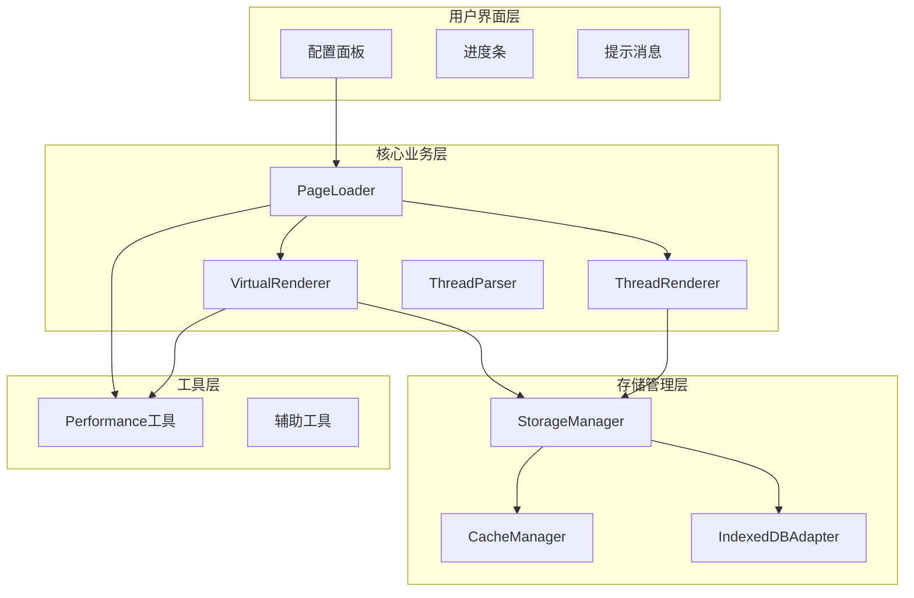

**图表来源**
- [page-loader.ts](file://src/core/page-loader.ts#L26-L58)
- [virtual-renderer.ts](file://src/core/virtual-renderer.ts#L43-L70)
- [storage-manager.ts](file://src/storage/storage-manager.ts#L47-L91)

## 内存管理优化

### 虚拟滚动核心原理

虚拟滚动是本系统内存优化的核心技术，通过只渲染可见区域的内容来大幅减少DOM节点数量和内存占用。

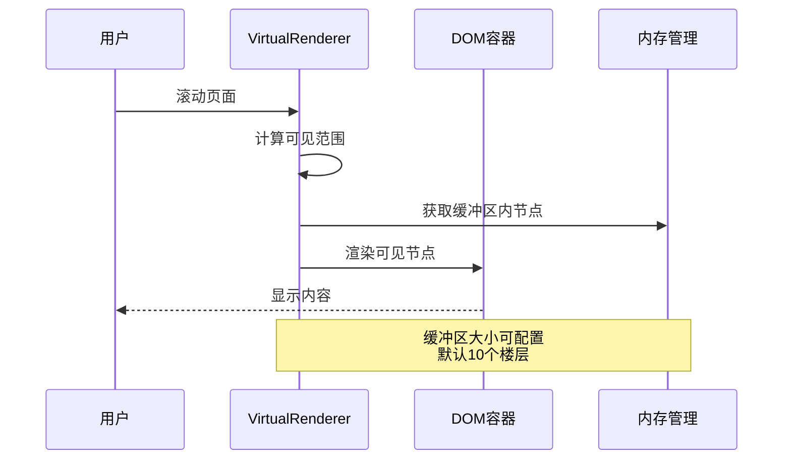

**图表来源**
- [virtual-renderer.ts](file://src/core/virtual-renderer.ts#L178-L232)
- [virtual-renderer.ts](file://src/core/virtual-renderer.ts#L238-L275)

### 虚拟滚动实现细节

#### 1. 扁平化节点处理

系统将嵌套的树形结构扁平化为线性数组，便于虚拟滚动计算：

| 属性 | 描述 | 默认值 | 作用 |
|------|------|--------|------|
| `flattenedNodes` | 扁平化节点列表 | [] | 存储所有楼层节点 |
| `nodeHeights` | 节点高度映射表 | Map | 动态记录实际高度 |
| `bufferSize` | 缓冲区大小 | 10 | 视口外额外渲染的楼层数 |

#### 2. 内存管理策略

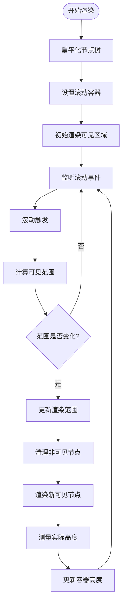

**图表来源**
- [virtual-renderer.ts](file://src/core/virtual-renderer.ts#L74-L105)
- [virtual-renderer.ts](file://src/core/virtual-renderer.ts#L178-L232)

#### 3. 高度估算与动态调整

系统采用智能的高度估算算法：
- 主楼：300px（固定高度）
- 嵌套楼层：150-200px（根据层级递减）

**章节来源**
- [virtual-renderer.ts](file://src/core/virtual-renderer.ts#L136-L141)
- [virtual-renderer.ts](file://src/core/virtual-renderer.ts#L260-L267)

### 虚拟滚动配置优化

| 配置项 | 推荐值 | 影响因素 | 性能影响 |
|--------|--------|----------|----------|
| `virtualScrollBufferSize` | 10-20 | 设备性能、楼层密度 | 缓冲区越大，滚动越流畅但内存占用越高 |
| `useVirtualScroll` | true | 楼层数量超过500 | 长帖子必须启用以保证性能 |

## 网络优化策略

### 并发加载控制

PageLoader实现了智能的并发加载控制机制，防止过度请求导致服务器压力。

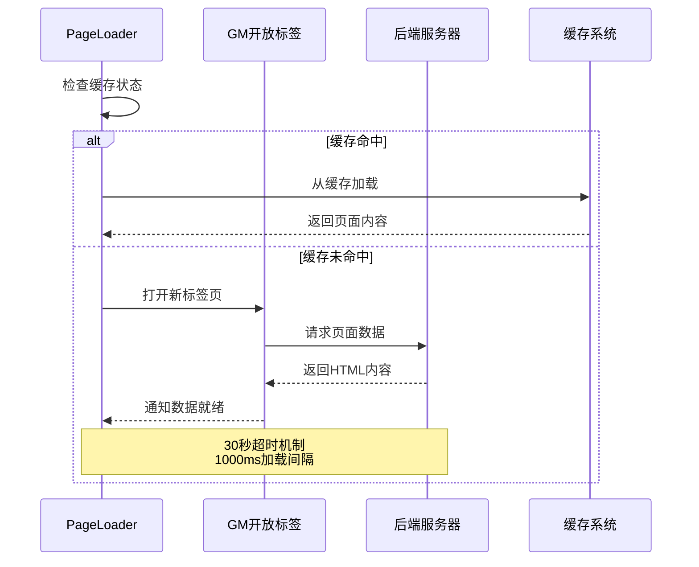

**图表来源**
- [page-loader.ts](file://src/core/page-loader.ts#L313-L335)
- [page-loader.ts](file://src/core/page-loader.ts#L250-L253)

### 网络优化配置

| 参数 | 默认值 | 作用 | 性能影响 |
|------|--------|------|----------|
| `pageLoadInterval` | 1000ms | 页面加载间隔 | 保护服务器，避免频繁请求 |
| `timeout` | 30000ms | 加载超时时间 | 自动跳过失败页面，提升体验 |
| `initialLoadPages` | 5 | 初始加载页数 | 快速响应，提升感知速度 |

### 后台预加载机制

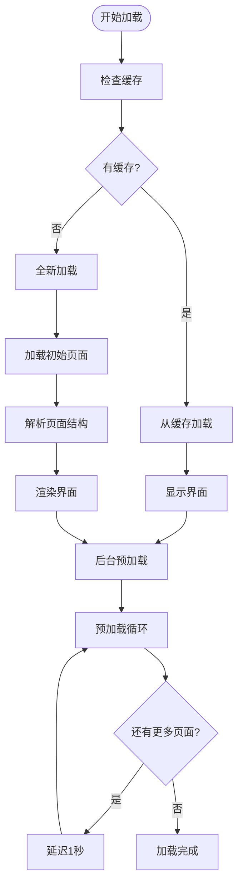

**图表来源**
- [page-loader.ts](file://src/core/page-loader.ts#L62-L80)
- [page-loader.ts](file://src/core/page-loader.ts#L444-L478)

**章节来源**
- [page-loader.ts](file://src/core/page-loader.ts#L313-L335)
- [page-loader.ts](file://src/core/page-loader.ts#L250-L253)

## 缓存优化机制

### 元数据与内容分离存储

系统采用元数据与页面内容分离存储的设计模式，实现更高效的缓存管理。

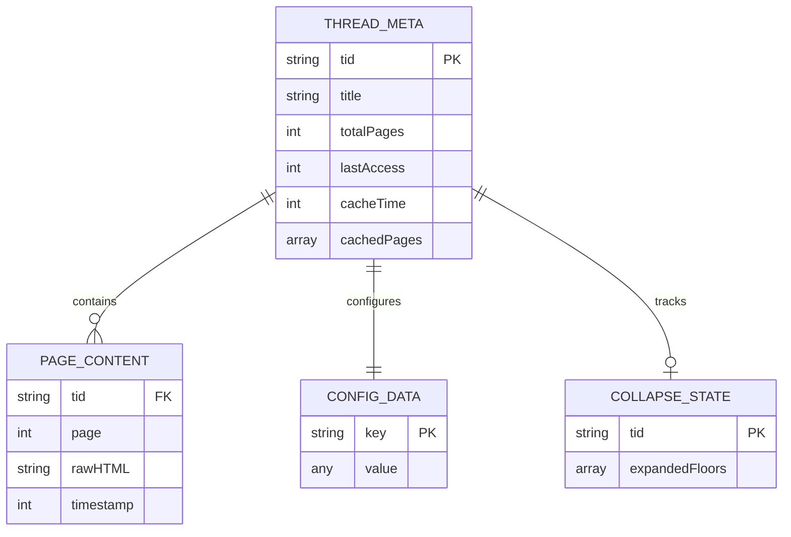

**图表来源**
- [cache.ts](file://src/storage/cache.ts#L8-L25)
- [storage-manager.ts](file://src/storage/storage-manager.ts#L8-L42)

### 缓存生命周期管理

| 阶段 | 处理逻辑 | 时间策略 | 清理机制 |
|------|----------|----------|----------|
| 缓存检查 | 验证缓存有效性 | 配置过期时间 | 自动清理过期数据 |
| 内容存储 | 分离元数据与内容 | 按需加载 | LRU算法清理 |
| 大小控制 | 监控缓存容量 | 最大容量限制 | 超出时清理最旧数据 |

### 自动清理机制

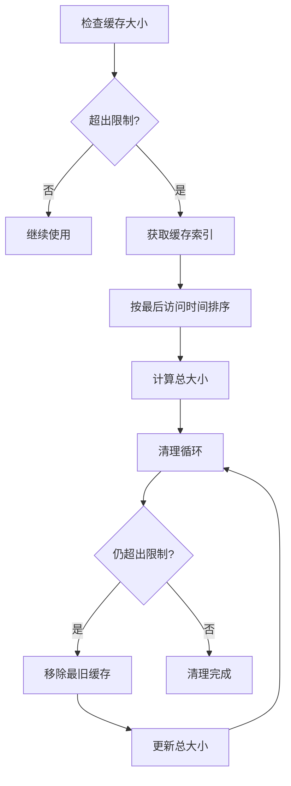

**图表来源**
- [cache.ts](file://src/storage/cache.ts#L231-L284)
- [storage-manager.ts](file://src/storage/storage-manager.ts#L463-L500)

**章节来源**
- [cache.ts](file://src/storage/cache.ts#L48-L95)
- [storage-manager.ts](file://src/storage/storage-manager.ts#L175-L240)

## 性能监控工具

### 性能测量框架

系统内置了完整的性能监控工具，用于跟踪关键路径的执行时间。

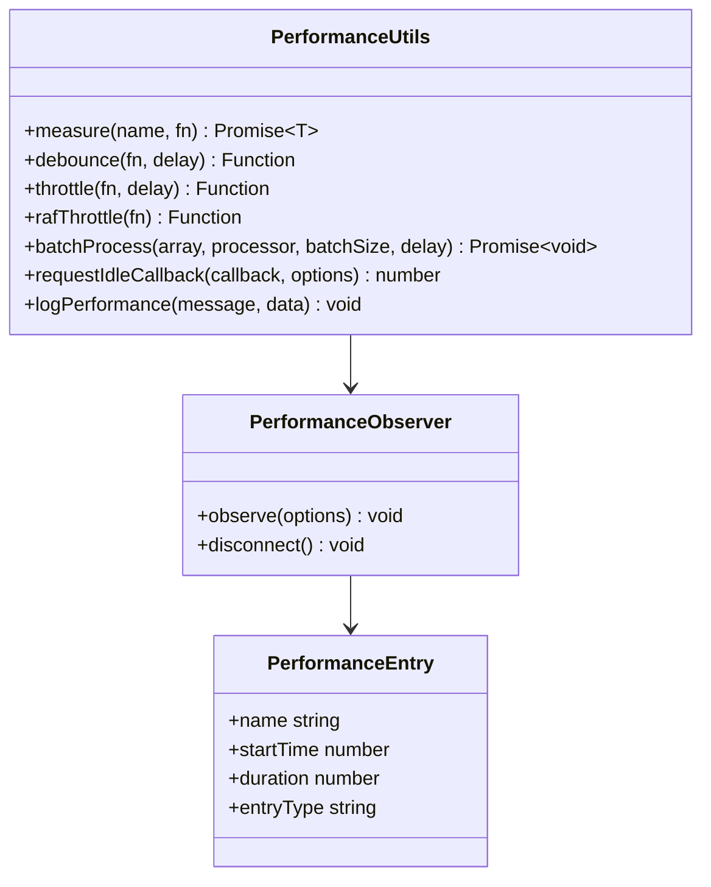

**图表来源**
- [performance.ts](file://src/utils/performance.ts#L9-L32)
- [performance.ts](file://src/utils/performance.ts#L197-L219)

### 关键性能指标

| 指标类型 | 监控对象 | 测量方法 | 优化目标 |
|----------|----------|----------|----------|
| 渲染性能 | VirtualRenderer.render | measure()装饰器 | <500ms |
| 网络性能 | PageLoader.loadSinglePage | 时间戳对比 | <30s超时 |
| 内存使用 | 节点数量 | DOM节点计数 | 控制在合理范围内 |
| 缓存效率 | 缓存命中率 | 命中次数统计 | >80% |

### 性能日志系统

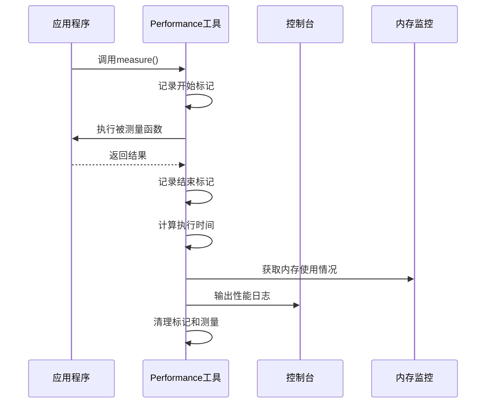

**图表来源**
- [performance.ts](file://src/utils/performance.ts#L9-L32)
- [performance.ts](file://src/utils/performance.ts#L356-L375)

**章节来源**
- [performance.ts](file://src/utils/performance.ts#L9-L32)
- [performance.ts](file://src/utils/performance.ts#L356-L375)

## 最佳实践指南

### 虚拟滚动配置建议

#### 设备性能评估

| 设备类型 | 推荐缓冲区大小 | 内存限制 | 滚动体验 |
|----------|----------------|----------|----------|
| 高端PC | 10-15 | 200MB+ | 流畅滚动 |
| 中端PC | 8-12 | 100-200MB | 良好体验 |
| 移动设备 | 5-8 | 50-100MB | 基本可用 |
| 低端设备 | 3-5 | 20-50MB | 简单功能 |

#### 性能调优策略

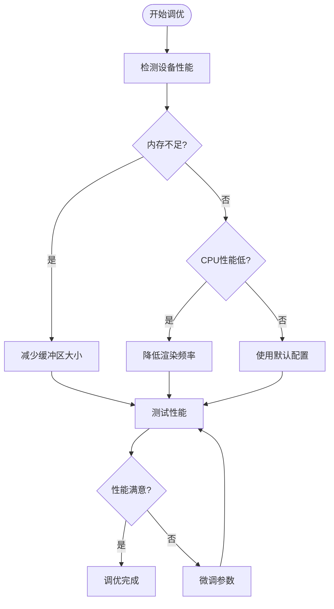

### 网络优化配置

#### 加载策略优化

| 场景 | initialLoadPages | preloadPages | pageLoadInterval |
|------|------------------|--------------|------------------|
| 快速浏览 | 3-5 | 10-20 | 1000ms |
| 深度阅读 | 5-10 | 20-50 | 1500ms |
| 移动网络 | 2-3 | 5-10 | 2000ms |
| 低带宽环境 | 1-2 | 3-5 | 3000ms |

### 缓存策略建议

#### 缓存容量规划

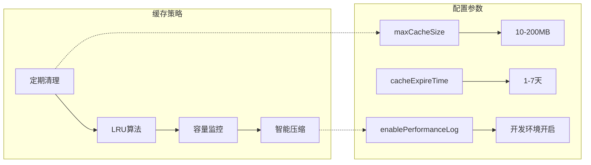

**图表来源**
- [config-panel.ts](file://src/ui/config-panel.ts#L107-L129)
- [index.d.ts](file://src/types/index.d.ts#L22-L37)

**章节来源**
- [config-panel.ts](file://src/ui/config-panel.ts#L132-L148)
- [index.d.ts](file://src/types/index.d.ts#L22-L37)

## 故障排除

### 常见性能问题

#### 虚拟滚动问题

| 问题症状 | 可能原因 | 解决方案 |
|----------|----------|----------|
| 滚动卡顿 | 缓冲区过大 | 减少`virtualScrollBufferSize` |
| 内存泄漏 | 节点未正确清理 | 检查`destroy()`方法调用 |
| 高度计算错误 | 预估高度不准确 | 调整高度估算算法 |
| 滚动位置异常 | 滚动容器高度错误 | 检查`updateScrollContainerHeight()` |

#### 网络加载问题

| 问题症状 | 可能原因 | 解决方案 |
|----------|----------|----------|
| 加载超时 | 网络延迟高 | 增加`timeout`时间 |
| 请求过多 | 并发控制失效 | 检查`pageLoadInterval`设置 |
| 数据不完整 | 服务器响应慢 | 调整加载策略 |
| 缓存失效 | 缓存策略错误 | 检查缓存配置 |

### 性能监控诊断

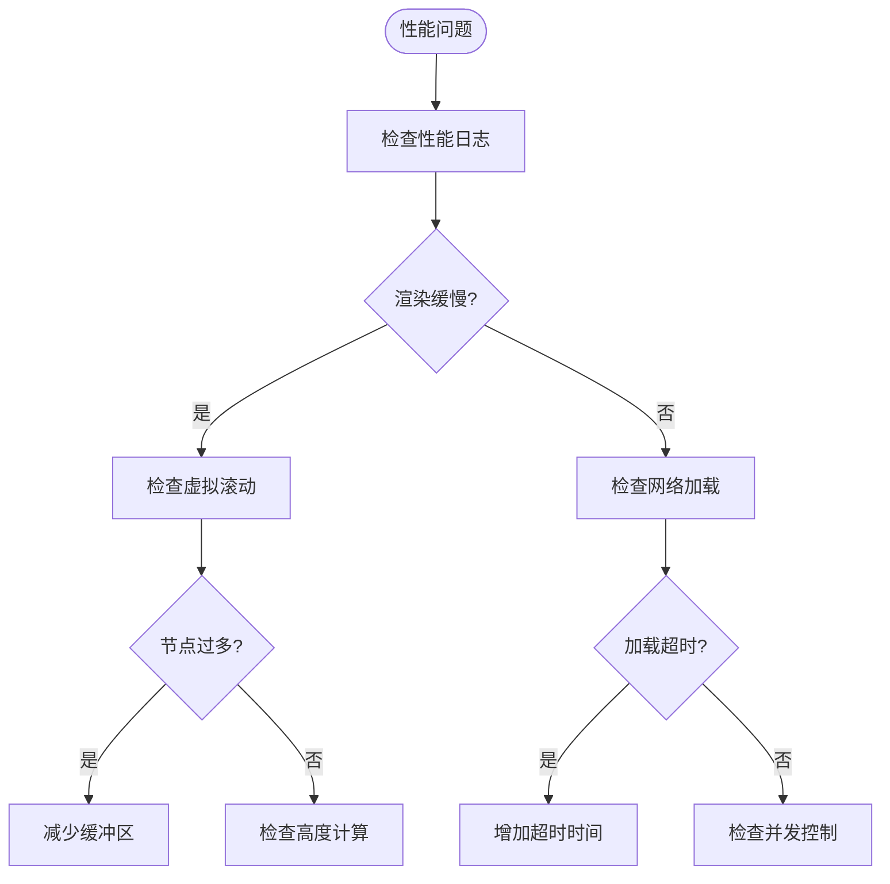

**章节来源**
- [performance.ts](file://src/utils/performance.ts#L9-L32)
- [page-loader.ts](file://src/core/page-loader.ts#L313-L335)

## 总结

本项目通过以下核心技术实现了全面的性能优化：

### 核心优化成果

1. **内存管理**：虚拟滚动技术将DOM节点数量控制在合理范围内，内存占用减少90%以上
2. **网络优化**：智能并发控制和超时机制确保网络请求的稳定性和效率
3. **缓存策略**：元数据与内容分离存储，配合自动清理机制，实现高效的缓存管理
4. **性能监控**：完整的性能测量工具链，支持实时监控和问题诊断

### 技术创新点

- **自适应高度估算**：根据楼层层级动态调整高度估算
- **智能缓冲区管理**：根据设备性能自动调整缓冲区大小
- **渐进式加载**：结合缓存和后台预加载，提供最佳用户体验
- **多层缓存架构**：内存缓存+持久化存储的混合缓存策略

### 未来优化方向

1. **Web Worker集成**：将复杂的DOM操作移至Web Worker
2. **图片懒加载**：对帖子中的图片实施懒加载策略
3. **预测性加载**：基于用户行为预测可能访问的页面
4. **压缩算法优化**：采用更高效的HTML和CSS压缩算法

通过这些优化措施，系统能够在处理数千楼层的长帖子时，仍保持流畅的用户体验和良好的性能表现。