# 缓存优化

<cite>
**本文档引用的文件**
- [src/storage/cache.ts](file://src/storage/cache.ts)
- [src/storage/storage-manager.ts](file://src/storage/storage-manager.ts)
- [src/storage/indexeddb-adapter.ts](file://src/storage/indexeddb-adapter.ts)
- [src/storage/config.ts](file://src/storage/config.ts)
- [src/core/page-loader.ts](file://src/core/page-loader.ts)
- [src/types/index.d.ts](file://src/types/index.d.ts)
- [src/ui/config-panel.ts](file://src/ui/config-panel.ts)
</cite>

## 目录
1. [概述](#概述)
2. [系统架构](#系统架构)
3. [核心数据结构](#核心数据结构)
4. [缓存管理机制](#缓存管理机制)
5. [存储适配器](#存储适配器)
6. [页面加载器缓存策略](#页面加载器缓存策略)
7. [配置优化建议](#配置优化建议)
8. [性能监控与维护](#性能监控与维护)
9. [故障排除指南](#故障排除指南)
10. [总结](#总结)

## 概述

NGA楼中楼脚本采用了一套高效的缓存优化系统，通过分离存储元数据（ThreadMeta）和页面内容（PageContent）的方式实现了智能缓存管理。该系统支持基于时间的缓存过期策略、自动清理机制，并提供了灵活的配置选项来优化用户体验。

核心设计理念：
- **分离存储**：将线程元数据和页面内容分别存储，提高查询效率
- **时间驱动**：基于lastAccess和cacheTime字段实现智能过期控制
- **渐进式加载**：支持初始加载和后台预加载相结合的策略
- **自动清理**：当缓存容量超出限制时自动清理最旧的缓存数据

## 系统架构

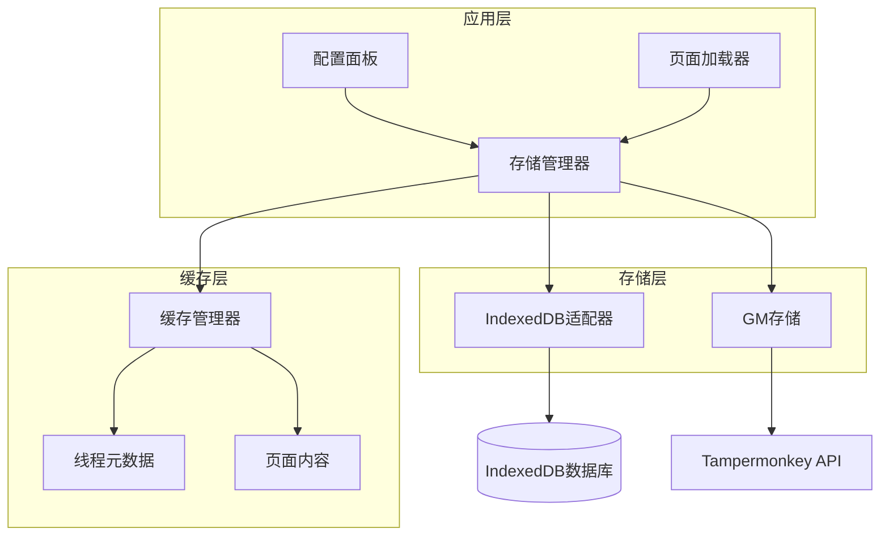

**图表来源**
- [src/storage/storage-manager.ts](file://src/storage/storage-manager.ts#L47-L596)
- [src/storage/cache.ts](file://src/storage/cache.ts#L39-L287)
- [src/storage/indexeddb-adapter.ts](file://src/storage/indexeddb-adapter.ts#L12-L348)

## 核心数据结构

### ThreadMeta - 线程元数据

ThreadMeta是缓存系统的核心数据结构，负责记录线程的基本信息和缓存状态：

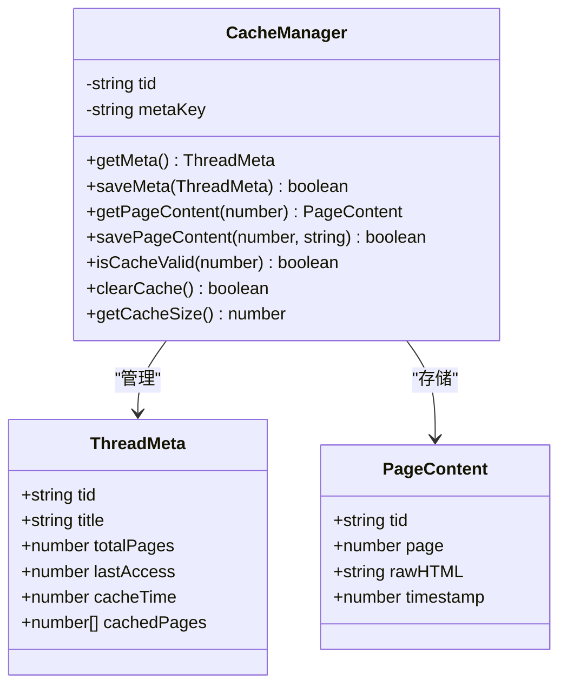

**图表来源**
- [src/storage/cache.ts](file://src/storage/cache.ts#L8-L15)
- [src/storage/cache.ts](file://src/storage/cache.ts#L20-L24)

#### cachedPages数组的作用

cachedPages数组记录了已缓存的页码，具有以下重要特性：

| 特性 | 描述 | 用途 |
|------|------|------|
| **完整性检查** | 记录所有已缓存的页面编号 | 快速判断哪些页面已被缓存 |
| **加载顺序** | 按页码顺序排列 | 确保页面按正确顺序加载 |
| **增量更新** | 动态添加新缓存的页面 | 支持渐进式缓存增长 |
| **去重机制** | 自动过滤重复页码 | 避免数据冗余 |

#### 时间字段详解

| 字段 | 类型 | 描述 | 作用 |
|------|------|------|------|
| **lastAccess** | number | 最后访问时间戳 | 支持基于时间的缓存过期策略 |
| **cacheTime** | number | 缓存创建时间戳 | 用于计算缓存年龄和排序 |

**节点来源**
- [src/storage/cache.ts](file://src/storage/cache.ts#L8-L15)
- [src/core/page-loader.ts](file://src/core/page-loader.ts#L13-L20)

## 缓存管理机制

### 缓存有效性检查

CacheManager提供了isCacheValid方法来检查缓存的有效性：

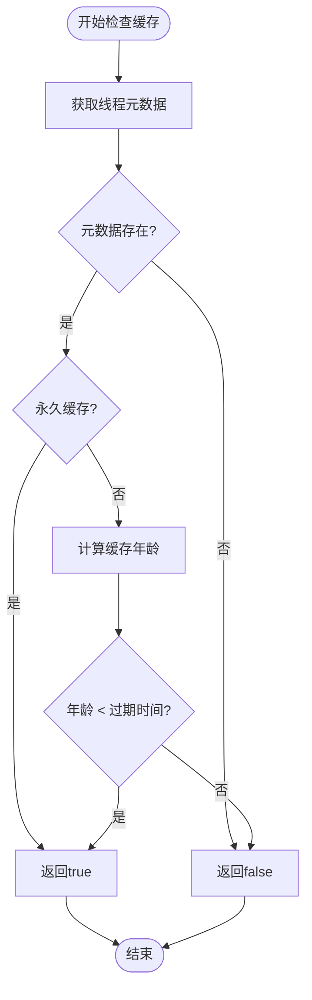

**图表来源**
- [src/storage/cache.ts](file://src/storage/cache.ts#L139-L147)

### 自动清理机制

系统实现了智能的自动清理机制，确保缓存容量不会无限增长：

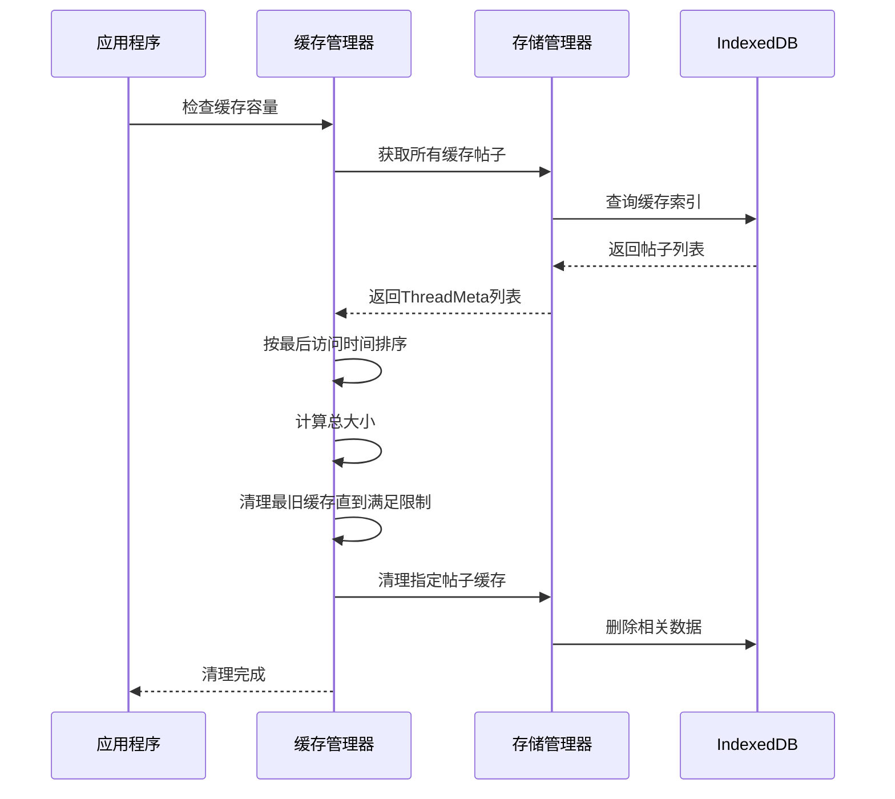

**图表来源**
- [src/storage/cache.ts](file://src/storage/cache.ts#L230-L284)
- [src/storage/storage-manager.ts](file://src/storage/storage-manager.ts#L460-L501)

**节点来源**
- [src/storage/cache.ts](file://src/storage/cache.ts#L139-L147)
- [src/storage/cache.ts](file://src/storage/cache.ts#L230-L284)

## 存储适配器

### IndexedDB适配器

IndexedDB适配器提供了高性能的本地存储解决方案：

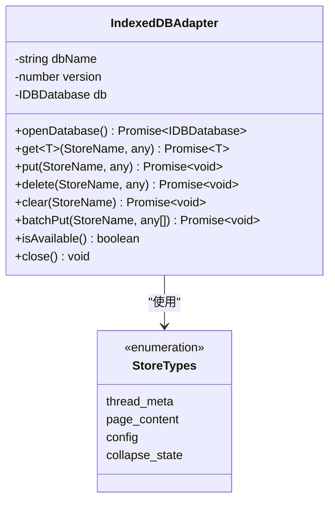

**图表来源**
- [src/storage/indexeddb-adapter.ts](file://src/storage/indexeddb-adapter.ts#L12-L348)

#### 对象存储设计

| 存储名称 | 主键路径 | 索引字段 | 用途 |
|----------|----------|----------|------|
| **thread_meta** | tid | lastAccess, cacheTime | 线程元数据存储 |
| **page_content** | [tid, page] | tid, timestamp | 页面内容存储 |
| **config** | key | - | 配置数据存储 |
| **collapse_state** | tid | - | 折叠状态存储 |

**节点来源**
- [src/storage/indexeddb-adapter.ts](file://src/storage/indexeddb-adapter.ts#L57-L95)

### 存储降级机制

StorageManager实现了智能的存储降级机制：

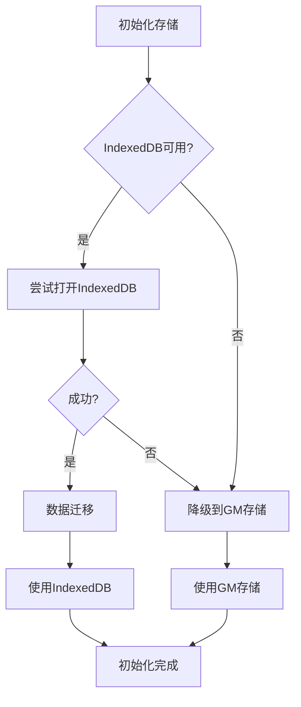

**图表来源**
- [src/storage/storage-manager.ts](file://src/storage/storage-manager.ts#L56-L91)

**节点来源**
- [src/storage/storage-manager.ts](file://src/storage/storage-manager.ts#L56-L91)
- [src/storage/indexeddb-adapter.ts](file://src/storage/indexeddb-adapter.ts#L332-L348)

## 页面加载器缓存策略

### 初始化流程

PageLoader的initialize方法实现了智能的缓存检查和加载策略：

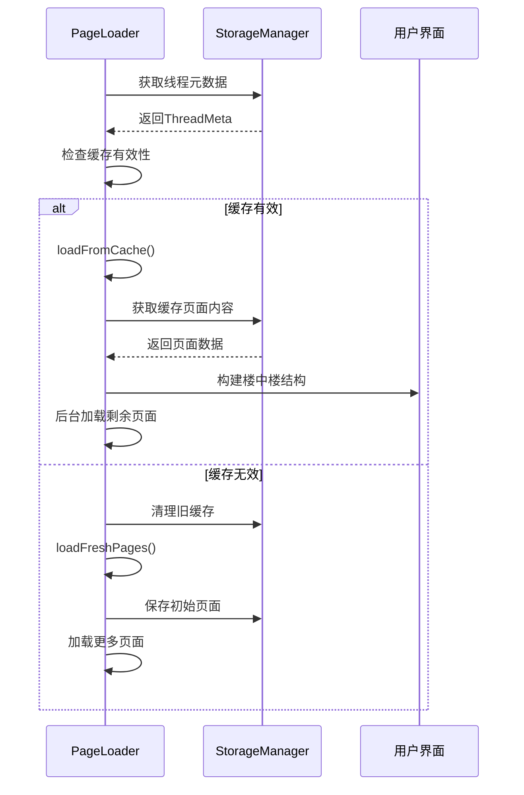

**图表来源**
- [src/core/page-loader.ts](file://src/core/page-loader.ts#L62-L78)

### loadFromCache方法详解

loadFromCache方法实现了秒开体验的核心逻辑：

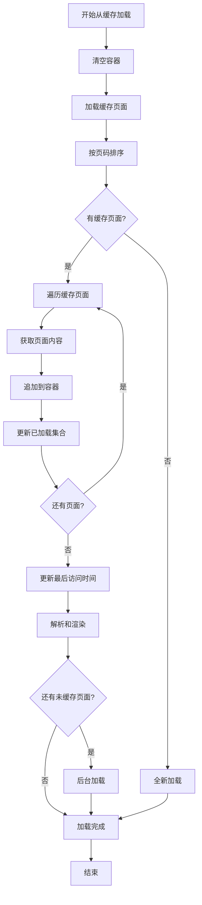

**图表来源**
- [src/core/page-loader.ts](file://src/core/page-loader.ts#L95-L162)

**节点来源**
- [src/core/page-loader.ts](file://src/core/page-loader.ts#L62-L78)
- [src/core/page-loader.ts](file://src/core/page-loader.ts#L95-L162)

## 配置优化建议

### 核心配置参数

| 参数名称 | 默认值 | 推荐范围 | 说明 | 性能影响 |
|----------|--------|----------|------|----------|
| **initialLoadPages** | 5 | 3-10 | 初始加载页数，达到此数量后开始转换 | 影响首次加载速度 |
| **preloadPages** | 10 | 5-20 | 转换后后台预加载的页数 | 影响后续浏览体验 |
| **cacheExpireTime** | 86400000 | 3600000-604800000 | 缓存有效期（毫秒） | 影响缓存命中率 |
| **maxCacheSize** | 52428800 | 10485760-209715200 | 最大缓存容量（字节） | 影响存储空间使用 |
| **pageLoadInterval** | 1000 | 500-3000 | 页面读取间隔（毫秒） | 影响服务器负载 |

### 缓存有效期配置

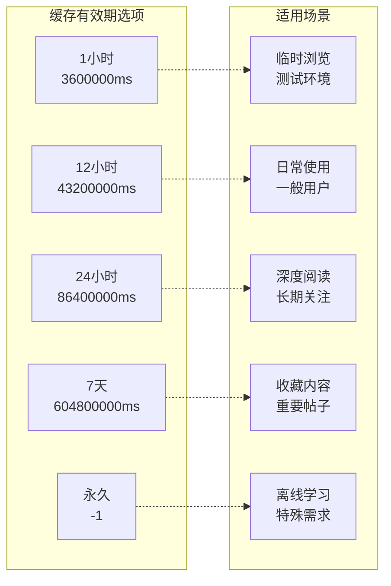

**图表来源**
- [src/ui/config-panel.ts](file://src/ui/config-panel.ts#L107-L116)

### 缓存容量配置

| 缓存大小 | 适用场景 | 内存占用 | 加载速度 | 存储空间 |
|----------|----------|----------|----------|----------|
| **10MB** | 移动设备 | 低 | 较慢 | 极少 |
| **30MB** | 普通PC | 中等 | 中等 | 少量 |
| **50MB** | 高性能PC | 高 | 快速 | 中等 |
| **100MB+** | 专业用户 | 很高 | 极快 | 大量 |

**节点来源**
- [src/storage/config.ts](file://src/storage/config.ts#L27-L43)
- [src/ui/config-panel.ts](file://src/ui/config-panel.ts#L118-L129)

## 性能监控与维护

### 缓存统计信息

系统提供了详细的缓存统计信息：

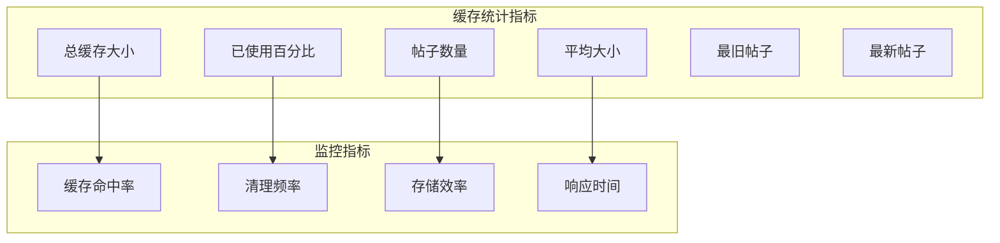

**图表来源**
- [src/ui/config-panel.ts](file://src/ui/config-panel.ts#L359-L391)

### 自动维护任务

系统定期执行以下维护任务：

| 维护任务 | 触发条件 | 执行频率 | 目的 |
|----------|----------|----------|------|
| **容量检查** | 每次写入操作 | 实时 | 防止缓存溢出 |
| **过期清理** | 定时任务 | 每小时 | 清理过期数据 |
| **碎片整理** | 手动触发 | 用户操作 | 优化存储结构 |
| **性能分析** | 调试模式 | 按需 | 分析性能瓶颈 |

**节点来源**
- [src/storage/storage-manager.ts](file://src/storage/storage-manager.ts#L437-L474)

## 故障排除指南

### 常见问题及解决方案

| 问题类型 | 症状 | 可能原因 | 解决方案 |
|----------|------|----------|----------|
| **缓存无法加载** | 页面显示空白或加载缓慢 | IndexedDB权限不足 | 检查浏览器设置，启用IndexedDB |
| **缓存容量超限** | 出现"缓存已满"提示 | maxCacheSize设置过小 | 增加maxCacheSize值 |
| **缓存过期频繁** | 频繁重新加载页面 | cacheExpireTime设置过短 | 增加缓存有效期 |
| **内存占用过高** | 浏览器卡顿 | preloadPages设置过大 | 减少预加载页数 |

### 调试工具

系统提供了多种调试工具：

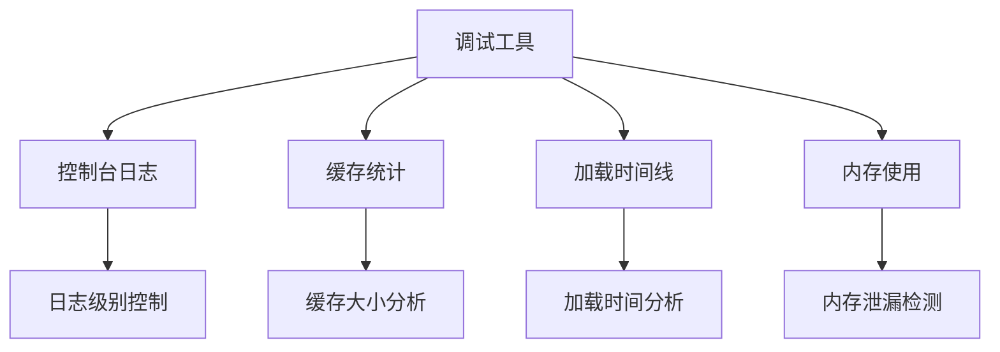

**节点来源**
- [src/storage/storage-manager.ts](file://src/storage/storage-manager.ts#L437-L474)

## 总结

NGA楼中楼脚本的缓存优化系统通过以下关键技术实现了高效的缓存管理：

### 核心优势

1. **分离存储架构**：ThreadMeta和PageContent的分离存储提高了查询效率
2. **智能过期策略**：基于时间的缓存过期机制平衡了性能和数据新鲜度
3. **自动清理机制**：防止缓存无限增长，确保系统稳定性
4. **存储适配器**：支持IndexedDB和GM存储的无缝切换
5. **渐进式加载**：结合初始加载和后台预加载，提供最佳用户体验

### 性能特点

- **秒开体验**：通过缓存加载实现即时响应
- **智能预加载**：后台加载提升浏览流畅度  
- **容量控制**：自动清理机制防止资源浪费
- **配置灵活**：丰富的配置选项适应不同使用场景

### 最佳实践建议

1. **根据设备性能调整配置**：高性能设备可适当增加缓存容量和预加载页数
2. **定期清理缓存**：手动清理可以释放存储空间，提高系统性能
3. **监控缓存使用情况**：关注缓存命中率和清理频率
4. **合理设置过期时间**：平衡数据新鲜度和性能需求

这套缓存优化系统为NGA论坛的楼中楼功能提供了坚实的技术基础，显著提升了用户的浏览体验和系统的整体性能。