# 网络优化

<cite>
**本文档引用的文件**
- [page-loader.ts](file://src/core/page-loader.ts)
- [config.ts](file://src/storage/config.ts)
- [index.d.ts](file://src/types/index.d.ts)
- [storage-manager.ts](file://src/storage/storage-manager.ts)
- [performance.ts](file://src/utils/performance.ts)
- [config-panel.ts](file://src/ui/config-panel.ts)
</cite>

## 目录
1. [简介](#简介)
2. [项目架构概览](#项目架构概览)
3. [核心组件分析](#核心组件分析)
4. [网络优化策略](#网络优化策略)
5. [页面加载机制](#页面加载机制)
6. [缓存与存储优化](#缓存与存储优化)
7. [性能监控与调优](#性能监控与调优)
8. [故障排除指南](#故障排除指南)
9. [总结](#总结)

## 简介

PageLoader是NGA楼中楼脚本的核心网络优化组件，专门设计用于高效处理大量页面数据的加载和渲染。它通过创新的并发加载策略、智能缓存机制和渐进式渲染技术，实现了在保持用户体验流畅性的同时最大化系统性能的目标。

本文档将深入解析PageLoader如何实现高效且稳定的页面加载策略，重点关注其在网络优化方面的技术创新和最佳实践。

## 项目架构概览

PageLoader作为整个系统的核心控制器，负责协调多个子系统的协作：

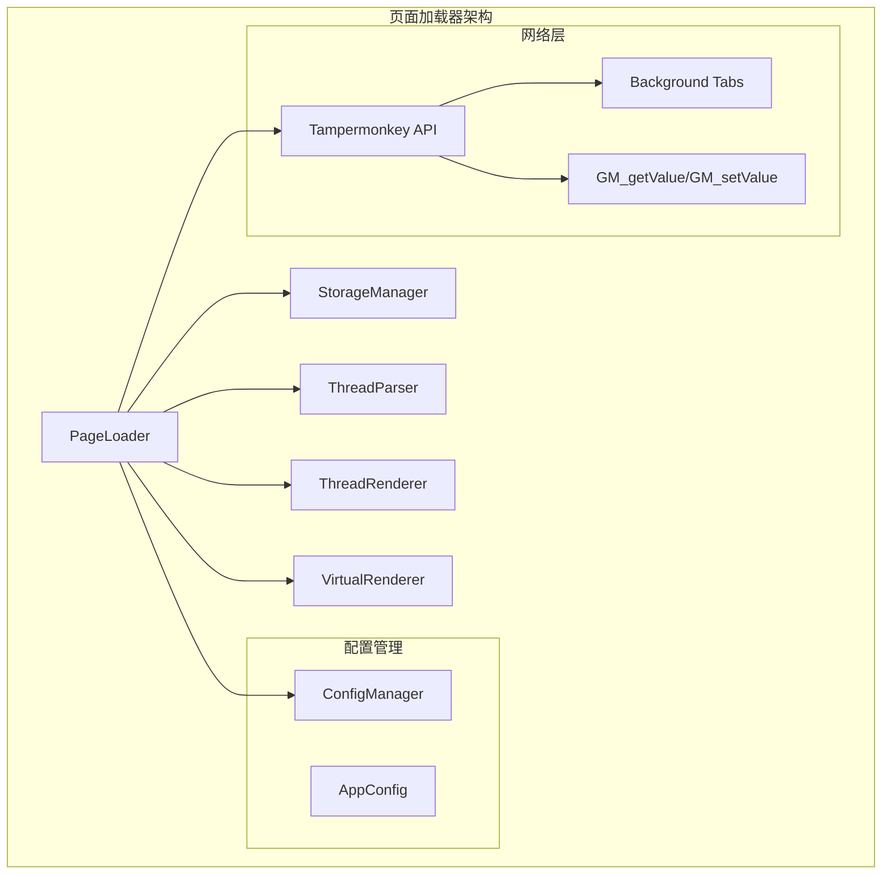

**图表来源**
- [page-loader.ts](file://src/core/page-loader.ts#L26-L53)
- [storage-manager.ts](file://src/storage/storage-manager.ts#L47-L91)
- [config.ts](file://src/storage/config.ts#L26-L43)

**章节来源**
- [page-loader.ts](file://src/core/page-loader.ts#L1-L590)
- [storage-manager.ts](file://src/storage/storage-manager.ts#L1-L596)

## 核心组件分析

### PageLoader类结构

PageLoader采用面向对象的设计模式，封装了复杂的页面加载逻辑：

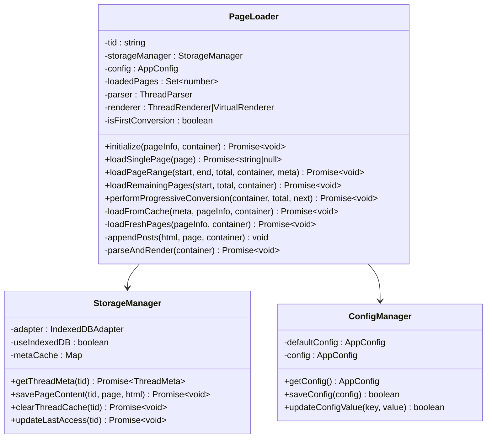

**图表来源**
- [page-loader.ts](file://src/core/page-loader.ts#L26-L53)
- [storage-manager.ts](file://src/storage/storage-manager.ts#L47-L91)
- [config.ts](file://src/storage/config.ts#L26-L43)

**章节来源**
- [page-loader.ts](file://src/core/page-loader.ts#L26-L590)
- [storage-manager.ts](file://src/storage/storage-manager.ts#L47-L596)

## 网络优化策略

### 并发加载机制

PageLoader的核心创新在于其基于Tampermonkey的并发加载策略：

#### loadSinglePage方法的实现原理

loadSinglePage方法是整个并发加载系统的核心，它利用GM_openInTab API在后台标签页中并发加载页面：

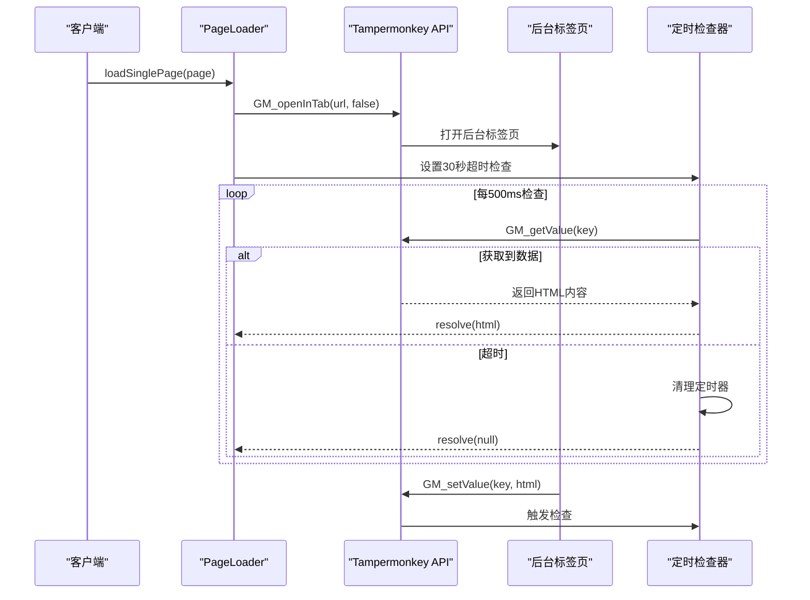

**图表来源**
- [page-loader.ts](file://src/core/page-loader.ts#L313-L335)
- [index.d.ts](file://src/types/index.d.ts#L77-L83)

#### 关键优化特性

1. **30秒超时保护机制**：防止单个页面加载阻塞整个流程
2. **非阻塞式检查**：每500ms轮询检查，平衡响应性和资源消耗
3. **自动清理机制**：成功获取数据后自动清理临时存储

**章节来源**
- [page-loader.ts](file://src/core/page-loader.ts#L313-L335)

### 页面加载间隔控制

pageLoadInterval配置项在连续页面加载间插入1000ms的间隔，这是防止对NGA服务器造成过大压力的关键策略：

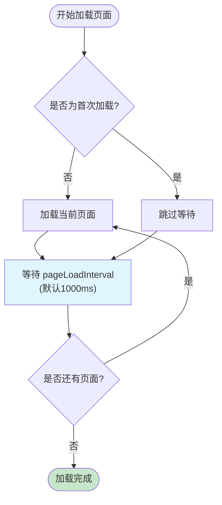

**图表来源**
- [page-loader.ts](file://src/core/page-loader.ts#L250-L253)
- [config.ts](file://src/storage/config.ts#L31)

#### 配置参数详解

| 参数名 | 默认值 | 取值范围 | 作用说明 |
|--------|--------|----------|----------|
| initialLoadPages | 5 | 1-50 | 达到此页数后立即开始转换展示 |
| preloadPages | 10 | 0-100 | 转换展示后继续后台加载的页数 |
| pageLoadInterval | 1000 | 0-5000 | 页面加载间隔（毫秒） |
| cacheExpireTime | 86400000 | -1/0-31536000000 | 缓存过期时间（毫秒） |

**章节来源**
- [config.ts](file://src/storage/config.ts#L28-L43)
- [config-panel.ts](file://src/ui/config-panel.ts#L81-L321)

## 页面加载机制

### 渐进式加载策略

PageLoader实现了三层加载策略，确保用户能够快速看到内容，同时后台持续补充完整数据：

#### 初始加载阶段

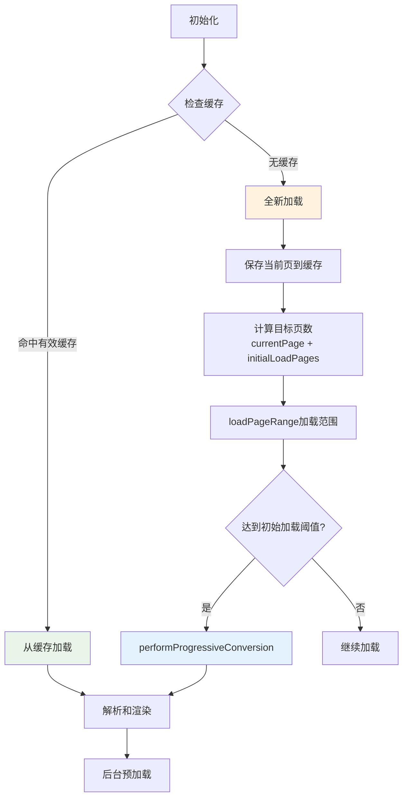

**图表来源**
- [page-loader.ts](file://src/core/page-loader.ts#L62-L80)
- [page-loader.ts](file://src/core/page-loader.ts#L165-L228)

#### 后台预加载机制

loadRemainingPages方法负责在初始加载完成后继续加载剩余页面：

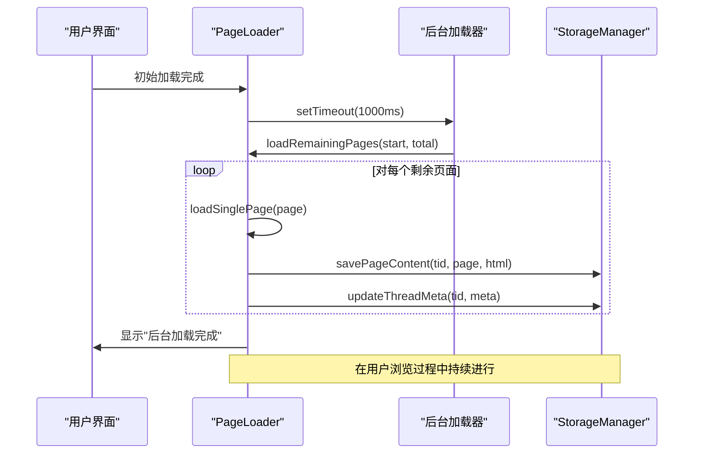

**图表来源**
- [page-loader.ts](file://src/core/page-loader.ts#L443-L479)

**章节来源**
- [page-loader.ts](file://src/core/page-loader.ts#L62-L228)
- [page-loader.ts](file://src/core/page-loader.ts#L443-L479)

### 缓存策略优化

PageLoader实现了多层次的缓存策略，包括内存缓存、本地存储和IndexedDB：

#### 缓存生命周期管理

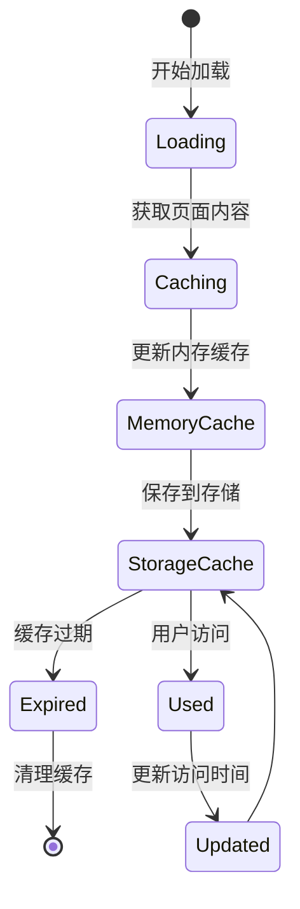

**图表来源**
- [storage-manager.ts](file://src/storage/storage-manager.ts#L175-L240)
- [storage-manager.ts](file://src/storage/storage-manager.ts#L570-L579)

**章节来源**
- [storage-manager.ts](file://src/storage/storage-manager.ts#L175-L240)
- [storage-manager.ts](file://src/storage/storage-manager.ts#L570-L579)

## 缓存与存储优化

### 存储适配器架构

StorageManager提供了统一的存储接口，自动选择最适合的存储方案：

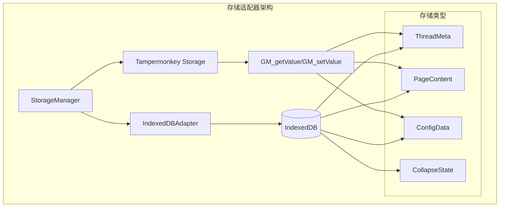

**图表来源**
- [storage-manager.ts](file://src/storage/storage-manager.ts#L47-L91)

### 缓存清理策略

PageLoader实现了智能的缓存清理机制，防止存储空间被过度占用：

#### LRU缓存清理算法

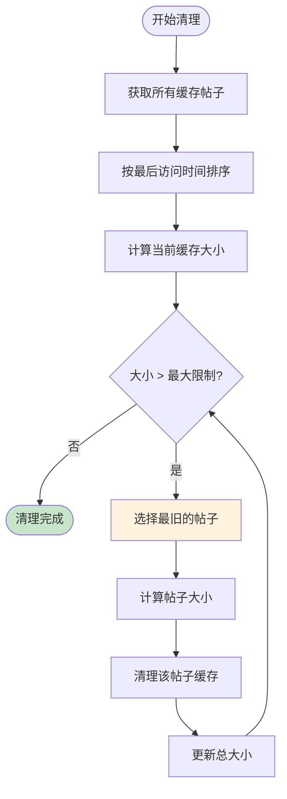

**图表来源**
- [storage-manager.ts](file://src/storage/storage-manager.ts#L463-L499)

**章节来源**
- [storage-manager.ts](file://src/storage/storage-manager.ts#L463-L499)

## 性能监控与调优

### 性能测量工具

PageLoader集成了全面的性能监控体系，包括执行时间测量、内存使用监控等：

#### 性能测量机制

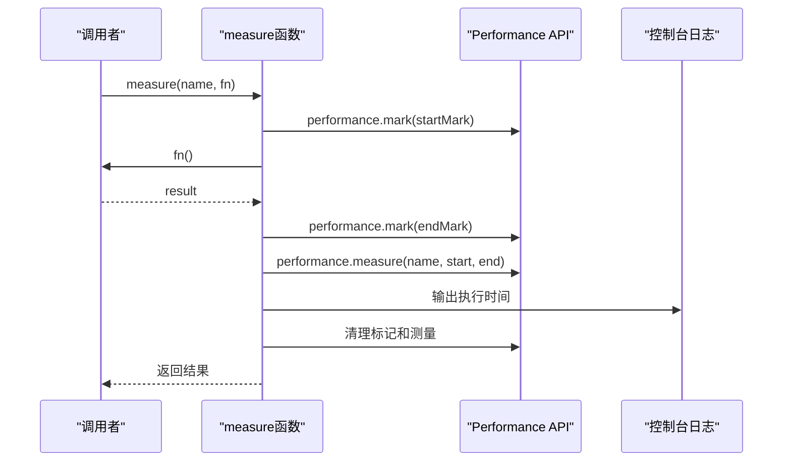

**图表来源**
- [performance.ts](file://src/utils/performance.ts#L9-L32)

#### 关键性能指标

| 指标类型 | 测量方法 | 用途说明 |
|----------|----------|----------|
| 加载时间 | measure() | 监控页面加载耗时 |
| 渲染时间 | performance.mark() | 监控DOM渲染性能 |
| 内存使用 | performance.memory | 监控JavaScript堆内存 |
| 缓存命中率 | 缓存统计 | 评估缓存效果 |

**章节来源**
- [performance.ts](file://src/utils/performance.ts#L9-L32)
- [performance.ts](file://src/utils/performance.ts#L350-L375)

### 虚拟滚动优化

PageLoader支持虚拟滚动功能，显著提升大数据量场景下的性能：

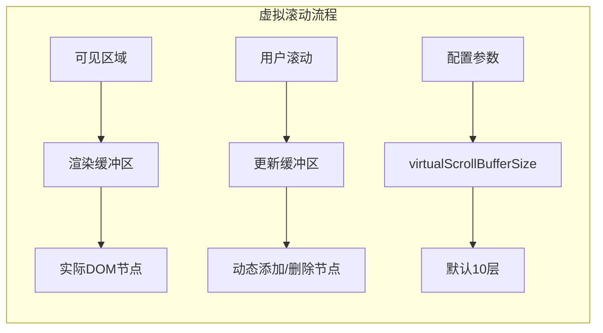

**图表来源**
- [config.ts](file://src/storage/config.ts#L42)

**章节来源**
- [config.ts](file://src/storage/config.ts#L41-L43)

## 故障排除指南

### 常见问题诊断

#### 页面加载超时问题

当遇到页面加载超时的情况时，可以按照以下步骤排查：

1. **检查网络连接**：确认浏览器能够正常访问NGA网站
2. **调整超时设置**：增加timeout参数值（目前固定为30秒）
3. **查看后台标签页**：检查Tampermonkey是否正确打开了后台标签页
4. **监控存储空间**：确保GM存储没有达到上限

#### 缓存失效问题

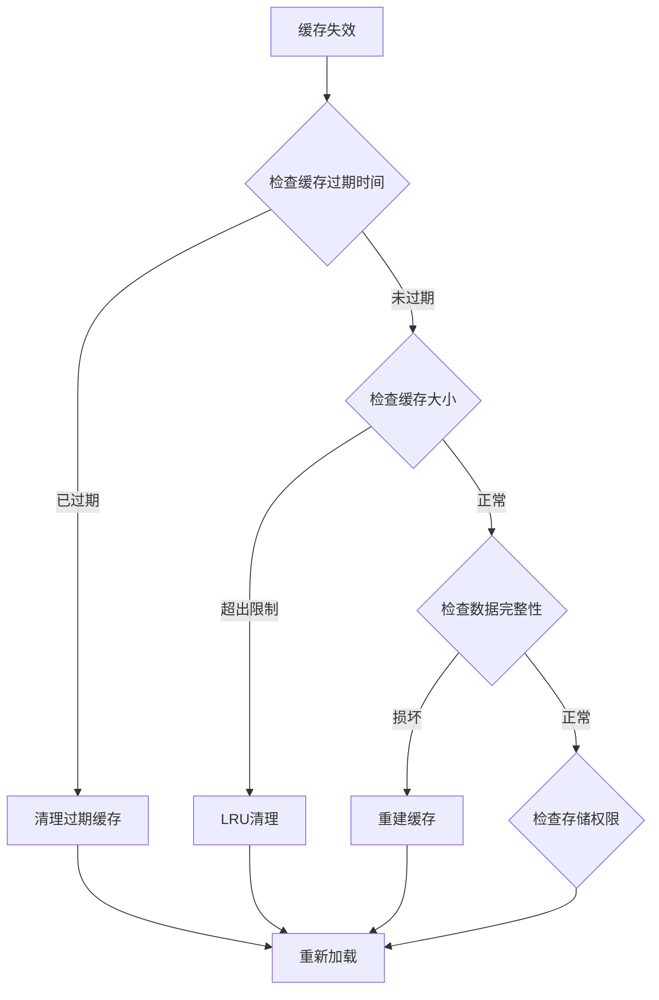

**图表来源**
- [storage-manager.ts](file://src/storage/storage-manager.ts#L463-L499)

### 性能优化建议

1. **合理配置加载参数**：
   - 根据网络状况调整initialLoadPages
   - 在移动设备上适当减少preloadPages

2. **监控存储使用**：
   - 定期清理过期缓存
   - 监控缓存命中率

3. **优化渲染策略**：
   - 启用虚拟滚动处理大数据
   - 合理设置缓冲区大小

**章节来源**
- [storage-manager.ts](file://src/storage/storage-manager.ts#L463-L499)

## 总结

PageLoader通过创新的网络优化策略，成功解决了大规模页面数据加载的技术挑战。其核心优势包括：

1. **并发加载机制**：利用Tampermonkey API实现高效的后台并发加载
2. **智能缓存策略**：多层次缓存结合LRU清理算法，最大化缓存效率
3. **渐进式渲染**：确保用户快速获得内容，同时后台持续完善数据
4. **自适应优化**：根据配置参数和运行环境自动调整加载策略
5. **完善的监控体系**：提供全面的性能监控和故障诊断能力

这些技术的综合应用，使得NGA楼中楼脚本能够在保持良好用户体验的同时，实现高性能的数据处理能力，为类似项目的开发提供了宝贵的参考价值。