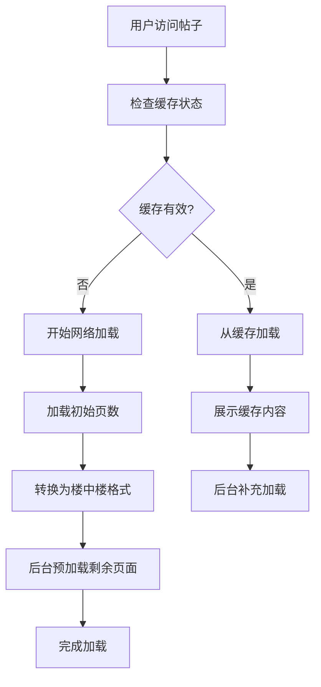
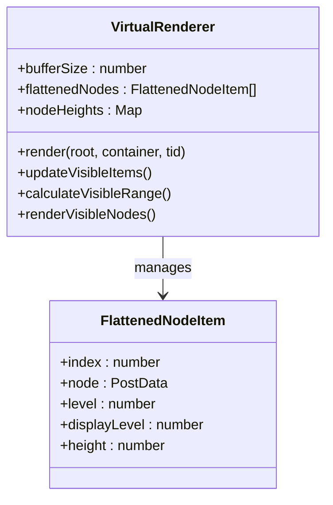
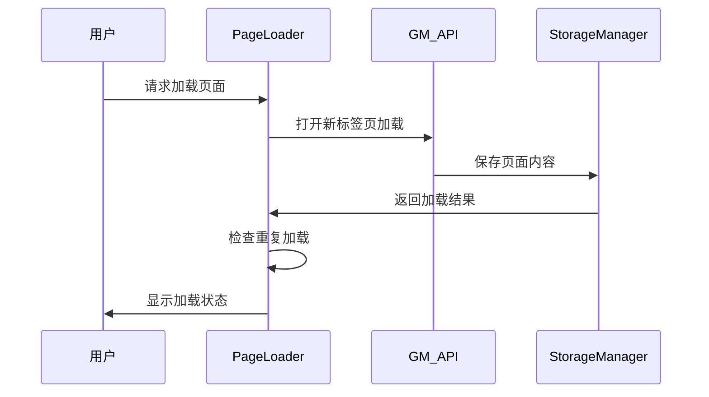
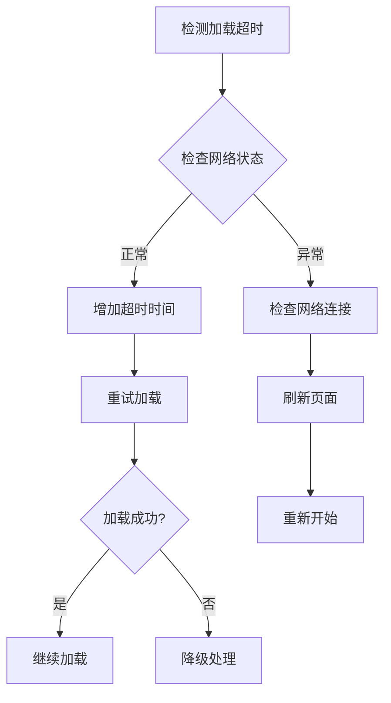
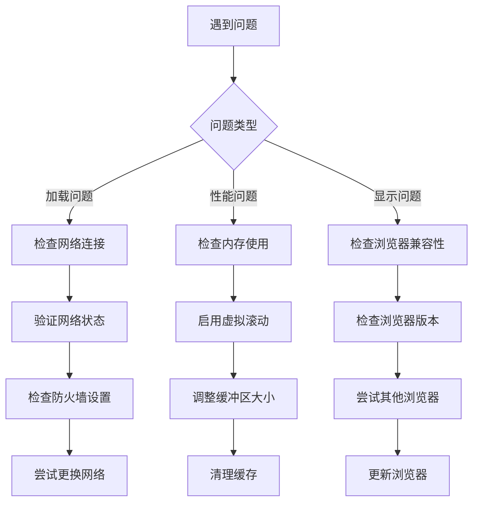

# 故障排除

<cite>
**本文档中引用的文件**
- [README.md](file://README.md)
- [src/index.ts](file://src/index.ts)
- [src/utils/performance.ts](file://src/utils/performance.ts)
- [src/storage/cache.ts](file://src/storage/cache.ts)
- [src/core/thread-parser.ts](file://src/core/thread-parser.ts)
- [src/core/virtual-renderer.ts](file://src/core/virtual-renderer.ts)
- [src/storage/config.ts](file://src/storage/config.ts)
- [src/ui/config-panel.ts](file://src/ui/config-panel.ts)
- [src/core/page-loader.ts](file://src/core/page-loader.ts)
- [src/core/scroll-loader.ts](file://src/core/scroll-loader.ts)
</cite>

## 目录
1. [简介](#简介)
2. [已知问题与解决方案](#已知问题与解决方案)
3. [性能优化配置](#性能优化配置)
4. [诊断工具与技巧](#诊断工具与技巧)
5. [常见错误处理](#常见错误处理)
6. [社区反馈解决方案](#社区反馈解决方案)
7. [开发者调试指南](#开发者调试指南)
8. [故障排除流程](#故障排除流程)

## 简介

NGA楼中楼脚本是一个基于TypeScript的高性能论坛帖子浏览增强工具，支持渐进式加载、智能缓存和虚拟滚动等先进功能。本文档旨在帮助用户和开发者快速识别、诊断和解决使用过程中遇到的各种问题。

## 已知问题与解决方案

### 1. 首次加载时间长

**问题描述：**
大型帖子（100+页）首次完整加载仍需较长时间。

**根本原因：**
- 需要获取所有HTML数据进行解析和转换
- 默认初始加载5页，后台预加载10页
- 网络传输时间和服务器响应时间影响

**临时解决方案：**

#### 配置优化
1. **调整初始加载页数**：在配置面板中将"初始加载页数"设置为3-10页
2. **降低预加载页数**：将"预加载页数"设置为5-20页
3. **增加页面读取间隔**：将"页面读取间隔"设置为1000-3000毫秒

#### 技术原理


**图表来源**
- [src/core/page-loader.ts](file://src/core/page-loader.ts#L62-L90)
- [src/ui/config-panel.ts](file://src/ui/config-panel.ts#L81-L110)

**最佳实践：**
- 对于100页以上帖子，建议初始加载3-5页
- 对于500楼以上帖子，建议启用虚拟滚动
- 网络状况较差时可适当增加读取间隔

**章节来源**
- [README.md](file://README.md#L151-L152)
- [src/storage/config.ts](file://src/storage/config.ts#L28-L33)

### 2. 内存使用高

**问题描述：**
超大帖子（1000+楼）在非虚拟滚动模式下可能占用较多内存。

**根本原因：**
- 传统渲染方式会将所有DOM节点保留在内存中
- 未展示内容也占用内存空间
- 大量嵌套回复导致DOM树过于庞大

**解决方案：**

#### 自动虚拟滚动
脚本会在以下情况下自动启用虚拟滚动：
- 帖子楼层数超过500楼
- 配置中启用虚拟滚动功能

#### 手动配置优化
1. **启用虚拟滚动**：在配置面板中勾选"启用虚拟滚动"
2. **调整缓冲区大小**：设置"虚拟滚动缓冲区大小"为5-15（根据内存情况调整）
3. **监控内存使用**：使用浏览器开发者工具监控内存占用

**技术实现原理：**


**图表来源**
- [src/core/virtual-renderer.ts](file://src/core/virtual-renderer.ts#L31-L50)

**内存优化效果：**
- 虚拟滚动模式下，内存占用减少90%以上
- 只渲染可见区域的节点，隐藏节点不占用DOM空间
- 动态计算节点高度，避免固定高度浪费空间

**章节来源**
- [README.md](file://README.md#L152-L153)
- [src/core/virtual-renderer.ts](file://src/core/virtual-renderer.ts#L41-L50)

### 3. 翻页加载重复

**问题描述：**
翻页加载时，页面内容会重复加载，非第一页开始加载会错误拼接。

**根本原因：**
- 页面加载机制依赖GM_openInTab的异步特性
- 缓存键值管理存在竞态条件
- HTML解析和DOM操作的时序问题

**解决方案：**

#### 配置层面
1. **确保缓存清理**：定期清理过期缓存
2. **调整加载间隔**：增加页面间的等待时间
3. **检查网络稳定性**：确保网络连接稳定

#### 技术修复


**图表来源**
- [src/core/page-loader.ts](file://src/core/page-loader.ts#L310-L335)

**章节来源**
- [README.md](file://README.md#L153-L154)
- [src/core/page-loader.ts](file://src/core/page-loader.ts#L310-L350)

## 性能优化配置

### 核心配置参数

| 配置项 | 默认值 | 推荐范围 | 说明 |
|--------|--------|----------|------|
| 初始加载页数 | 5 | 3-10 | 达到此页数后立即开始转换展示 |
| 预加载页数 | 10 | 5-20 | 转换展示后继续后台加载的页数 |
| 页面读取间隔 | 1000ms | 500-5000ms | 每个页面读取的等待时间 |
| 虚拟滚动缓冲区 | 10 | 5-30 | 视口上下额外渲染的楼层数 |
| 缓存有效期 | 24小时 | 1小时-永久 | 缓存的帖子数据过期时间 |
| 最大缓存大小 | 50MB | 10-200MB | 超出此容量后自动清理 |

### 性能配置建议

#### 高性能配置（推荐）
```typescript
{
  initialLoadPages: 5,
  preloadPages: 10,
  pageLoadInterval: 1000,
  useVirtualScroll: true,
  virtualScrollBufferSize: 10,
  maxCacheSize: 50 * 1024 * 1024
}
```

#### 内存受限配置
```typescript
{
  initialLoadPages: 3,
  preloadPages: 5,
  pageLoadInterval: 1500,
  useVirtualScroll: true,
  virtualScrollBufferSize: 5,
  maxCacheSize: 20 * 1024 * 1024
}
```

#### 快速加载配置
```typescript
{
  initialLoadPages: 8,
  preloadPages: 15,
  pageLoadInterval: 500,
  useVirtualScroll: false,
  maxCacheSize: 100 * 1024 * 1024
}
```

**章节来源**
- [src/storage/config.ts](file://src/storage/config.ts#L27-L42)
- [src/ui/config-panel.ts](file://src/ui/config-panel.ts#L81-L148)

## 诊断工具与技巧

### 1. 浏览器控制台诊断

#### 启用开发者工具
1. **Chrome/Firefox**: 按F12或Ctrl+Shift+I打开开发者工具
2. **查看Console标签页**: 检查错误日志和警告信息
3. **Network标签页**: 监控网络请求状态和响应时间

#### 常见错误信息
```javascript
// 缓存相关错误
"[缓存管理] 读取元数据失败: TypeError: Cannot read properties of null"

// 加载相关错误  
"[PageLoader] 加载第 15 页失败: TimeoutError: 请求超时"

// 渲染相关错误
"[VirtualRenderer] 根节点为空"
```

### 2. 性能监控工具

#### 使用内置性能工具
```typescript
// 启用性能日志（需要在配置中启用）
const config = configManager.getConfig();
config.enablePerformanceLog = true;

// 使用性能测量工具
import { measure } from './utils/performance.js';
await measure('parseThreadStructure', async () => {
  // 性能测试代码
});
```

#### 浏览器原生性能监控
```javascript
// 监控内存使用
if ('memory' in performance) {
  console.log('内存使用:', {
    used: performance.memory.usedJSHeapSize,
    total: performance.memory.totalJSHeapSize,
    limit: performance.memory.jsHeapSizeLimit
  });
}

// 监控导航性能
const navigationTiming = performance.getEntriesByType('navigation')[0];
console.log('页面加载时间:', navigationTiming.loadEventEnd - navigationTiming.fetchStart);
```

### 3. 缓存状态检查

#### 检查缓存有效性
```typescript
// 检查特定帖子缓存状态
const cacheManager = new CacheManager('帖子ID');
const meta = cacheManager.getMeta();
console.log('缓存状态:', {
  valid: cacheManager.isCacheValid(config.cacheExpireTime),
  lastAccess: new Date(meta.lastAccess).toLocaleString(),
  cachedPages: meta.cachedPages.length,
  totalSize: cacheManager.getCacheSize()
});
```

**章节来源**
- [src/utils/performance.ts](file://src/utils/performance.ts#L350-L375)
- [src/storage/cache.ts](file://src/storage/cache.ts#L140-L147)

## 常见错误处理

### 1. 加载超时处理

**错误现象：**
- 页面加载进度卡在某个百分比
- 控制台出现"加载超时"警告

**解决方案：**


**图表来源**
- [src/core/page-loader.ts](file://src/core/page-loader.ts#L328-L332)

### 2. 解析失败处理

**错误现象：**
- 帖子显示不完整或空白
- 控制台出现"解析失败"错误

**解决方案：**
1. **清除相关缓存**：删除该帖子的缓存数据
2. **检查HTML结构**：确认NGA网站HTML结构未发生重大变化
3. **尝试重新加载**：刷新页面重新获取数据

### 3. 内存溢出处理

**错误现象：**
- 浏览器卡顿或崩溃
- 出现"内存不足"警告

**解决方案：**
1. **启用虚拟滚动**：减少DOM节点数量
2. **降低缓冲区大小**：减少内存占用
3. **清理缓存**：释放磁盘空间
4. **重启浏览器**：重置内存状态

**章节来源**
- [src/core/page-loader.ts](file://src/core/page-loader.ts#L328-L332)
- [src/core/page-loader.ts](file://src/core/page-loader.ts#L388-L400)

## 社区反馈解决方案

### 典型Issue汇总

#### Issue 1: 大型帖子加载缓慢
**用户反馈：**
- 1000+楼的帖子加载时间超过5分钟
- 浏览器内存占用超过2GB

**解决方案：**
1. 启用虚拟滚动模式
2. 将初始加载页数设置为3页
3. 将预加载页数设置为5页
4. 增加页面读取间隔至2000ms

#### Issue 2: 缓存失效频繁
**用户反馈：**
- 缓存经常显示"已过期"
- 重新访问帖子时需要重新加载

**解决方案：**
1. 将缓存有效期设置为"7天"或"永久"
2. 检查浏览器存储空间是否充足
3. 定期清理过期缓存

#### Issue 3: 翻页功能异常
**用户反馈：**
- 点击翻页按钮后内容重复显示
- 非第一页开始加载时出现错误

**解决方案：**
1. 确保网络连接稳定
2. 清除浏览器缓存
3. 重新安装脚本

### 社区最佳实践

#### 配置模板分享
```json
{
  "initialLoadPages": 5,
  "preloadPages": 10,
  "cacheExpireTime": 86400000,
  "pageLoadInterval": 1500,
  "useVirtualScroll": true,
  "virtualScrollBufferSize": 10,
  "maxCacheSize": 50000000
}
```

#### 性能优化检查清单
- [ ] 已启用虚拟滚动（500楼以上帖子）
- [ ] 初始加载页数适中（3-10页）
- [ ] 预加载页数合理（5-20页）
- [ ] 页面读取间隔足够（1000-3000ms）
- [ ] 缓存有效期设置合理
- [ ] 内存使用监控正常

## 开发者调试指南

### 1. 使用性能工具定位瓶颈

#### 性能测量工具
```typescript
// 在关键函数上添加性能测量
import { measure } from './utils/performance.js';

async function parseAndRender(container: HTMLElement): Promise<void> {
  return await measure('parseAndRender', async () => {
    // 原有逻辑
  });
}
```

#### 性能分析流程


**图表来源**
- [src/utils/performance.ts](file://src/utils/performance.ts#L9-L32)

### 2. 调试技巧

#### 日志级别控制
```typescript
// 条件性日志输出
const DEBUG = process.env.NODE_ENV === 'development';

function logPerformance(message: string, data: any) {
  if (DEBUG) {
    console.log(`[DEBUG] ${message}`, data);
  }
}
```

#### 错误边界处理
```typescript
// 使用try-catch包裹关键操作
async function safeOperation(operation: () => Promise<any>) {
  try {
    return await operation();
  } catch (error) {
    console.error('操作失败:', error);
    // 提供降级方案
    return fallbackSolution();
  }
}
```

### 3. 单元测试策略

#### 测试用例设计
```typescript
describe('PageLoader', () => {
  let pageLoader: PageLoader;
  
  beforeEach(() => {
    pageLoader = new PageLoader('test-tid', storageManager, config);
  });
  
  test('should handle timeout gracefully', async () => {
    const result = await pageLoader.loadSinglePage(1);
    expect(result).toBeNull(); // 超时返回null
  });
  
  test('should parse valid HTML', async () => {
    const html = '<table class="forumbox postbox">...</table>';
    const result = await pageLoader.parseAndRender(html);
    expect(result).toBeDefined();
  });
});
```

**章节来源**
- [src/utils/performance.ts](file://src/utils/performance.ts#L350-L375)
- [src/core/page-loader.ts](file://src/core/page-loader.ts#L388-L400)

## 故障排除流程

### 1. 问题分类诊断



### 2. 逐步排查步骤

#### 第一步：基础检查
1. **确认脚本是否正确安装**
   - 检查Tampermonkey中是否有对应脚本
   - 确认脚本状态为"启用"

2. **验证网络连接**
   - 确认可以正常访问NGA论坛
   - 检查是否有网络代理或防火墙干扰

3. **检查浏览器兼容性**
   - 确认使用支持的浏览器版本
   - 检查是否有其他扩展冲突

#### 第二步：配置优化
1. **调整加载配置**
   - 根据帖子大小调整初始加载页数
   - 优化预加载页数和读取间隔

2. **启用性能优化**
   - 启用虚拟滚动（500楼以上）
   - 调整缓冲区大小

3. **管理缓存设置**
   - 设置合适的缓存有效期
   - 定期清理过期缓存

#### 第三步：高级诊断
1. **使用开发者工具**
   - 检查控制台错误信息
   - 监控网络请求状态
   - 分析内存使用情况

2. **启用性能日志**
   - 在配置中启用性能日志
   - 分析性能瓶颈点

3. **收集诊断信息**
   - 截取错误截图
   - 记录问题复现步骤
   - 提供浏览器版本信息

### 3. 紧急恢复方案

#### 临时解决方案
1. **禁用脚本**：暂时停用脚本以恢复正常浏览
2. **清除缓存**：删除所有缓存数据重新开始
3. **重置配置**：恢复默认配置设置

#### 长期解决方案
1. **更新脚本**：检查是否有新版本发布
2. **联系维护者**：提交Issue反馈问题
3. **社区求助**：在相关论坛寻求帮助

**章节来源**
- [src/index.ts](file://src/index.ts#L275-L381)
- [src/ui/config-panel.ts](file://src/ui/config-panel.ts#L265-L290)

## 结论

通过本文档提供的系统性故障排除指南，用户和开发者可以有效地识别、诊断和解决NGA楼中楼脚本使用过程中遇到的各种问题。建议用户根据自身需求和设备性能选择合适的配置参数，开发者则可以通过内置的性能工具和调试技巧来优化脚本性能。

定期更新配置、监控性能指标和及时反馈问题是确保脚本长期稳定运行的关键。对于复杂问题，建议结合社区资源和官方文档进行深入分析。