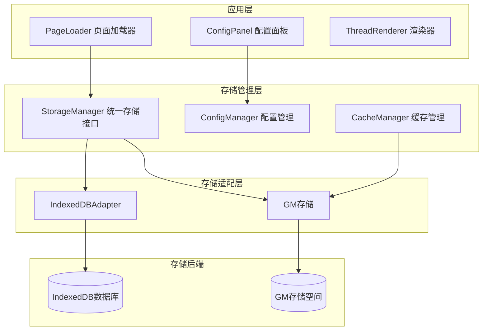
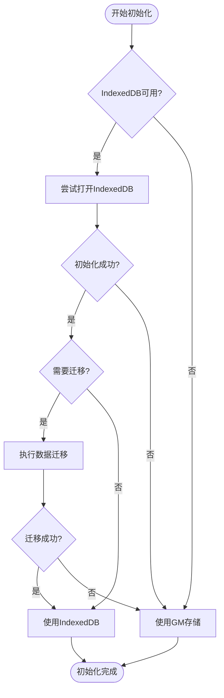
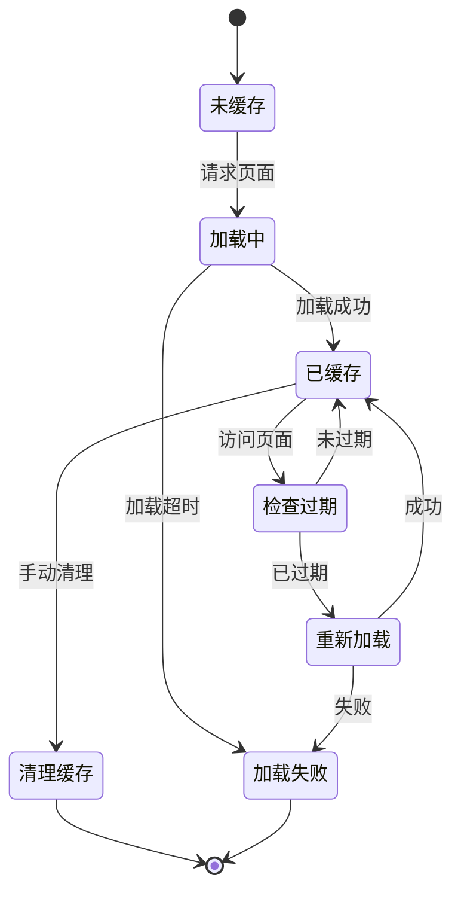
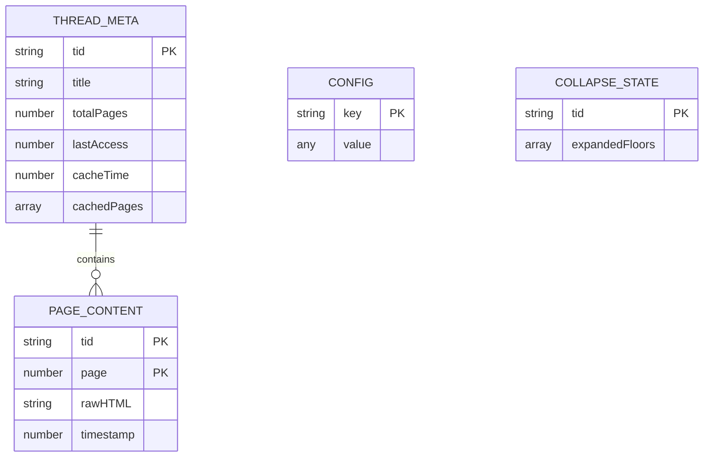
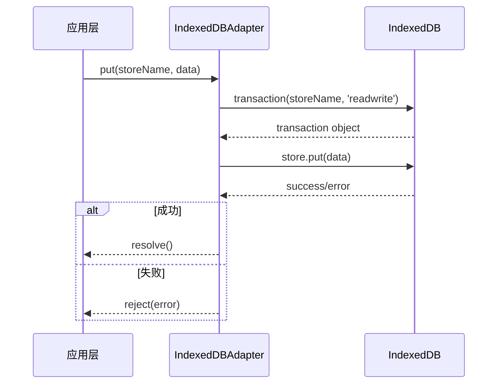
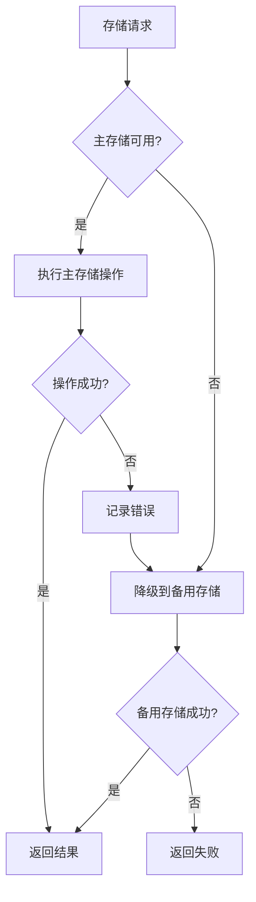

# 存储架构

<cite>
**本文档引用的文件**
- [storage-manager.ts](file://src/storage/storage-manager.ts)
- [cache.ts](file://src/storage/cache.ts)
- [config.ts](file://src/storage/config.ts)
- [indexeddb-adapter.ts](file://src/storage/indexeddb-adapter.ts)
- [page-loader.ts](file://src/core/page-loader.ts)
- [index.d.ts](file://src/types/index.d.ts)
- [CLAUDE.md](file://CLAUDE.md)
</cite>

## 目录
1. [简介](#简介)
2. [存储架构概览](#存储架构概览)
3. [StorageManager统一存储接口](#storagemanager统一存储接口)
4. [缓存管理系统](#缓存管理系统)
5. [配置管理](#配置管理)
6. [IndexedDB适配器](#indexeddb适配器)
7. [缓存键命名规范](#缓存键命名规范)
8. [存储策略与性能优化](#存储策略与性能优化)
9. [故障转移机制](#故障转移机制)
10. [最佳实践建议](#最佳实践建议)

## 简介

NGA嵌套回复扩展采用了基于GM存储和IndexedDB的混合持久化方案，通过StorageManager作为统一接口抽象底层存储机制，实现了灵活的数据存储和高效的缓存管理。该架构支持无缝切换存储后端，同时提供了完善的数据迁移、过期管理和性能优化功能。

## 存储架构概览

系统采用分层存储架构，主要包含以下组件：



**图表来源**
- [storage-manager.ts](file://src/storage/storage-manager.ts#L47-L95)
- [indexeddb-adapter.ts](file://src/storage/indexeddb-adapter.ts#L12-L50)

**章节来源**
- [storage-manager.ts](file://src/storage/storage-manager.ts#L47-L95)
- [CLAUDE.md](file://CLAUDE.md#L84-L97)

## StorageManager统一存储接口

StorageManager是整个存储架构的核心组件，负责统一管理GM存储和IndexedDB两种存储后端，提供一致的API接口。

### 核心特性

1. **自动降级机制**：优先使用IndexedDB，失败时自动降级到GM存储
2. **数据迁移**：支持从GM存储向IndexedDB的平滑迁移
3. **内存缓存**：对频繁访问的元数据进行内存缓存
4. **透明切换**：上层应用无需关心底层存储实现

### 存储初始化流程



**图表来源**
- [storage-manager.ts](file://src/storage/storage-manager.ts#L56-L90)

### 主要存储操作

StorageManager提供了以下核心存储操作：

| 操作类型 | 方法名 | 描述 | 存储位置 |
|---------|--------|------|----------|
| 线程元数据 | `getThreadMeta()` / `saveThreadMeta()` | 存储帖子基本信息和缓存状态 | thread_meta表 |
| 页面内容 | `getPageContent()` / `savePageContent()` | 存储页面HTML内容和时间戳 | page_content表 |
| 配置数据 | `getConfig()` / `saveConfig()` | 存储用户配置和全局设置 | config表 |
| 折叠状态 | `getCollapseState()` / `saveCollapseState()` | 存储回复折叠状态 | collapse_state表 |

**章节来源**
- [storage-manager.ts](file://src/storage/storage-manager.ts#L175-L586)

## 缓存管理系统

缓存管理系统负责管理主题元数据、页面内容和折叠状态，采用基于时间戳的缓存过期策略，默认24小时过期。

### 缓存数据结构

#### 主题元数据结构

```typescript
interface ThreadMeta {
  tid: string;           // 帖子ID
  title?: string;        // 帖子标题
  totalPages?: number;   // 总页数
  lastAccess: number;    // 最后访问时间戳
  cacheTime: number;     // 缓存创建时间戳
  cachedPages?: number[];// 已缓存的页面列表
}
```

#### 页面内容结构

```typescript
interface PageContent {
  tid: string;           // 帖子ID
  page: number;          // 页面编号
  rawHTML: string;       // 原始HTML内容
  timestamp: number;     // 时间戳
}
```

### 缓存生命周期管理



**图表来源**
- [cache.ts](file://src/storage/cache.ts#L140-L147)
- [page-loader.ts](file://src/core/page-loader.ts#L82-L90)

### 缓存清理策略

系统实现了智能的缓存清理机制：

1. **容量限制**：当缓存总大小超过配置的最大缓存容量时自动清理
2. **时间过期**：基于最后访问时间的LRU清理策略
3. **手动清理**：用户可通过配置面板手动清理特定帖子缓存

**章节来源**
- [cache.ts](file://src/storage/cache.ts#L230-L284)
- [storage-manager.ts](file://src/storage/storage-manager.ts#L460-L500)

## 配置管理

配置管理系统负责存储和管理用户的个性化设置，包括加载策略、缓存设置和性能参数。

### 配置项详解

| 配置项 | 默认值 | 描述 | 影响范围 |
|--------|--------|------|----------|
| initialLoadPages | 5 | 初始加载的页面数量 | 页面加载速度 |
| preloadPages | 10 | 预加载的页面数量 | 后台加载效率 |
| cacheExpireTime | 86400000 | 缓存过期时间（毫秒） | 缓存更新频率 |
| pageLoadInterval | 1000 | 页面加载间隔（毫秒） | 避免请求过载 |
| maxCacheSize | 52428800 | 最大缓存大小（字节） | 内存使用控制 |
| useVirtualScroll | true | 是否启用虚拟滚动 | 大主题性能 |

### 配置持久化

配置数据存储在GM存储中，键名为`NGA_THREAD_CONFIG`，采用JSON序列化存储：

```typescript
// 配置数据结构示例
{
  "initialLoadPages": 5,
  "preloadPages": 10,
  "cacheExpireTime": 86400000,
  "pageLoadInterval": 1000,
  "maxCacheSize": 52428800,
  "useVirtualScroll": true
}
```

**章节来源**
- [config.ts](file://src/storage/config.ts#L27-L43)
- [config.ts](file://src/storage/config.ts#L51-L104)

## IndexedDB适配器

IndexedDBAdapter封装了IndexedDB的操作，提供Promise风格的API，支持事务处理和批量操作。

### 数据库结构设计



**图表来源**
- [indexeddb-adapter.ts](file://src/storage/indexeddb-adapter.ts#L58-L95)

### 核心功能特性

1. **事务支持**：所有操作都在事务中执行，保证数据一致性
2. **批量操作**：支持批量写入以提高性能
3. **索引优化**：为常用查询字段建立索引
4. **异步API**：基于Promise的异步操作接口

### 事务处理流程



**图表来源**
- [indexeddb-adapter.ts](file://src/storage/indexeddb-adapter.ts#L117-L135)

**章节来源**
- [indexeddb-adapter.ts](file://src/storage/indexeddb-adapter.ts#L12-L348)

## 缓存键命名规范

系统采用统一的键命名规范来组织存储数据：

### 键命名规则

| 数据类型 | 命名格式 | 示例 | 用途 |
|----------|----------|------|------|
| 主题元数据 | `NGA_THREAD_META_{tid}` | `NGA_THREAD_META_123456` | 存储帖子基本信息 |
| 页面内容 | `NGA_PAGE_CONTENT_{tid}_{page}` | `NGA_PAGE_CONTENT_123456_1` | 存储页面HTML内容 |
| 配置数据 | `NGA_THREAD_CONFIG` | `NGA_THREAD_CONFIG` | 存储全局配置 |
| 折叠状态 | `NGA_COLLAPSE_STATE_{tid}` | `NGA_COLLAPSE_STATE_123456` | 存储回复折叠状态 |
| 缓存索引 | `NGA_CACHE_INDEX` | `NGA_CACHE_INDEX` | 存储所有帖子ID列表 |

### 数据迁移兼容性

系统支持从旧版本的GM存储格式平滑迁移到新的IndexedDB格式，确保用户数据的连续性和完整性。

**章节来源**
- [storage-manager.ts](file://src/storage/storage-manager.ts#L106-L169)
- [cache.ts](file://src/storage/cache.ts#L43-L46)

## 存储策略与性能优化

### 页面加载间隔优化

为了避免对NGA服务器造成过大压力，系统实现了智能的页面加载间隔控制：

```typescript
// 推荐的页面加载间隔配置
const config = {
  pageLoadInterval: 1000, // 1秒间隔
  maxConcurrentRequests: 3 // 最大并发请求数
}
```

### 虚拟滚动优化

对于大主题（超过webWorkerParseThreshold阈值），系统自动启用虚拟滚动：

```typescript
// 虚拟滚动配置
const virtualScrollConfig = {
  useVirtualScroll: true,
  virtualScrollBufferSize: 10, // 视口上下额外渲染的楼层数
  incrementalRenderBatch: 3    // 增量渲染批次大小
}
```

### 内存管理策略

1. **懒加载**：只在需要时加载页面内容
2. **LRU清理**：基于访问频率的缓存清理
3. **分页加载**：避免一次性加载过多数据

**章节来源**
- [page-loader.ts](file://src/core/page-loader.ts#L250-L253)
- [config.ts](file://src/storage/config.ts#L36-L43)

## 故障转移机制

系统实现了完善的故障转移机制，确保在各种异常情况下的数据安全和服务可用性。

### 存储后端故障转移



**图表来源**
- [storage-manager.ts](file://src/storage/storage-manager.ts#L181-L195)
- [storage-manager.ts](file://src/storage/storage-manager.ts#L227-L237)

### 数据完整性保障

1. **双存储备份**：同时维护GM和IndexedDB两份数据副本
2. **原子操作**：使用事务确保数据一致性
3. **错误恢复**：自动检测和修复存储损坏

**章节来源**
- [storage-manager.ts](file://src/storage/storage-manager.ts#L175-L586)

## 最佳实践建议

### 性能优化建议

1. **合理设置pageLoadInterval**
   - 小主题：500-1000ms
   - 大主题：1000-2000ms
   - 避免设置过低导致请求被封禁

2. **优化缓存配置**
   ```typescript
   // 推荐的缓存配置
   const optimalConfig = {
     cacheExpireTime: 86400000,    // 24小时
     maxCacheSize: 104857600,      // 100MB
     preloadPages: 15,             // 预加载更多页面
     useVirtualScroll: true        // 大主题启用虚拟滚动
   }
   ```

3. **监控存储使用情况**
   - 定期检查缓存大小
   - 及时清理不需要的缓存
   - 监控存储性能指标

### 开发建议

1. **使用统一的存储接口**
   - 通过StorageManager访问所有存储功能
   - 避直接操作GM存储或IndexedDB

2. **处理存储异常**
   ```typescript
   try {
     await storageManager.saveThreadMeta(tid, meta);
   } catch (error) {
     console.warn('存储失败，使用备用方案');
     // 实现降级逻辑
   }
   ```

3. **优化数据结构**
   - 合理设计缓存键名
   - 使用适当的索引提高查询效率
   - 控制单条数据的大小

**章节来源**
- [config.ts](file://src/storage/config.ts#L27-L43)
- [page-loader.ts](file://src/core/page-loader.ts#L250-L253)