# 数据流

<cite>
**本文档中引用的文件**
- [src/index.ts](file://src/index.ts)
- [src/core/page-loader.ts](file://src/core/page-loader.ts)
- [src/core/thread-parser.ts](file://src/core/thread-parser.ts)
- [src/core/thread-renderer.ts](file://src/core/thread-renderer.ts)
- [src/core/scroll-loader.ts](file://src/core/scroll-loader.ts)
- [src/core/virtual-renderer.ts](file://src/core/virtual-renderer.ts)
- [src/ui/config-panel.ts](file://src/ui/config-panel.ts)
- [src/storage/config.ts](file://src/storage/config.ts)
- [src/storage/storage-manager.ts](file://src/storage/storage-manager.ts)
- [src/utils/performance.ts](file://src/utils/performance.ts)
- [src/types/index.d.ts](file://src/types/index.d.ts)
- [CLAUDE.md](file://CLAUDE.md)
</cite>

## 目录
1. [简介](#简介)
2. [项目架构概览](#项目架构概览)
3. [数据流核心组件](#数据流核心组件)
4. [完整执行路径分析](#完整执行路径分析)
5. [关键数据模型](#关键数据模型)
6. [错误处理机制](#错误处理机制)
7. [性能监控与优化](#性能监控与优化)
8. [用户交互响应流程](#用户交互响应流程)
9. [总结](#总结)

## 简介

NGA楼中楼脚本是一个复杂的用户脚本系统，专门用于将NGA论坛的平面主题结构转换为嵌套回复（楼中楼）视图。该项目采用模块化架构，通过精心设计的数据流实现了渐进式加载、智能缓存和高性能渲染三大核心功能。

本文档基于CLAUDE.md中定义的数据流基础，深入分析从脚本启动到最终渲染的完整执行路径，详细说明各个模块间的数据传递过程和关键算法实现。

## 项目架构概览

项目采用分层架构设计，主要包含以下核心层次：

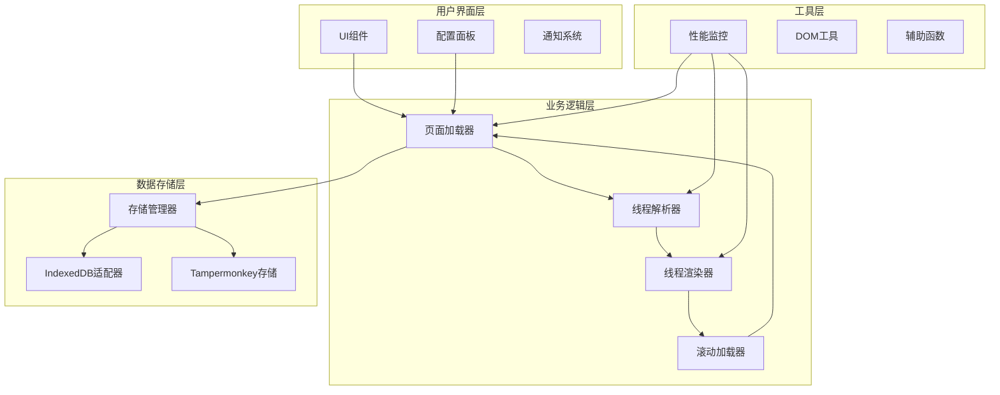

**图表来源**
- [src/index.ts](file://src/index.ts#L1-L50)
- [src/core/page-loader.ts](file://src/core/page-loader.ts#L1-L50)
- [src/storage/storage-manager.ts](file://src/storage/storage-manager.ts#L1-L50)

## 数据流核心组件

### 1. index.ts - 脚本入口与初始化

index.ts作为整个系统的入口点，负责检测主题并提取tid，同时协调各个子系统的初始化。

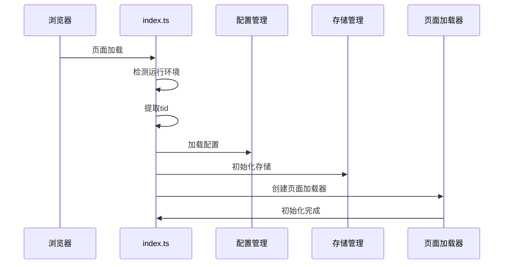

**图表来源**
- [src/index.ts](file://src/index.ts#L275-L381)

**章节来源**
- [src/index.ts](file://src/index.ts#L1-L381)

### 2. PageLoader - 多阶段加载协调器

PageLoader是整个数据流的核心协调器，管理三个关键加载阶段：初始加载、后台预加载和滚动加载。

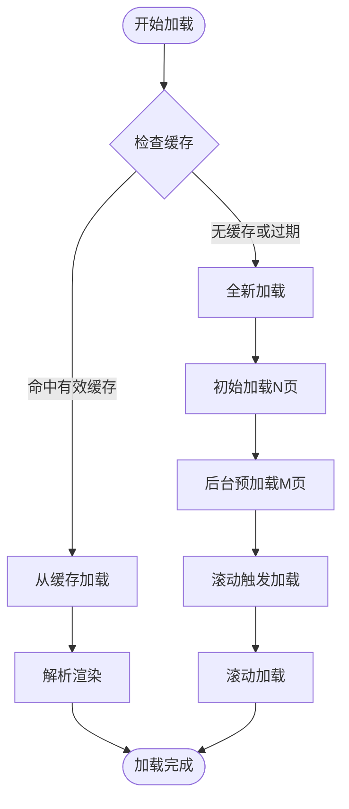

**图表来源**
- [src/core/page-loader.ts](file://src/core/page-loader.ts#L62-L80)
- [src/core/page-loader.ts](file://src/core/page-loader.ts#L168-L228)

**章节来源**
- [src/core/page-loader.ts](file://src/core/page-loader.ts#L1-L590)

### 3. ThreadParser - HTML解析器

ThreadParser负责从原始HTML中提取回复信息，构建具有父子关系的评论树结构。

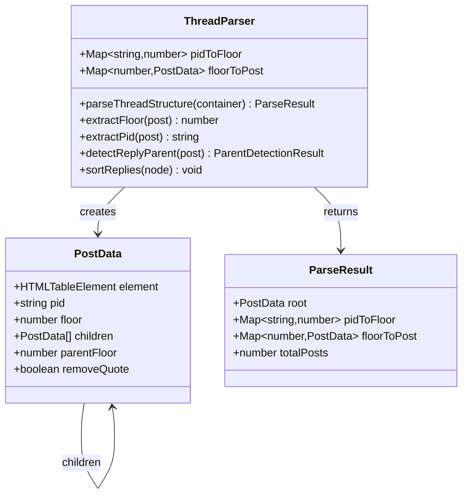

**图表来源**
- [src/core/thread-parser.ts](file://src/core/thread-parser.ts#L9-L26)
- [src/core/thread-parser.ts](file://src/core/thread-parser.ts#L40-L116)

**章节来源**
- [src/core/thread-parser.ts](file://src/core/thread-parser.ts#L1-L258)

### 4. Renderer - 渲染引擎

系统提供两种渲染模式：标准渲染器和虚拟渲染器，根据配置自动选择最适合的渲染方式。

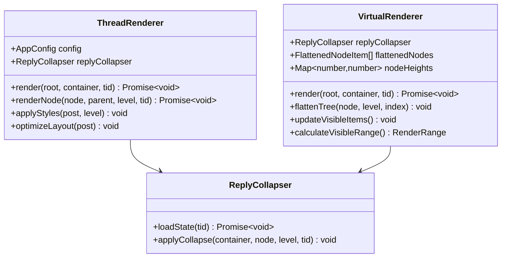

**图表来源**
- [src/core/thread-renderer.ts](file://src/core/thread-renderer.ts#L25-L62)
- [src/core/virtual-renderer.ts](file://src/core/virtual-renderer.ts#L43-L106)

**章节来源**
- [src/core/thread-renderer.ts](file://src/core/thread-renderer.ts#L1-L266)
- [src/core/virtual-renderer.ts](file://src/core/virtual-renderer.ts#L1-L502)

### 5. ScrollLoader - 滚动加载管理器

ScrollLoader监听滚动事件，实现无限滚动加载功能。

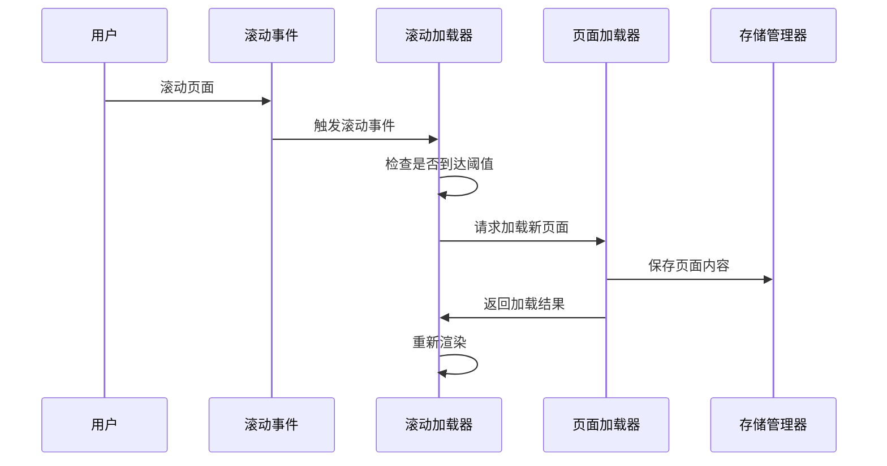

**图表来源**
- [src/core/scroll-loader.ts](file://src/core/scroll-loader.ts#L38-L45)
- [src/core/scroll-loader.ts](file://src/core/scroll-loader.ts#L140-L188)

**章节来源**
- [src/core/scroll-loader.ts](file://src/core/scroll-loader.ts#L1-L286)

## 完整执行路径分析

### 脚本启动阶段

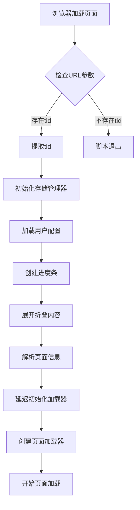

**图表来源**
- [src/index.ts](file://src/index.ts#L275-L381)

### 页面加载阶段

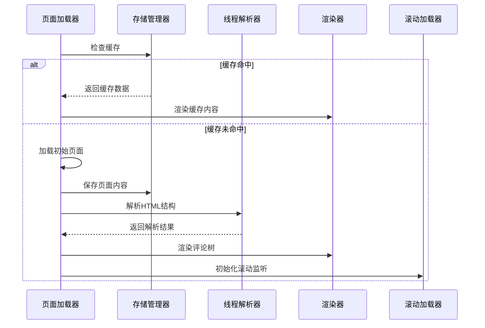

**图表来源**
- [src/core/page-loader.ts](file://src/core/page-loader.ts#L62-L80)
- [src/core/page-loader.ts](file://src/core/page-loader.ts#L168-L228)

### 渐进式转换阶段

当加载的页面数量达到配置阈值时，系统会触发渐进式转换：

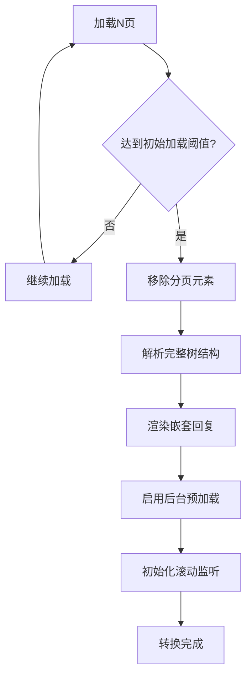

**图表来源**
- [src/core/page-loader.ts](file://src/core/page-loader.ts#L270-L285)

### 后台预加载阶段

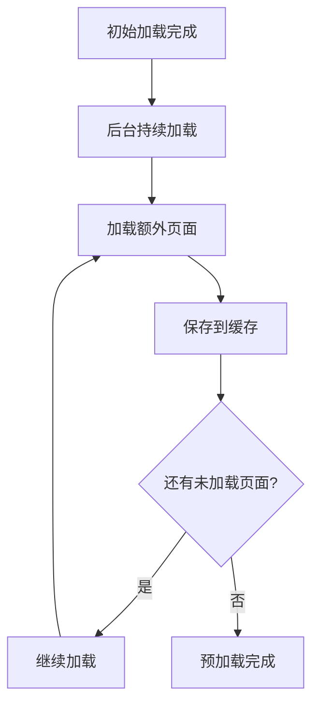

**图表来源**
- [src/core/page-loader.ts](file://src/core/page-loader.ts#L301-L308)

### 滚动加载阶段

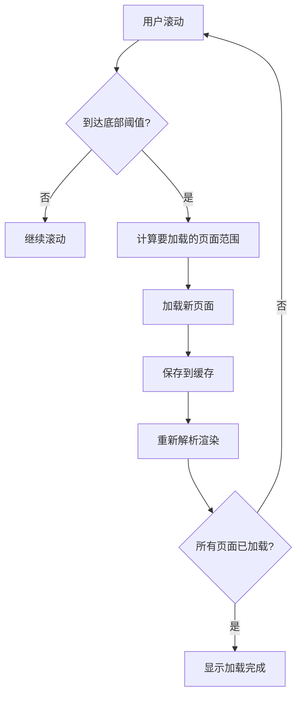

**图表来源**
- [src/core/scroll-loader.ts](file://src/core/scroll-loader.ts#L60-L72)
- [src/core/scroll-loader.ts](file://src/core/scroll-loader.ts#L140-L188)

**章节来源**
- [src/core/page-loader.ts](file://src/core/page-loader.ts#L286-L308)
- [src/core/scroll-loader.ts](file://src/core/scroll-loader.ts#L46-L134)

## 关键数据模型

### AppConfig - 应用配置模型

AppConfig定义了整个系统的配置参数，控制加载策略、缓存行为和性能优化选项。

| 配置项 | 类型 | 默认值 | 描述 |
|--------|------|--------|------|
| initialLoadPages | number | 5 | 初始加载的页面数量，达到此数量后立即开始转换 |
| preloadPages | number | 10 | 后台预加载的页面数量 |
| cacheExpireTime | number | 86400000 | 缓存过期时间（毫秒，默认24小时） |
| pageLoadInterval | number | 1000 | 页面读取间隔（毫秒） |
| maxCacheSize | number | 52428800 | 最大缓存大小（字节，默认50MB） |
| useVirtualScroll | boolean | true | 是否启用虚拟滚动 |
| virtualScrollBufferSize | number | 10 | 虚拟滚动缓冲区大小 |

**章节来源**
- [src/storage/config.ts](file://src/storage/config.ts#L6-L21)
- [src/storage/config.ts](file://src/storage/config.ts#L27-L43)

### ThreadData - 线程数据模型

ThreadData是系统内部使用的数据结构，用于表示完整的线程信息。

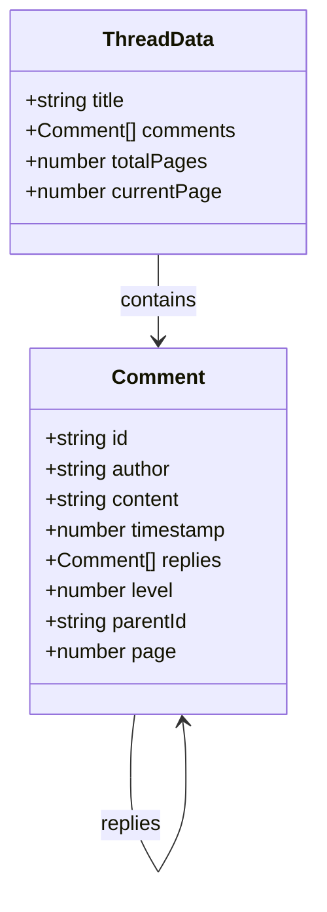

**图表来源**
- [src/types/index.d.ts](file://src/types/index.d.ts#L15-L20)
- [src/types/index.d.ts](file://src/types/index.d.ts#L3-L13)

### ThreadMeta - 缓存元数据模型

ThreadMeta存储线程的缓存相关信息，用于缓存管理和过期控制。

| 字段 | 类型 | 描述 |
|------|------|------|
| tid | string | 线程ID |
| title | string | 线程标题 |
| totalPages | number | 总页数 |
| cachedPages | number[] | 已缓存的页面列表 |
| lastAccess | number | 最后访问时间戳 |
| cacheTime | number | 缓存创建时间戳 |

**章节来源**
- [src/core/page-loader.ts](file://src/core/page-loader.ts#L10-L19)
- [src/storage/storage-manager.ts](file://src/storage/storage-manager.ts#L8-L15)

## 错误处理机制

系统实现了多层次的错误处理机制，确保单页加载失败不会影响整体流程：

### 页面加载错误处理

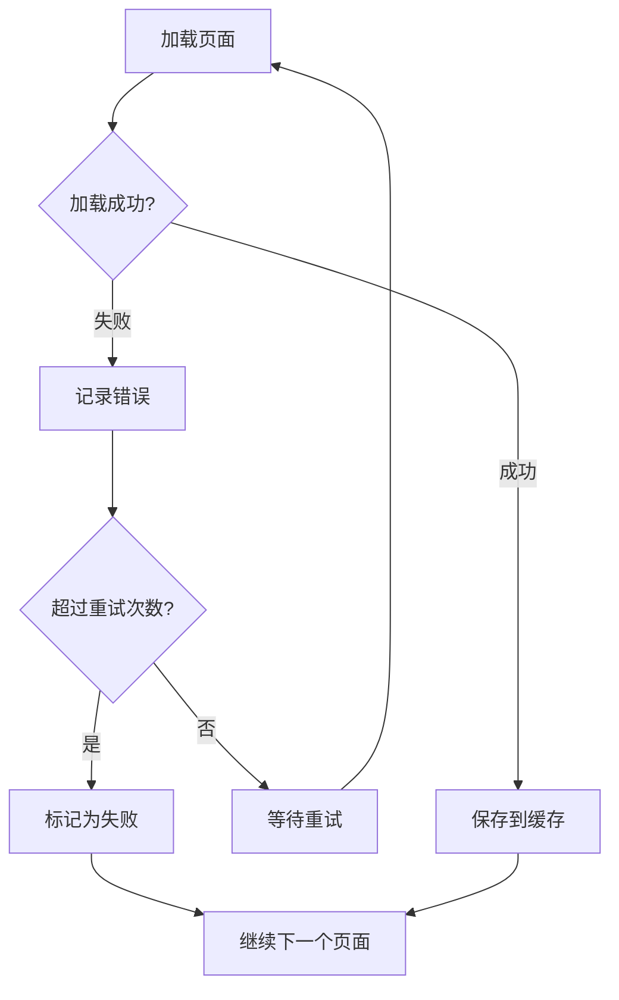

**图表来源**
- [src/core/page-loader.ts](file://src/core/page-loader.ts#L240-L289)

### 缓存读取错误处理

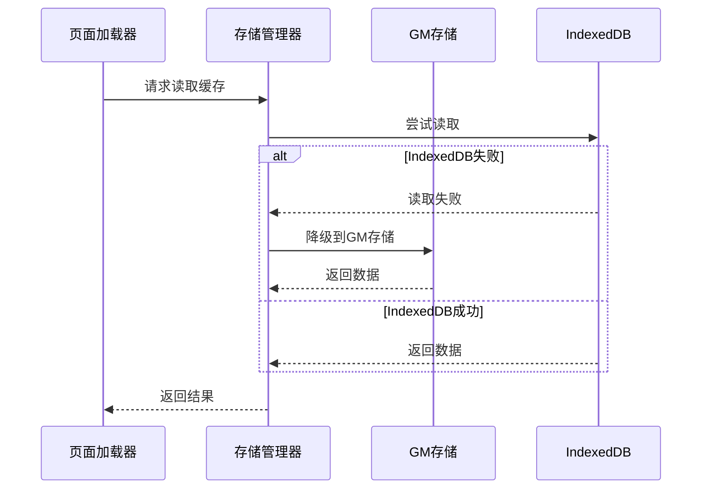

**图表来源**
- [src/storage/storage-manager.ts](file://src/storage/storage-manager.ts#L181-L195)

### 渲染错误处理

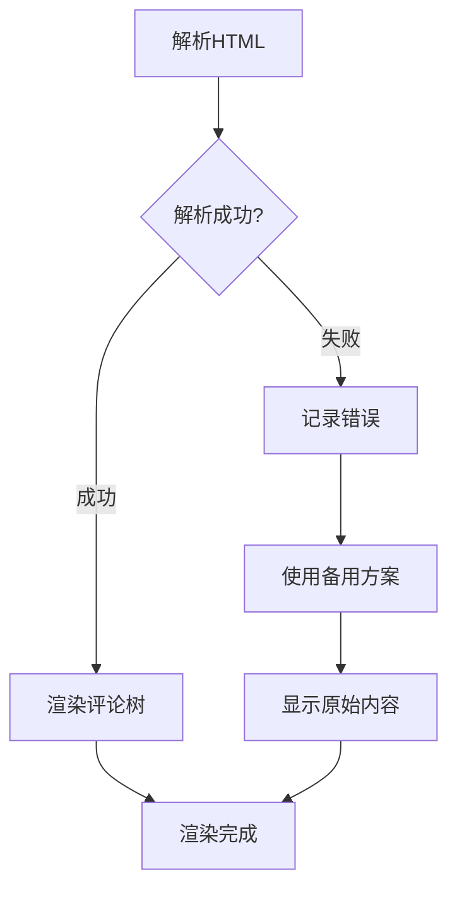

**章节来源**
- [src/core/page-loader.ts](file://src/core/page-loader.ts#L387-L401)
- [src/storage/storage-manager.ts](file://src/storage/storage-manager.ts#L181-L230)

## 性能监控与优化

### 性能测量工具

系统内置了完善的性能监控体系，使用performance.ts中的工具测量各阶段耗时：

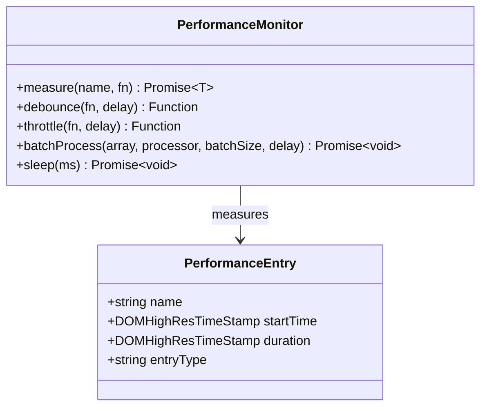

**图表来源**
- [src/utils/performance.ts](file://src/utils/performance.ts#L9-L32)

### 关键性能指标

| 指标名称 | 测量位置 | 用途 |
|----------|----------|------|
| PageLoader.initialize | 页面加载初始化 | 监控加载器启动时间 |
| parseThreadStructure | HTML解析 | 监控解析性能 |
| renderThreadedView | 渲染过程 | 监控渲染耗时 |
| VirtualRenderer.render | 虚拟渲染 | 监控虚拟滚动性能 |

### 优化策略

1. **渐进式加载**：先加载关键页面，再逐步加载其余内容
2. **智能缓存**：基于访问频率和时间的缓存策略
3. **虚拟滚动**：大主题自动启用虚拟滚动，减少DOM节点
4. **批量处理**：使用batchProcess处理大量数据
5. **防抖节流**：滚动事件使用防抖技术减少频繁触发

**章节来源**
- [src/utils/performance.ts](file://src/utils/performance.ts#L1-L375)

## 用户交互响应流程

### 配置面板交互

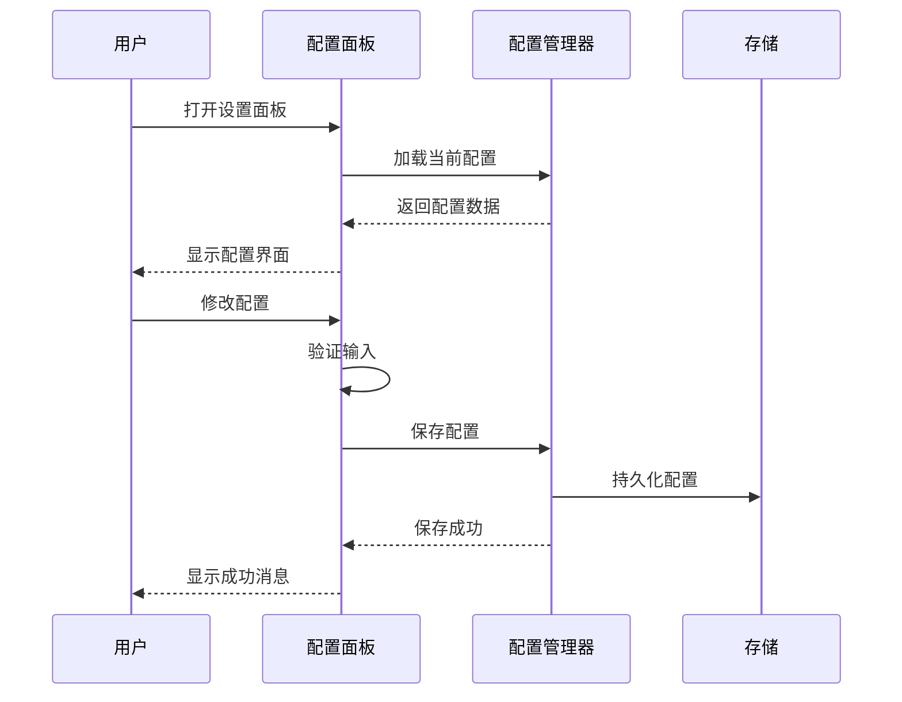

**图表来源**
- [src/ui/config-panel.ts](file://src/ui/config-panel.ts#L268-L350)

### 缓存管理交互

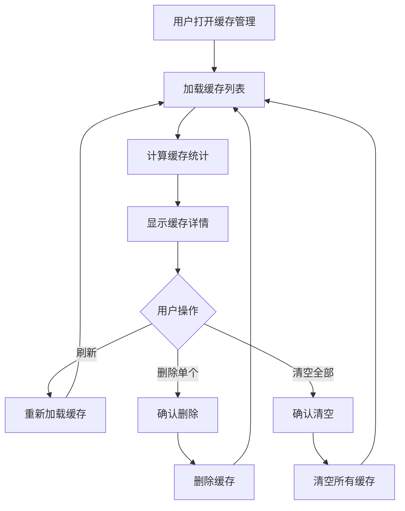

**图表来源**
- [src/ui/config-panel.ts](file://src/ui/config-panel.ts#L352-L490)

**章节来源**
- [src/ui/config-panel.ts](file://src/ui/config-panel.ts#L1-L560)

## 总结

NGA楼中楼脚本通过精心设计的数据流实现了复杂的功能需求：

### 核心优势

1. **模块化架构**：清晰的职责分离，便于维护和扩展
2. **渐进式加载**：优化用户体验，减少首次加载时间
3. **智能缓存**：基于访问模式的缓存策略，提升重复访问速度
4. **错误容错**：完善的错误处理机制，确保系统稳定性
5. **性能优化**：多种性能优化技术，适应不同规模的主题

### 数据流特点

- **单向数据流**：数据从PageLoader流向ThreadParser，再到Renderer
- **异步处理**：大量使用Promise和async/await，支持并发处理
- **事件驱动**：滚动加载等特性基于事件驱动架构
- **配置驱动**：通过AppConfig灵活控制各种行为

### 扩展性考虑

系统的设计充分考虑了未来的扩展需求：
- 支持多种存储后端（GM存储和IndexedDB）
- 渲染器可插拔设计
- 配置系统可扩展
- 性能监控可定制

这种设计使得系统能够在保持稳定性的基础上，轻松应对NGA论坛不断变化的需求和挑战。