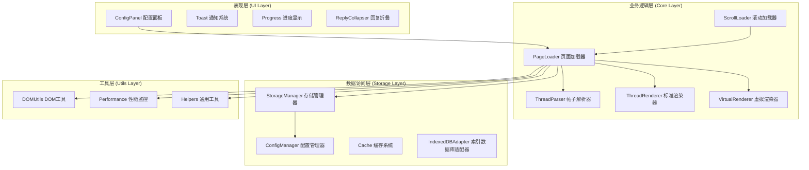
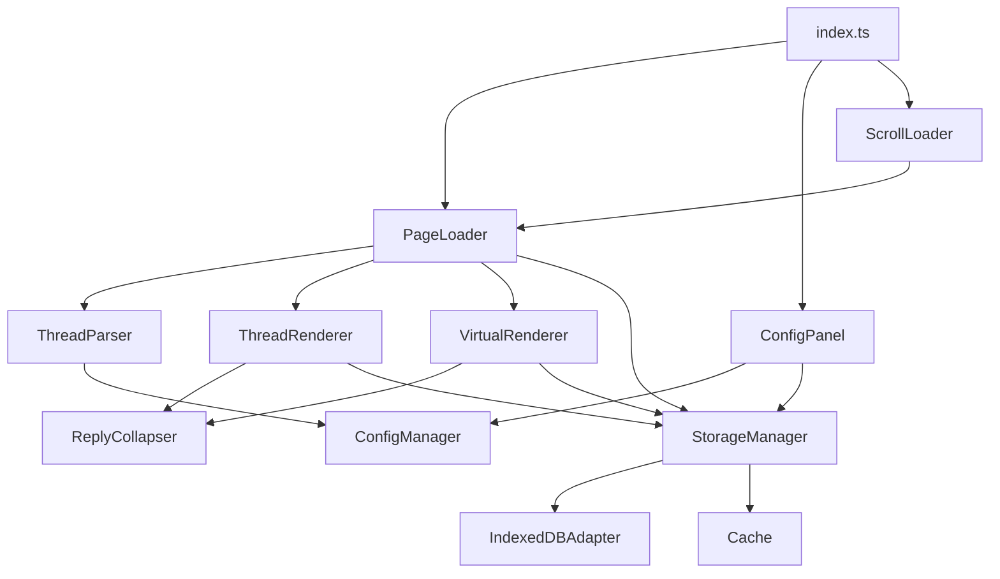
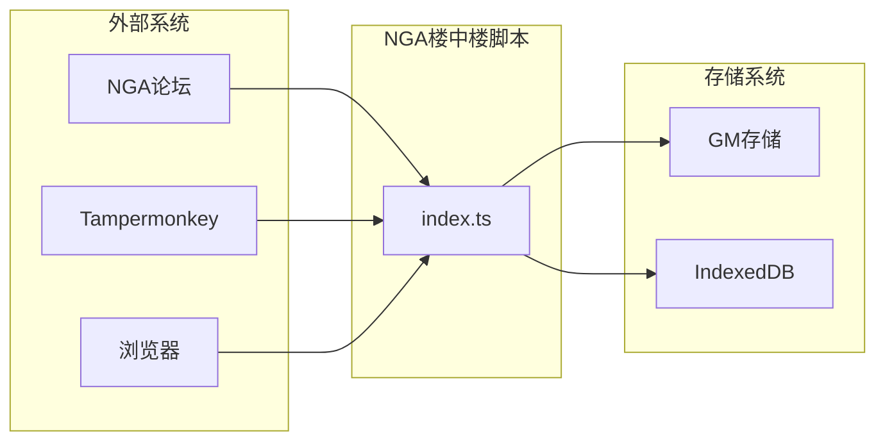
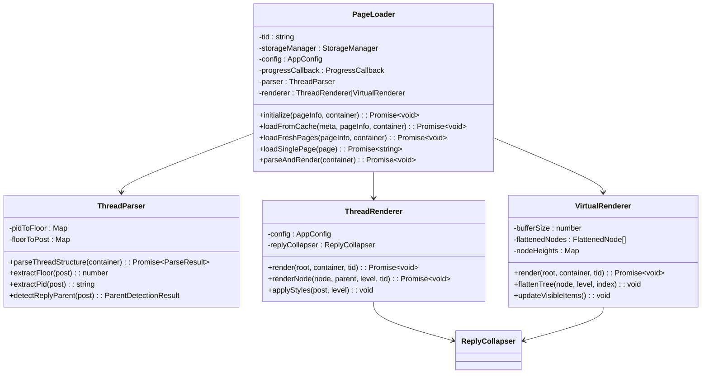
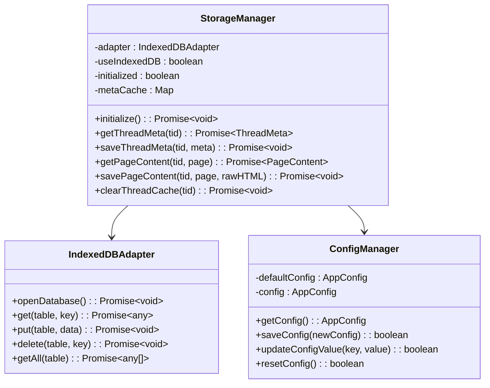

# 架构设计

<cite>
**本文档中引用的文件**
- [src/index.ts](file://src/index.ts)
- [vite.config.ts](file://vite.config.ts)
- [package.json](file://package.json)
- [CLAUDE.md](file://CLAUDE.md)
- [src/core/page-loader.ts](file://src/core/page-loader.ts)
- [src/core/thread-parser.ts](file://src/core/thread-parser.ts)
- [src/core/thread-renderer.ts](file://src/core/thread-renderer.ts)
- [src/core/virtual-renderer.ts](file://src/core/virtual-renderer.ts)
- [src/core/scroll-loader.ts](file://src/core/scroll-loader.ts)
- [src/storage/storage-manager.ts](file://src/storage/storage-manager.ts)
- [src/storage/config.ts](file://src/storage/config.ts)
- [src/ui/config-panel.ts](file://src/ui/config-panel.ts)
- [src/types/index.d.ts](file://src/types/index.d.ts)
</cite>

## 目录
1. [项目概述](#项目概述)
2. [整体架构设计](#整体架构设计)
3. [模块化分层架构](#模块化分层架构)
4. [核心数据流分析](#核心数据流分析)
5. [关键架构决策](#关键架构决策)
6. [组件依赖关系](#组件依赖关系)
7. [可扩展性设计](#可扩展性设计)
8. [系统上下文图](#系统上下文图)
9. [组件分解图](#组件分解图)
10. [总结](#总结)

## 项目概述

NGA楼中楼脚本是一个基于TypeScript的Tampermonkey用户脚本，旨在将NGA论坛的平面主题结构转换为嵌套回复（楼中楼）形式。该项目采用高内聚、低耦合的模块化分层架构，支持渐进式加载、智能缓存和虚拟滚动等高级功能。

### 核心特性
- **渐进式加载**：初始加载少量页面，后续按需加载
- **智能缓存**：支持本地存储和IndexedDB双重存储方案
- **虚拟滚动**：针对大型主题的高性能渲染优化
- **配置管理**：丰富的用户自定义选项
- **响应式设计**：适应不同设备和屏幕尺寸

## 整体架构设计

项目采用经典的三层架构模式，结合现代前端设计理念，实现了清晰的职责分离和良好的可维护性。



**图表来源**
- [src/index.ts](file://src/index.ts#L1-L50)
- [src/core/page-loader.ts](file://src/core/page-loader.ts#L1-L50)
- [src/storage/storage-manager.ts](file://src/storage/storage-manager.ts#L1-L50)

## 模块化分层架构

### 表现层（UI组件）

表现层负责用户界面的展示和交互，包含以下核心组件：

#### ConfigPanel - 配置面板
- **职责**：提供用户友好的配置界面
- **功能**：加载配置、缓存管理、性能优化设置
- **特点**：响应式设计，实时预览效果

#### Toast - 通知系统
- **职责**：向用户提供反馈信息
- **类型**：成功、错误、信息三种状态
- **特点**：自动消失，不影响用户体验

#### Progress - 进度显示
- **职责**：展示加载进度和状态信息
- **功能**：实时更新加载状态，提供详细统计信息

#### ReplyCollapser - 回复折叠
- **职责**：管理回复的展开/折叠状态
- **功能**：持久化折叠状态，提升浏览体验

**章节来源**
- [src/ui/config-panel.ts](file://src/ui/config-panel.ts#L1-L100)
- [src/ui/toast.ts](file://src/ui/toast.ts)
- [src/ui/progress.ts](file://src/ui/progress.ts)
- [src/ui/reply-collapser.ts](file://src/ui/reply-collapser.ts)

### 业务逻辑层（核心模块）

业务逻辑层是系统的核心，负责处理主要的业务逻辑和数据处理。

#### PageLoader - 页面加载器
作为整个系统的协调者，PageLoader负责：
- **页面加载策略**：控制初始加载、预加载和后台加载
- **缓存管理**：智能判断缓存有效性，决定加载策略
- **渲染器选择**：根据配置选择标准渲染器或虚拟渲染器
- **进度跟踪**：实时更新加载进度和状态信息

#### ThreadParser - 帖子解析器
负责将HTML内容解析为结构化的回复树：
- **HTML解析**：提取帖子数据和楼层信息
- **关系建立**：识别父子回复关系
- **树构建**：构建完整的回复层次结构
- **数据验证**：确保解析结果的准确性

#### ThreadRenderer - 标准渲染器
处理中小型主题的标准渲染：
- **DOM操作**：高效地构建DOM结构
- **样式应用**：动态添加CSS样式和类名
- **布局优化**：简化和优化显示布局
- **事件绑定**：处理用户交互事件

#### VirtualRenderer - 虚拟渲染器
专为大型主题设计的高性能渲染器：
- **虚拟滚动**：只渲染可见区域的内容
- **动态计算**：实时计算可视区域和缓冲区
- **性能优化**：减少DOM操作和内存占用
- **异步测量**：动态测量元素高度

#### ScrollLoader - 滚动加载器
实现无限滚动和懒加载功能：
- **滚动监听**：监听用户滚动行为
- **阈值判断**：确定何时触发加载更多
- **批量加载**：支持批量加载多个页面
- **状态管理**：维护加载状态和完成标志

**章节来源**
- [src/core/page-loader.ts](file://src/core/page-loader.ts#L1-L100)
- [src/core/thread-parser.ts](file://src/core/thread-parser.ts#L1-L100)
- [src/core/thread-renderer.ts](file://src/core/thread-renderer.ts#L1-L100)
- [src/core/virtual-renderer.ts](file://src/core/virtual-renderer.ts#L1-L100)
- [src/core/scroll-loader.ts](file://src/core/scroll-loader.ts#L1-L100)

### 数据访问层（存储模块）

数据访问层提供统一的数据存储和访问接口：

#### StorageManager - 存储管理器
- **双层存储**：支持GM存储和IndexedDB双重方案
- **自动降级**：当IndexedDB不可用时自动切换
- **数据迁移**：无缝从旧存储方案迁移到新方案
- **缓存优化**：内存缓存提升频繁访问数据的性能

#### ConfigManager - 配置管理器
- **配置持久化**：保存和加载用户配置
- **默认值管理**：提供合理的默认配置
- **配置验证**：确保配置值的有效性
- **版本兼容**：处理配置格式的版本变化

#### Cache - 缓存系统
- **多级缓存**：内存缓存和磁盘缓存相结合
- **LRU淘汰**：基于最近最少使用的淘汰策略
- **过期管理**：支持配置缓存过期时间
- **容量控制**：防止缓存占用过多存储空间

**章节来源**
- [src/storage/storage-manager.ts](file://src/storage/storage-manager.ts#L1-L100)
- [src/storage/config.ts](file://src/storage/config.ts#L1-L50)
- [src/storage/cache.ts](file://src/storage/cache.ts)

## 核心数据流分析

基于CLAUDE.md中的数据流信息，系统遵循以下完整的数据处理流程：

```mermaid
sequenceDiagram
participant Index as index.ts<br/>入口点
participant PageLoader as PageLoader<br/>页面加载器
participant ThreadParser as ThreadParser<br/>帖子解析器
participant Renderer as Renderer<br/>渲染器
participant ScrollLoader as ScrollLoader<br/>滚动加载器
participant ConfigPanel as ConfigPanel<br/>配置面板
Index->>Index : 检测主题，提取tid
Index->>Index : 初始化存储层
Index->>Index : 创建进度条
Index->>Index : 展开当前页面折叠
Index->>Index : 解析页面信息
Index->>ConfigPanel : 延迟创建配置面板
Index->>PageLoader : 创建页面加载器
Index->>ScrollLoader : 初始化滚动加载器
PageLoader->>PageLoader : 检查缓存有效性
alt 缓存命中
PageLoader->>PageLoader : 从缓存加载页面
PageLoader->>PageLoader : 更新访问时间
else 缓存失效
PageLoader->>PageLoader : 全新加载页面
PageLoader->>PageLoader : 保存到缓存
end
PageLoader->>ThreadParser : 解析帖子结构
ThreadParser->>ThreadParser : 提取帖子数据
ThreadParser->>ThreadParser : 建立父子关系
ThreadParser->>ThreadParser : 构建回复树
PageLoader->>Renderer : 渲染楼中楼视图
Renderer->>Renderer : 应用样式和布局
Renderer->>Renderer : 处理折叠逻辑
ScrollLoader->>ScrollLoader : 监听滚动事件
ScrollLoader->>PageLoader : 触发懒加载
PageLoader->>PageLoader : 加载更多页面
PageLoader->>ThreadParser : 重新解析
PageLoader->>Renderer : 更新渲染
```



**图表来源**
- [src/index.ts](file://src/index.ts#L275-L381)
- [src/core/page-loader.ts](file://src/core/page-loader.ts#L62-L100)
- [src/core/thread-parser.ts](file://src/core/thread-parser.ts#L51-L115)
- [src/core/thread-renderer.ts](file://src/core/thread-renderer.ts#L38-L61)

### 数据流详细说明

1. **初始化阶段**：index.ts作为程序入口，负责整体初始化和组件协调
2. **缓存检查**：PageLoader首先检查本地缓存，决定加载策略
3. **页面加载**：根据缓存状态，选择全新加载或从缓存加载
4. **数据解析**：ThreadParser将HTML内容解析为结构化数据
5. **渲染展示**：选择合适的渲染器进行页面渲染
6. **交互响应**：ScrollLoader监听用户滚动，触发懒加载

**章节来源**
- [CLAUDE.md](file://CLAUDE.md#L76-L82)

## 关键架构决策

### Vite构建工具的选择

项目选择Vite作为构建工具而非传统的Webpack，这一决策基于以下考虑：

#### 优势分析
- **开发体验**：快速的热重载和模块热替换
- **构建性能**：利用ESBuild进行快速打包
- **TypeScript支持**：内置的TypeScript编译支持
- **插件生态**：丰富的插件生态系统

#### 特殊配置决策
在vite.config.ts中禁用了tree-shaking（treeshake: false）：

```typescript
build: {
  minify: false, // 不压缩，保持代码可读性
  target: 'esnext',
  rollupOptions: {
    treeshake: false, // 禁用tree-shaking以确保所有代码都被打包
  },
},
```

**决策原因**：
1. **Tampermonkey兼容性**：确保所有模块都能被正确打包
2. **调试便利性**：保持代码可读性，便于调试
3. **模块依赖完整性**：确保所有必要的模块都被包含

**章节来源**
- [vite.config.ts](file://vite.config.ts#L38-L44)
- [CLAUDE.md](file://CLAUDE.md#L66)

### 双存储架构设计

系统采用双存储架构，支持GM存储和IndexedDB两种方案：

#### 存储方案对比

| 特性 | GM存储 | IndexedDB |
|------|--------|-----------|
| **存储容量** | 有限制的存储空间 | 大容量存储 |
| **访问速度** | 较慢的同步访问 | 快速的异步访问 |
| **数据类型** | 仅支持基本数据类型 | 支持复杂数据结构 |
| **浏览器兼容性** | 广泛兼容 | 现代浏览器支持 |
| **数据迁移** | 不支持自动迁移 | 支持无缝迁移 |

#### 自动降级机制
系统具备智能的存储方案选择和降级能力：
- **优先使用IndexedDB**：提供最佳性能和容量
- **自动降级**：当IndexedDB不可用时自动切换到GM存储
- **数据迁移**：支持从旧存储方案平滑迁移到新方案

**章节来源**
- [src/storage/storage-manager.ts](file://src/storage/storage-manager.ts#L63-L84)
- [src/storage/storage-manager.ts](file://src/storage/storage-manager.ts#L96-L170)

### 渲染器选择策略

系统根据配置自动选择合适的渲染器：

```typescript
const useVirtualScroll = config.useVirtualScroll !== false;
this.renderer = useVirtualScroll
  ? new VirtualRenderer(config, storageManager)
  : new ThreadRenderer(config, storageManager);
```

#### 选择标准
- **小型主题**（< 500楼）：使用标准渲染器，DOM操作简单高效
- **大型主题**（≥ 500楼）：使用虚拟渲染器，避免DOM操作过多导致的性能问题

**章节来源**
- [src/core/page-loader.ts](file://src/core/page-loader.ts#L48-L52)

## 组件依赖关系

### 核心组件依赖图



**图表来源**
- [src/index.ts](file://src/index.ts#L2-L8)
- [src/core/page-loader.ts](file://src/core/page-loader.ts#L3-L8)

### 关键依赖关系分析

#### PageLoader的核心地位
PageLoader作为系统的协调者，承担着重要的依赖关系：
- **向上依赖**：ConfigManager（配置）、StorageManager（存储）
- **向下依赖**：ThreadParser（解析）、ThreadRenderer/VirtualRenderer（渲染）
- **横向依赖**：ScrollLoader（滚动加载）

#### ConfigPanel的依赖链
ConfigPanel依赖于：
- **ConfigManager**：获取和保存配置
- **StorageManager**：访问缓存数据
- **Toast**：提供用户反馈

#### StorageManager的抽象层
StorageManager作为存储层的抽象接口：
- **向上抽象**：为上层组件提供统一的存储接口
- **向下适配**：适配不同的存储实现（GM/IndexedDB）
- **内部管理**：管理缓存、迁移、清理等功能

**章节来源**
- [src/core/page-loader.ts](file://src/core/page-loader.ts#L26-L57)
- [src/ui/config-panel.ts](file://src/ui/config-panel.ts#L25-L32)
- [src/storage/storage-manager.ts](file://src/storage/storage-manager.ts#L47-L91)

## 可扩展性设计

### 配置面板的扩展机制

配置面板采用了模块化的扩展设计，支持未来的功能扩展：

#### 配置项分类体系
```typescript
interface AppConfig {
  // 加载配置
  initialLoadPages: number;
  preloadPages: number;
  pageLoadInterval: number;
  
  // 缓存配置
  cacheExpireTime: number;
  maxCacheSize: number;
  
  // 性能优化
  useVirtualScroll: boolean;
  virtualScrollBufferSize: number;
  
  // 功能开关
  enableReplyCollapse: boolean;
  replyCollapseThreshold: number;
  
  // 实验性功能
  enableWebWorkerParse: boolean;
  webWorkerParseThreshold: number;
}
```

#### 扩展点设计
1. **新增配置项**：通过修改AppConfig接口即可添加新的配置选项
2. **动态UI生成**：配置面板支持动态生成对应的UI控件
3. **验证机制**：内置配置验证，确保新添加的配置项有效性
4. **默认值管理**：自动处理新配置项的默认值

### 渲染器的可插拔架构

系统支持多种渲染器的动态选择和扩展：

#### 渲染器接口标准化
所有渲染器都实现相同的接口：
- `render(root: PostData, container: HTMLElement, tid: string): Promise<void>`
- 提供统一的渲染入口

#### 新渲染器的集成步骤
1. **实现接口**：实现标准的渲染器接口
2. **注册选择**：在PageLoader中添加选择逻辑
3. **配置支持**：在ConfigPanel中添加相关配置项
4. **测试验证**：确保与现有系统的兼容性

### 存储层的可扩展性

存储层设计支持新的存储方案的接入：

#### 存储适配器模式
```typescript
interface StorageAdapter {
  get<T>(key: string): Promise<T | null>;
  set<T>(key: string, value: T, ttl?: number): Promise<void>;
  remove(key: string): Promise<void>;
  clear(): Promise<void>;
}
```

#### 新存储方案的接入流程
1. **实现适配器**：实现StorageAdapter接口
2. **注册适配器**：在StorageManager中注册新的适配器
3. **配置选择**：在配置中添加存储方案选择
4. **迁移支持**：提供数据迁移机制

**章节来源**
- [src/storage/config.ts](file://src/storage/config.ts#L6-L21)
- [src/ui/config-panel.ts](file://src/ui/config-panel.ts#L80-L150)

## 系统上下文图

### 外部系统交互



**图表来源**
- [src/index.ts](file://src/index.ts#L1-L20)
- [vite.config.ts](file://vite.config.ts#L16-L25)

### 数据流向分析

1. **输入数据**：NGA论坛的HTML页面内容
2. **处理流程**：脚本解析、缓存、渲染
3. **输出结果**：格式化后的楼中楼视图
4. **存储数据**：配置、缓存、折叠状态

**章节来源**
- [CLAUDE.md](file://CLAUDE.md#L99-L105)

## 组件分解图

### 核心组件详细分解

#### PageLoader组件分解


**图表来源**
- [src/core/page-loader.ts](file://src/core/page-loader.ts#L26-L57)
- [src/core/thread-parser.ts](file://src/core/thread-parser.ts#L40-L50)
- [src/core/thread-renderer.ts](file://src/core/thread-renderer.ts#L25-L35)

#### 存储管理层分解


**图表来源**
- [src/storage/storage-manager.ts](file://src/storage/storage-manager.ts#L47-L91)
- [src/storage/config.ts](file://src/storage/config.ts#L26-L46)
- [src/storage/indexeddb-adapter.ts](file://src/storage/indexeddb-adapter.ts)

**章节来源**
- [src/core/page-loader.ts](file://src/core/page-loader.ts#L1-L100)
- [src/storage/storage-manager.ts](file://src/storage/storage-manager.ts#L1-L100)

## 总结

NGA楼中楼脚本展现了优秀的软件架构设计原则：

### 架构优势
1. **高内聚低耦合**：各模块职责明确，依赖关系清晰
2. **分层架构**：表现层、业务逻辑层、数据访问层职责分明
3. **可扩展性**：支持功能扩展和存储方案扩展
4. **性能优化**：虚拟滚动、智能缓存、渐进式加载等优化措施
5. **用户体验**：配置灵活、响应迅速、界面友好

### 设计亮点
- **智能存储方案**：双存储架构确保数据安全和性能
- **渲染器选择**：根据主题规模自动选择最优渲染方案
- **配置驱动**：丰富的配置选项满足不同用户需求
- **渐进式加载**：平衡性能和用户体验的最佳实践

### 技术创新
- **虚拟滚动技术**：解决大型主题的性能瓶颈
- **智能缓存策略**：基于时间和容量的双重缓存管理
- **自动降级机制**：确保在各种环境下都能正常工作
- **模块化设计**：支持功能的独立扩展和维护

这套架构设计不仅满足了当前的功能需求，更为未来的功能扩展和技术升级奠定了坚实的基础，体现了现代软件工程的最佳实践。