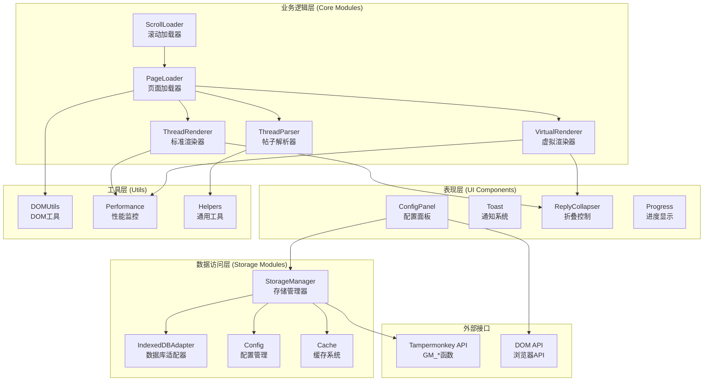
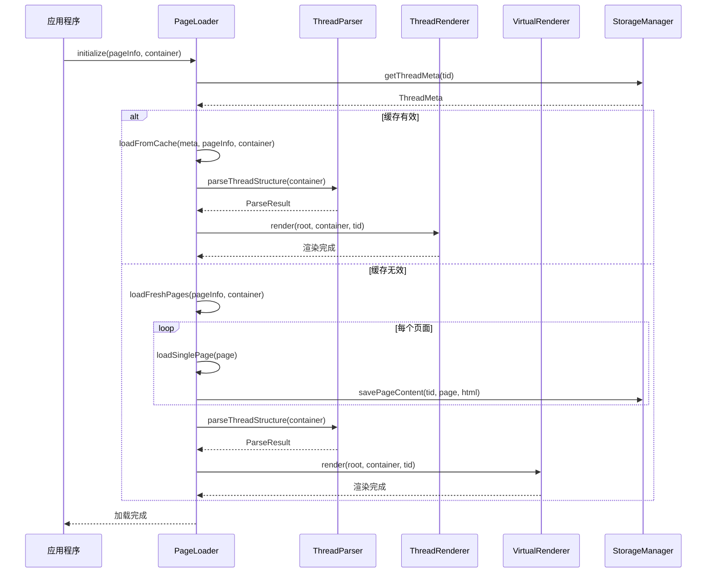
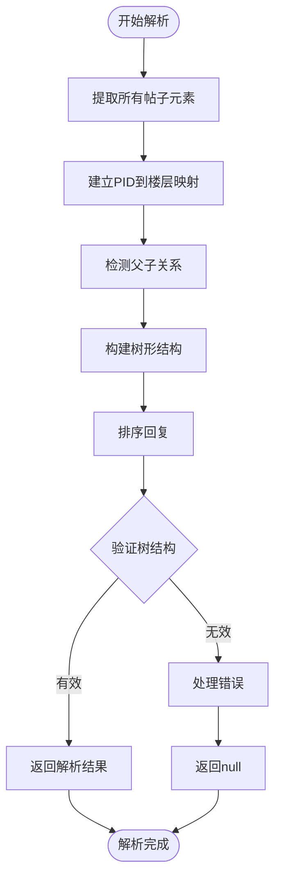
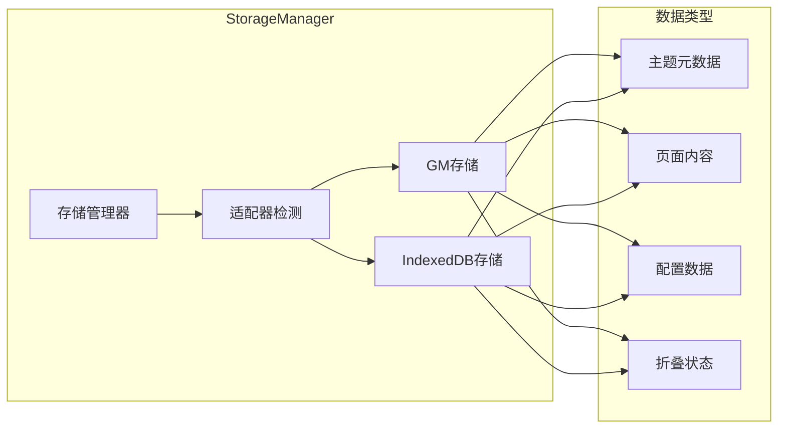
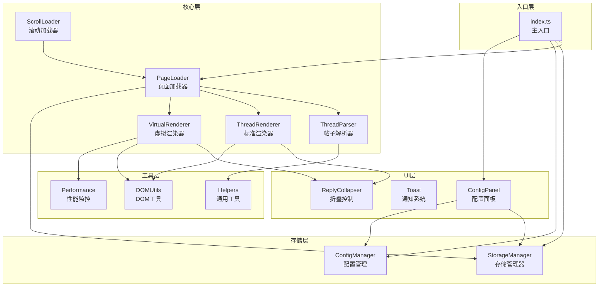
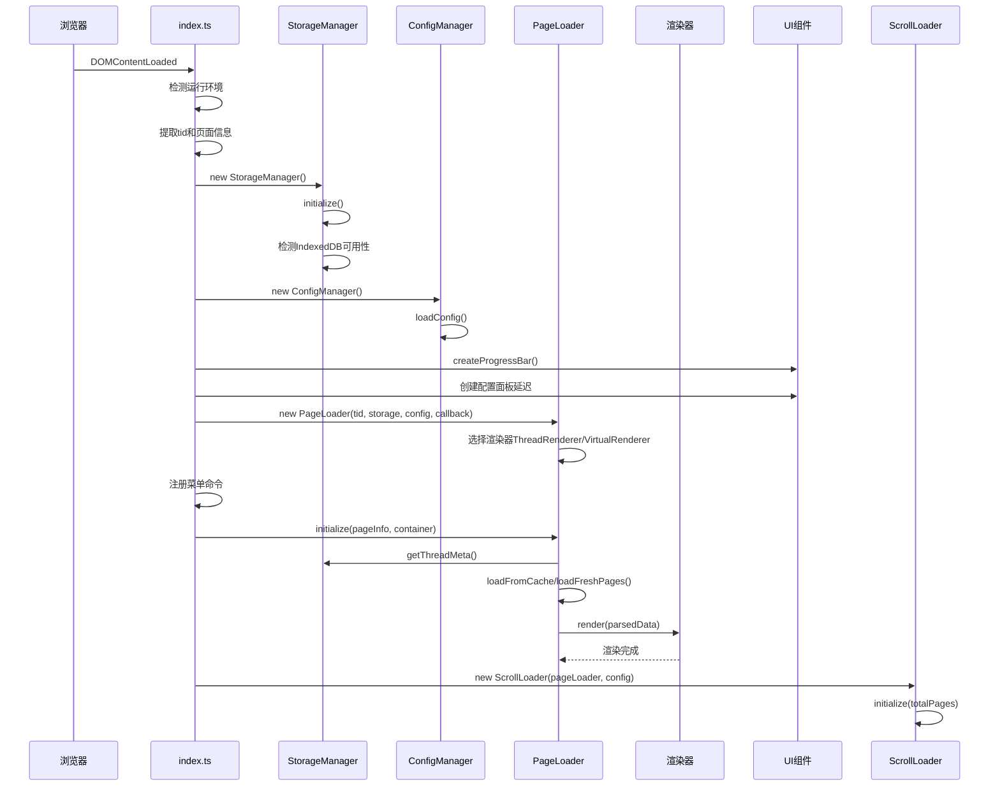

# 模块结构

<cite>
**本文档中引用的文件**
- [src/index.ts](file://src/index.ts)
- [src/core/page-loader.ts](file://src/core/page-loader.ts)
- [src/core/thread-parser.ts](file://src/core/thread-parser.ts)
- [src/core/thread-renderer.ts](file://src/core/thread-renderer.ts)
- [src/core/virtual-renderer.ts](file://src/core/virtual-renderer.ts)
- [src/storage/storage-manager.ts](file://src/storage/storage-manager.ts)
- [src/storage/config.ts](file://src/storage/config.ts)
- [src/ui/config-panel.ts](file://src/ui/config-panel.ts)
- [src/types/index.d.ts](file://src/types/index.d.ts)
- [vite.config.ts](file://vite.config.ts)
- [package.json](file://package.json)
- [CLAUDE.md](file://CLAUDE.md)
</cite>

## 目录
1. [项目概述](#项目概述)
2. [分层架构设计](#分层架构设计)
3. [核心模块详解](#核心模块详解)
4. [模块依赖关系](#模块依赖关系)
5. [初始化流程](#初始化流程)
6. [扩展指南](#扩展指南)
7. [性能优化](#性能优化)
8. [总结](#总结)

## 项目概述

NGA楼中楼脚本是一个基于TypeScript的Tampermonkey用户脚本，专门用于将NGA论坛的平面主题结构转换为嵌套回复（楼中楼）形式。该项目采用现代化的分层架构设计，实现了渐进式加载、智能缓存和大型主题的虚拟滚动功能。

### 技术栈特点
- **TypeScript**：提供强类型支持和更好的开发体验
- **Vite构建系统**：快速开发和高效的打包优化
- **模块化设计**：清晰的职责分离和高内聚低耦合
- **双存储方案**：兼容GM存储和现代IndexedDB

## 分层架构设计

项目采用经典的三层架构模式，每层都有明确的职责划分：



**图表来源**
- [src/index.ts](file://src/index.ts#L1-L381)
- [src/core/page-loader.ts](file://src/core/page-loader.ts#L1-L590)
- [src/storage/storage-manager.ts](file://src/storage/storage-manager.ts#L1-L596)

### 表现层（UI组件）

表现层负责用户界面的展示和交互，包含以下核心组件：

| 组件名称 | 职责描述 | 主要功能 |
|---------|---------|---------|
| ConfigPanel | 配置管理界面 | 用户配置设置、缓存管理、性能调节 |
| Toast | 通知系统 | 操作反馈、错误提示、成功确认 |
| ReplyCollapser | 折叠控制 | 回复展开/折叠、状态持久化 |
| Progress | 进度显示 | 加载状态可视化、实时进度跟踪 |

**章节来源**
- [src/ui/config-panel.ts](file://src/ui/config-panel.ts#L1-L560)

### 业务逻辑层（核心模块）

业务逻辑层是系统的核心，处理主要的业务流程和数据处理：

| 模块名称 | 职责描述 | 关键特性 |
|---------|---------|---------|
| PageLoader | 页面加载协调器 | 渐进式加载、缓存策略、后台预加载 |
| ThreadParser | 帖子结构解析器 | HTML解析、树形结构构建、父子关系识别 |
| ThreadRenderer | 标准渲染引擎 | DOM操作、样式应用、布局优化 |
| VirtualRenderer | 虚拟滚动渲染器 | 大数据集优化、视口管理、性能提升 |
| ScrollLoader | 滚动触发加载器 | 无限滚动、懒加载、用户体验优化 |

**章节来源**
- [src/core/page-loader.ts](file://src/core/page-loader.ts#L1-L590)
- [src/core/thread-parser.ts](file://src/core/thread-parser.ts#L1-L258)
- [src/core/thread-renderer.ts](file://src/core/thread-renderer.ts#L1-L266)
- [src/core/virtual-renderer.ts](file://src/core/virtual-renderer.ts#L1-L502)

### 数据访问层（存储模块）

数据访问层提供统一的数据存储抽象，支持多种存储后端：

| 组件名称 | 职责描述 | 存储类型 | 特性 |
|---------|---------|---------|-----|
| StorageManager | 统一存储接口 | GM/IndexedDB | 自动降级、数据迁移、事务支持 |
| IndexedDBAdapter | 数据库适配器 | IndexedDB | 异步操作、批量处理、索引查询 |
| Config | 配置管理 | KV存储 | 类型安全、默认值、持久化 |
| Cache | 缓存系统 | 内存+磁盘 | LRU策略、过期清理、容量控制 |

**章节来源**
- [src/storage/storage-manager.ts](file://src/storage/storage-manager.ts#L1-L596)
- [src/storage/config.ts](file://src/storage/config.ts#L1-L105)

## 核心模块详解

### PageLoader：页面加载协调器

PageLoader是整个系统的核心协调器，负责管理复杂的页面加载策略和缓存机制。



**图表来源**
- [src/core/page-loader.ts](file://src/core/page-loader.ts#L62-L80)
- [src/core/page-loader.ts](file://src/core/page-loader.ts#L165-L228)

**关键特性：**
- **渐进式加载**：达到指定页数后立即开始渲染
- **智能缓存**：基于时间的缓存策略和LRU清理
- **后台预加载**：在用户阅读时继续加载后续页面
- **错误恢复**：单个页面加载失败不影响整体流程

**章节来源**
- [src/core/page-loader.ts](file://src/core/page-loader.ts#L28-L53)

### ThreadParser：帖子结构解析器

ThreadParser负责从原始HTML中提取和构建帖子的树形结构，是楼中楼功能的基础。



**图表来源**
- [src/core/thread-parser.ts](file://src/core/thread-parser.ts#L51-L115)

**解析算法特点：**
- **两阶段解析**：先建立映射关系，再构建树结构
- **引用检测**：通过`div.quote`元素识别父子关系
- **楼层排序**：按楼层号升序排列子节点
- **完整性验证**：确保根节点存在且结构完整

**章节来源**
- [src/core/thread-parser.ts](file://src/core/thread-parser.ts#L118-L257)

### 渲染器对比：ThreadRenderer vs VirtualRenderer

两种渲染器针对不同场景优化，体现了架构的灵活性：

| 特性 | ThreadRenderer | VirtualRenderer |
|------|---------------|-----------------|
| **适用场景** | 小到中等主题（<500楼） | 大型主题（>500楼） |
| **DOM节点数** | O(n) - 所有楼层都创建 | O(viewport) - 只创建可见楼层 |
| **内存使用** | 高（完整DOM树） | 低（虚拟化） |
| **初始渲染速度** | 快（直接DOM操作） | 中等（需要计算位置） |
| **滚动性能** | 中等（DOM操作较多） | 优秀（固定DOM数量） |
| **配置选项** | 基础样式和折叠 | 缓冲区大小、视口管理 |

**章节来源**
- [src/core/thread-renderer.ts](file://src/core/thread-renderer.ts#L25-L266)
- [src/core/virtual-renderer.ts](file://src/core/virtual-renderer.ts#L43-L502)

### StorageManager：统一存储接口

StorageManager提供了透明的存储抽象，支持GM存储和IndexedDB的自动切换。



**图表来源**
- [src/storage/storage-manager.ts](file://src/storage/storage-manager.ts#L47-L91)

**存储策略：**
- **自动降级**：IndexedDB不可用时自动切换到GM存储
- **数据迁移**：从旧版本GM存储自动迁移数据
- **类型安全**：泛型接口确保数据完整性
- **事务支持**：批量操作的原子性保证

**章节来源**
- [src/storage/storage-manager.ts](file://src/storage/storage-manager.ts#L172-L240)

## 模块依赖关系

项目的模块依赖关系体现了良好的分层设计和解耦原则：



**图表来源**
- [src/index.ts](file://src/index.ts#L2-L8)
- [src/core/page-loader.ts](file://src/core/page-loader.ts#L3-L8)

### 关键依赖规则

1. **禁止循环依赖**：每个模块只能依赖其下层模块
2. **接口隔离**：高层模块不直接依赖底层的具体实现
3. **依赖倒置**：具体实现依赖于抽象接口
4. **单一职责**：每个模块专注于单一功能领域

**章节来源**
- [CLAUDE.md](file://CLAUDE.md#L63-L67)

## 初始化流程

系统的初始化遵循严格的顺序，确保各模块正确加载和协作：



**图表来源**
- [src/index.ts](file://src/index.ts#L275-L381)

### 初始化步骤详解

1. **环境检测**：确定运行环境和页面类型
2. **存储初始化**：建立数据存储连接
3. **配置加载**：读取用户偏好设置
4. **UI准备**：创建进度条和配置面板
5. **核心初始化**：启动页面加载器和渲染器
6. **事件绑定**：注册滚动和菜单事件

**章节来源**
- [src/index.ts](file://src/index.ts#L296-L381)

## 扩展指南

### 新增渲染策略

要添加新的渲染策略，可以参考现有渲染器的实现模式：

```typescript
// 示例：自定义渲染器接口
interface CustomRenderer {
    render(root: PostData, container: HTMLElement, tid: string): Promise<void>;
    destroy(): void;
    updateConfig(config: AppConfig): void;
}

// 实现示例
class AdaptiveRenderer implements CustomRenderer {
    private config: AppConfig;
    private baseRenderer: ThreadRenderer;
    private virtualRenderer: VirtualRenderer;
    
    constructor(config: AppConfig, storageManager: StorageManager) {
        this.config = config;
        this.baseRenderer = new ThreadRenderer(config, storageManager);
        this.virtualRenderer = new VirtualRenderer(config, storageManager);
    }
    
    async render(root: PostData, container: HTMLElement, tid: string): Promise<void> {
        const nodeCount = this.countNodes(root);
        const renderer = nodeCount > 500 
            ? this.virtualRenderer 
            : this.baseRenderer;
            
        await renderer.render(root, container, tid);
    }
    
    private countNodes(node: PostData): number {
        let count = 1;
        if (node.children) {
            for (const child of node.children) {
                count += this.countNodes(child);
            }
        }
        return count;
    }
}
```

### 新增UI组件

添加新的UI组件需要遵循以下模式：

```typescript
// UI组件模板
class NewUIComponent {
    private container: HTMLElement;
    private config: AppConfig;
    
    constructor(config: AppConfig) {
        this.config = config;
        this.container = this.createContainer();
    }
    
    private createContainer(): HTMLElement {
        const container = document.createElement('div');
        container.className = 'custom-ui-component';
        // 添加样式和事件监听器
        return container;
    }
    
    show(): void {
        this.container.style.display = 'block';
    }
    
    hide(): void {
        this.container.style.display = 'none';
    }
    
    updateConfig(config: AppConfig): void {
        this.config = config;
        // 更新组件配置
    }
}
```

### 存储适配器扩展

如果需要支持新的存储后端，可以实现StorageAdapter接口：

```typescript
interface StorageAdapter {
    get<T>(key: string): Promise<T | null>;
    set<T>(key: string, value: T, ttl?: number): Promise<void>;
    remove(key: string): Promise<void>;
    clear(): Promise<void>;
}

class RedisAdapter implements StorageAdapter {
    private client: RedisClient;
    
    constructor(options: RedisOptions) {
        this.client = new RedisClient(options);
    }
    
    async get<T>(key: string): Promise<T | null> {
        const value = await this.client.get(key);
        return value ? JSON.parse(value) : null;
    }
    
    async set<T>(key: string, value: T, ttl?: number): Promise<void> {
        const jsonValue = JSON.stringify(value);
        if (ttl) {
            await this.client.setex(key, ttl, jsonValue);
        } else {
            await this.client.set(key, jsonValue);
        }
    }
}
```

## 性能优化

### Vite配置优化

项目使用了特殊的Vite配置来确保所有模块都被正确打包：

```typescript
// vite.config.ts中的关键配置
export default defineConfig({
    build: {
        minify: false, // 保持代码可读性
        target: 'esnext',
        rollupOptions: {
            treeshake: false, // 禁用tree-shaking
        },
    },
});
```

**treeshake禁用的原因：**
- **模块完整性**：确保所有模块都被正确导入
- **动态依赖**：某些模块通过反射机制动态加载
- **类型定义**：TypeScript类型声明需要完整保留

**章节来源**
- [vite.config.ts](file://vite.config.ts#L38-L44)

### 渲染性能优化

1. **虚拟滚动**：大型主题自动启用虚拟滚动
2. **增量渲染**：分批渲染减少阻塞
3. **DOM操作优化**：使用DocumentFragment批量操作
4. **样式缓存**：CSS类名复用减少计算

### 内存管理

1. **缓存策略**：LRU算法清理过期数据
2. **弱引用**：避免内存泄漏
3. **及时清理**：组件销毁时清理事件监听器

## 总结

NGA楼中楼脚本展现了优秀的模块化架构设计，通过清晰的分层结构实现了高内聚低耦合的目标。项目的主要优势包括：

### 架构优势

1. **分层清晰**：表现层、业务逻辑层、数据访问层职责分明
2. **模块独立**：每个模块可以独立开发和测试
3. **扩展性强**：插件化设计支持功能扩展
4. **性能优化**：针对大数据量场景的专门优化

### 设计原则

1. **单一职责**：每个模块专注单一功能领域
2. **开放封闭**：对扩展开放，对修改封闭
3. **依赖倒置**：高层模块不依赖低层模块的具体实现
4. **接口隔离**：客户端不应依赖它不需要的接口

### 技术特色

1. **双存储方案**：兼容传统GM存储和现代IndexedDB
2. **智能渲染**：根据数据量自动选择最优渲染策略
3. **渐进式加载**：提升用户体验和性能表现
4. **类型安全**：完整的TypeScript类型定义

这种架构设计不仅满足了当前的功能需求，也为未来的功能扩展和性能优化奠定了坚实的基础。开发者可以基于现有的架构模式轻松添加新功能，同时保持代码的可维护性和可扩展性。