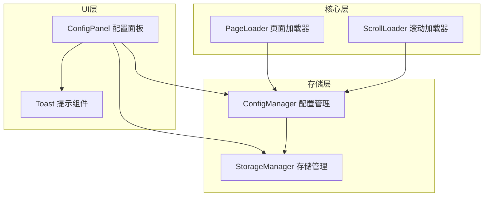
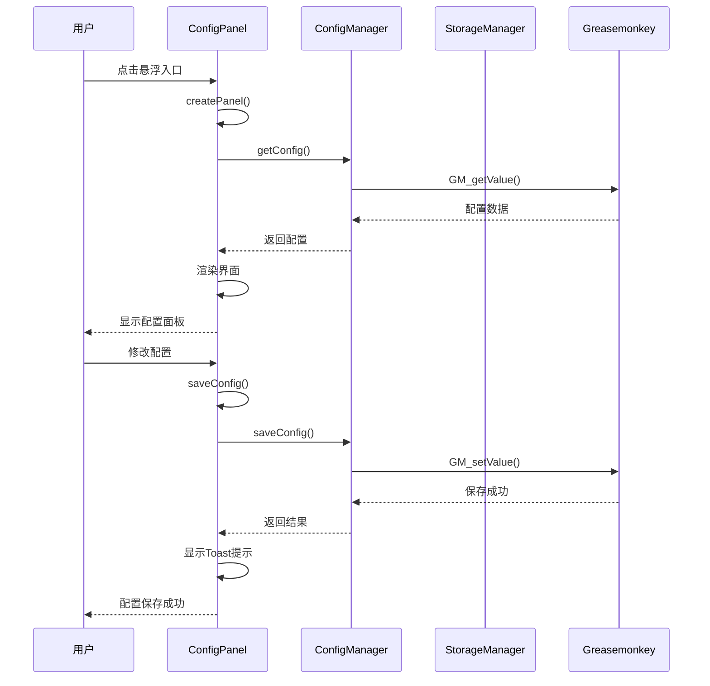
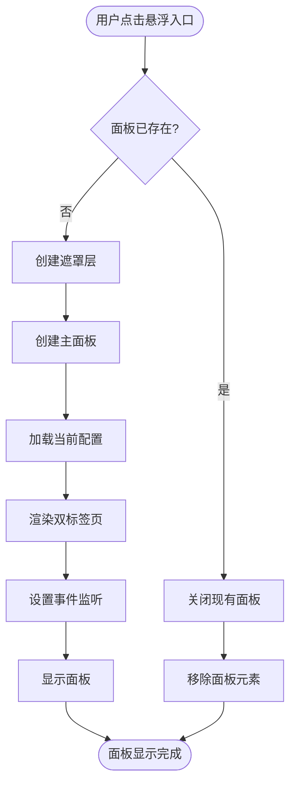
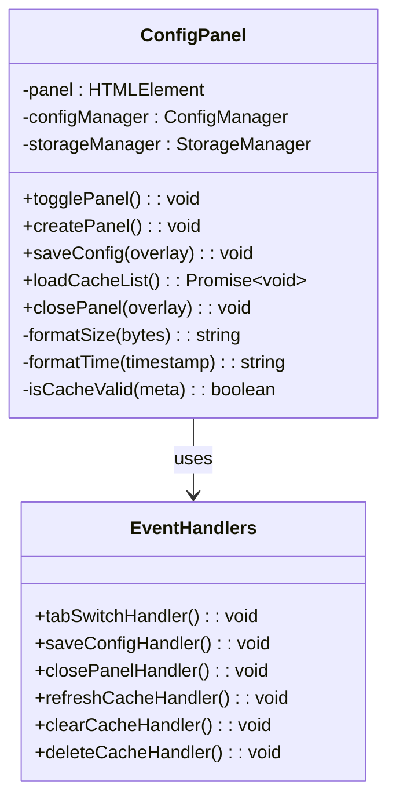
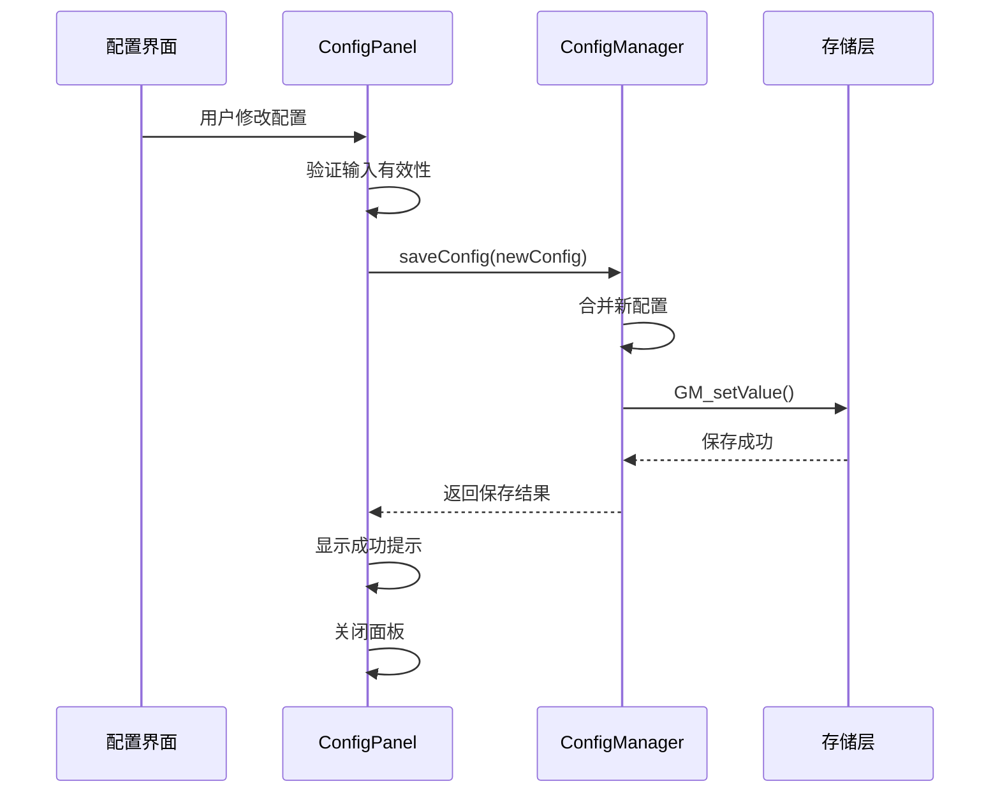
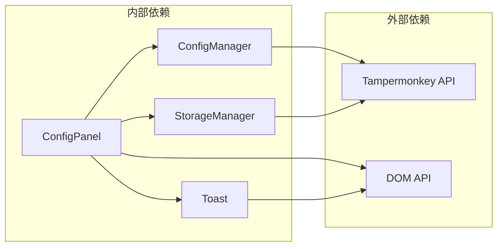

# 可视化配置面板

<cite>
**本文档引用的文件**
- [config-panel.ts](file://src/ui/config-panel.ts)
- [config.ts](file://src/storage/config.ts)
- [storage-manager.ts](file://src/storage/storage-manager.ts)
- [index.ts](file://src/index.ts)
- [toast.ts](file://src/ui/toast.ts)
- [index.d.ts](file://src/types/index.d.ts)
</cite>

## 目录
1. [简介](#简介)
2. [项目结构](#项目结构)
3. [核心组件](#核心组件)
4. [架构概览](#架构概览)
5. [详细组件分析](#详细组件分析)
6. [依赖关系分析](#依赖关系分析)
7. [性能考虑](#性能考虑)
8. [故障排除指南](#故障排除指南)
9. [结论](#结论)

## 简介

可视化配置面板是NGA楼中楼脚本的核心用户界面组件，提供了直观的双标签页设计，允许用户自定义加载策略和缓存设置。该面板采用悬浮入口设计，通过渐变动画呈现，为用户提供便捷的配置管理体验。

## 项目结构

配置面板位于项目的UI层，与其他核心组件协同工作：

**图表来源**
- [config-panel.ts](file://src/ui/config-panel.ts#L1-L560)
- [config.ts](file://src/storage/config.ts#L1-L105)
- [storage-manager.ts](file://src/storage/storage-manager.ts#L1-L596)

**章节来源**
- [config-panel.ts](file://src/ui/config-panel.ts#L1-L560)
- [index.ts](file://src/index.ts#L1-L381)

## 核心组件

### ConfigPanel 类

ConfigPanel 是配置面板的主要类，负责创建、管理和交互配置界面：

- **面板创建**：动态生成包含两个标签页的配置界面
- **事件处理**：管理用户交互事件和状态变化
- **数据绑定**：与ConfigManager和StorageManager进行数据同步
- **状态管理**：维护面板的显示状态和配置变更

### 数据模型

配置系统使用以下核心数据结构：

| 配置项 | 类型 | 默认值 | 描述 |
|--------|------|--------|------|
| initialLoadPages | number | 5 | 初始加载页数（1-50） |
| preloadPages | number | 10 | 预加载页数（0-100） |
| cacheExpireTime | number | 86400000 | 缓存有效期（毫秒） |
| pageLoadInterval | number | 1000 | 页面读取间隔（毫秒） |
| maxCacheSize | number | 52428800 | 最大缓存容量（字节） |
| useVirtualScroll | boolean | true | 是否启用虚拟滚动 |
| virtualScrollBufferSize | number | 10 | 虚拟滚动缓冲区大小 |

**章节来源**
- [config-panel.ts](file://src/ui/config-panel.ts#L25-L32)
- [config.ts](file://src/storage/config.ts#L6-L21)

## 架构概览

配置面板采用分层架构设计，确保组件间的松耦合和高内聚：

**图表来源**
- [config-panel.ts](file://src/ui/config-panel.ts#L37-L262)
- [config.ts](file://src/storage/config.ts#L51-L74)

## 详细组件分析

### 面板创建与渲染

配置面板采用动态创建的方式，在用户触发时才构建DOM结构：

**图表来源**
- [config-panel.ts](file://src/ui/config-panel.ts#L268-L285)
- [config-panel.ts](file://src/ui/config-panel.ts#L37-L262)

#### 标签页设计

面板采用双标签页布局，提供清晰的功能分区：

- **加载配置标签**：管理页面加载策略参数
- **缓存管理标签**：控制缓存行为和清理操作

每个标签页都包含相应的配置选项和操作按钮，确保用户能够快速访问所需功能。

#### 事件处理机制

配置面板实现了完整的事件处理系统：

**图表来源**
- [config-panel.ts](file://src/ui/config-panel.ts#L195-L261)
- [config-panel.ts](file://src/ui/config-panel.ts#L225-L243)

**章节来源**
- [config-panel.ts](file://src/ui/config-panel.ts#L37-L262)

### 数据绑定与持久化

配置系统实现了双向数据绑定，确保配置变更能够实时反映到应用中：

#### 配置管理流程

**图表来源**
- [config-panel.ts](file://src/ui/config-panel.ts#L291-L348)
- [config.ts](file://src/storage/config.ts#L65-L74)

#### 缓存管理系统集成

配置面板与StorageManager深度集成，提供完整的缓存管理功能：

- **缓存列表显示**：实时展示所有缓存的帖子信息
- **容量监控**：动态计算和显示缓存使用情况
- **清理操作**：支持单个删除和批量清理

**章节来源**
- [config-panel.ts](file://src/ui/config-panel.ts#L351-L507)
- [storage-manager.ts](file://src/storage/storage-manager.ts#L392-L434)

### 用户界面设计

#### 响应式布局

配置面板采用响应式设计，适应不同的屏幕尺寸：

- **固定宽度**：主面板宽度为700px，确保内容可读性
- **最大高度**：限制为80vh，避免遮挡过多页面内容
- **弹性布局**：使用flexbox实现灵活的子元素排列

#### 可访问性设计

面板遵循Web可访问性标准：

- **键盘导航**：支持Tab键在表单元素间导航
- **语义化标记**：使用适当的HTML标签和ARIA属性
- **颜色对比**：确保足够的颜色对比度
- **焦点指示**：为交互元素提供清晰的焦点指示

#### 动画效果

面板使用CSS过渡动画提升用户体验：

- **淡入效果**：遮罩层透明度从0到1的平滑过渡
- **位移动画**：面板从下方20px位置向上移动
- **悬停效果**：按钮悬停时的视觉反馈

**章节来源**
- [config-panel.ts](file://src/ui/config-panel.ts#L38-L64)
- [config-panel.ts](file://src/ui/config-panel.ts#L245-L260)

### 状态管理

配置面板实现了完整的状态管理机制：

#### 面板状态

| 状态 | 描述 | 触发条件 |
|------|------|----------|
| 隐藏 | 面板完全不可见 | 初始状态或用户关闭 |
| 显示中 | 正在执行显示动画 | 用户点击悬浮入口 |
| 显示 | 面板完全可见 | 显示动画完成后 |
| 关闭中 | 正在执行关闭动画 | 用户点击关闭按钮 |

#### 配置状态

配置系统维护以下状态信息：

- **当前配置**：从ConfigManager获取的最新配置
- **临时配置**：用户在面板中修改但未保存的配置
- **验证状态**：各配置项的有效性检查结果

**章节来源**
- [config-panel.ts](file://src/ui/config-panel.ts#L268-L285)
- [config-panel.ts](file://src/ui/config-panel.ts#L548-L557)

## 依赖关系分析

配置面板与多个核心组件存在密切的依赖关系：

**图表来源**
- [config-panel.ts](file://src/ui/config-panel.ts#L1-L7)
- [config.ts](file://src/storage/config.ts#L51-L74)
- [storage-manager.ts](file://src/storage/storage-manager.ts#L56-L90)

### 依赖注入模式

配置面板采用依赖注入模式，通过构造函数接收依赖：

- **ConfigManager**：负责配置的读取和保存
- **StorageManager**：负责缓存数据的管理

这种设计提高了组件的可测试性和可维护性。

**章节来源**
- [config-panel.ts](file://src/ui/config-panel.ts#L29-L32)
- [index.ts](file://src/index.ts#L322-L324)

## 性能考虑

### 内存管理

配置面板实现了有效的内存管理策略：

- **延迟初始化**：面板仅在用户需要时创建
- **事件清理**：面板关闭时移除所有事件监听器
- **DOM复用**：避免重复创建相同的DOM结构

### 异步操作

缓存管理操作采用异步处理：

- **并发加载**：同时获取多个缓存项的信息
- **进度反馈**：为长时间操作提供进度指示
- **错误恢复**：网络错误时提供友好的错误提示

### 数据优化

- **懒加载**：缓存列表按需加载
- **分页显示**：大量缓存时采用分页展示
- **智能排序**：按最后访问时间排序缓存项

## 故障排除指南

### 常见问题及解决方案

#### 配置无法保存

**症状**：修改配置后点击保存，但配置没有生效

**可能原因**：
- Tampermonkey权限不足
- 浏览器存储空间已满
- 配置格式验证失败

**解决方法**：
1. 检查Tampermonkey的GM_setValue权限
2. 清理浏览器缓存和存储
3. 验证输入值是否在有效范围内

#### 缓存管理功能异常

**症状**：缓存列表无法加载或显示错误

**可能原因**：
- IndexedDB访问被阻止
- 存储损坏或格式错误
- 网络连接问题

**解决方法**：
1. 检查浏览器的IndexedDB支持
2. 尝试清除所有缓存重新加载
3. 检查网络连接状态

#### 面板显示异常

**症状**：配置面板无法正常显示或样式错乱

**可能原因**：
- CSS样式冲突
- DOM结构被其他脚本修改
- 浏览器兼容性问题

**解决方法**：
1. 检查页面上的CSS冲突
2. 重启浏览器或禁用冲突的扩展
3. 使用现代浏览器版本

**章节来源**
- [config-panel.ts](file://src/ui/config-panel.ts#L313-L348)
- [config-panel.ts](file://src/ui/config-panel.ts#L461-L468)

## 结论

可视化配置面板是NGA楼中楼脚本的重要组成部分，它成功地将复杂的配置管理功能封装在一个用户友好的界面中。通过双标签页设计、实时数据绑定和完善的错误处理，该面板为用户提供了高效的配置管理体验。

### 主要优势

1. **直观的用户界面**：双标签页设计清晰区分了加载配置和缓存管理功能
2. **实时反馈**：配置变更即时生效，提供及时的用户反馈
3. **强大的缓存管理**：完整的缓存监控和清理功能
4. **良好的可访问性**：遵循Web可访问性标准，支持多种交互方式
5. **高性能设计**：采用异步操作和内存优化，确保流畅的用户体验

### 改进建议

1. **配置导入导出**：添加配置备份和恢复功能
2. **高级过滤**：在缓存列表中添加搜索和过滤功能
3. **配置模板**：提供预设的配置模板供用户选择
4. **移动端优化**：针对移动设备优化界面布局

配置面板的设计体现了现代Web应用的最佳实践，为用户提供了专业而易用的配置管理工具。