# 智能缓存系统

<cite>
**本文档引用的文件**
- [CLAUDE.md](file://CLAUDE.md)
- [src/storage/cache.ts](file://src/storage/cache.ts)
- [src/storage/storage-manager.ts](file://src/storage/storage-manager.ts)
- [src/storage/indexeddb-adapter.ts](file://src/storage/indexeddb-adapter.ts)
- [src/storage/config.ts](file://src/storage/config.ts)
- [src/core/page-loader.ts](file://src/core/page-loader.ts)
- [src/ui/config-panel.ts](file://src/ui/config-panel.ts)
</cite>

## 目录
1. [简介](#简介)
2. [存储架构概览](#存储架构概览)
3. [核心组件分析](#核心组件分析)
4. [缓存管理机制](#缓存管理机制)
5. [存储适配器设计](#存储适配器设计)
6. [缓存策略与过期机制](#缓存策略与过期机制)
7. [性能优化与容量管理](#性能优化与容量管理)
8. [系统集成与用户体验](#系统集成与用户体验)
9. [故障排除指南](#故障排除指南)
10. [总结](#总结)

## 简介

智能缓存系统是NGA嵌套回复用户脚本的核心组件，旨在为用户提供快速、高效的论坛浏览体验。该系统通过多层次的缓存策略，结合IndexedDB和GM存储的统一接口，实现了24小时内快速恢复的用户体验，同时具备智能的容量管理和自动清理机制。

系统采用基于配置的缓存过期策略，支持从1小时到永久存储的灵活配置，并通过内存缓存和磁盘存储的双重保障，确保数据的安全性和访问效率。

## 存储架构概览

智能缓存系统采用分层存储架构，包含以下核心存储实体：

```mermaid
graph TB
subgraph "存储架构"
A[NGA_THREAD_META_{tid}] --> B[主题元数据<br/>totalPages, cachedPages, lastAccess]
C[NGA_PAGE_CONTENT_{tid}_{page}] --> D[页面内容<br/>rawHTML, timestamp]
E[NGA_THREAD_CONFIG] --> F[用户配置<br/>cacheExpireTime, maxCacheSize]
G[NGA_COLLAPSE_STATE_{tid}] --> H[折叠状态<br/>expandedFloors]
end
subgraph "存储适配器"
I[StorageManager] --> J[IndexedDBAdapter]
I --> K[GM存储]
J --> L[数据库操作]
K --> M[Tampermonkey API]
end
subgraph "缓存管理层"
N[CacheManager] --> O[缓存验证]
N --> P[自动清理]
N --> Q[容量监控]
end
A --> I
C --> I
E --> I
G --> I
I --> N
```

**图表来源**
- [src/storage/storage-manager.ts](file://src/storage/storage-manager.ts#L47-L596)
- [src/storage/cache.ts](file://src/storage/cache.ts#L39-L287)

**章节来源**
- [CLAUDE.md](file://CLAUDE.md#L84-L96)

## 核心组件分析

### StorageManager - 统一存储接口

StorageManager作为存储层的统一接口，提供了透明的存储抽象，自动在IndexedDB和GM存储之间进行降级切换。

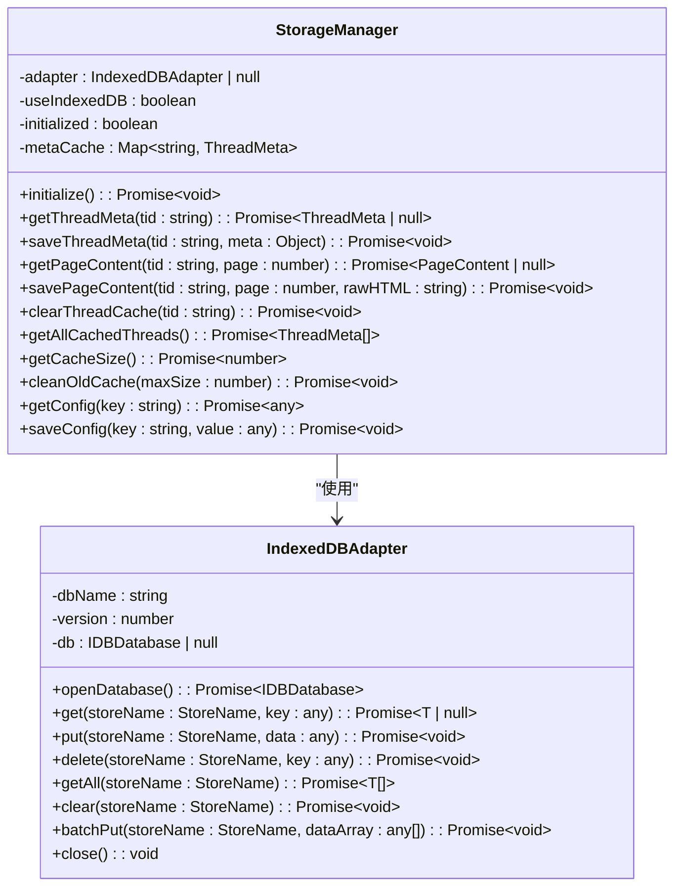

**图表来源**
- [src/storage/storage-manager.ts](file://src/storage/storage-manager.ts#L47-L596)
- [src/storage/indexeddb-adapter.ts](file://src/storage/indexeddb-adapter.ts#L12-L348)

### CacheManager - 缓存管理核心

CacheManager负责具体的缓存操作，包括元数据管理、页面内容缓存和自动清理功能。

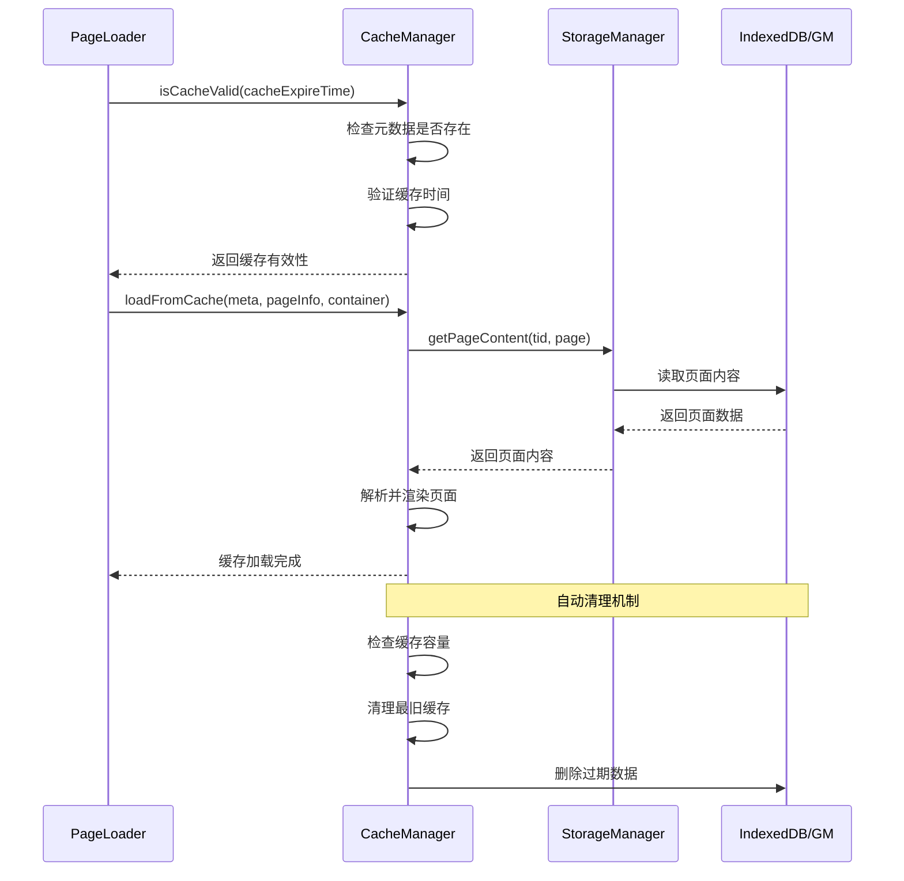

**图表来源**
- [src/storage/cache.ts](file://src/storage/cache.ts#L138-L147)
- [src/core/page-loader.ts](file://src/core/page-loader.ts#L85-L90)

**章节来源**
- [src/storage/cache.ts](file://src/storage/cache.ts#L39-L287)
- [src/storage/storage-manager.ts](file://src/storage/storage-manager.ts#L47-L596)

## 缓存管理机制

### 元数据缓存（NGA_THREAD_META_{tid}）

元数据缓存存储每个主题的关键信息，包括页面总数、已缓存页面列表、最后访问时间和创建时间。

| 字段名 | 类型 | 描述 | 必填 |
|--------|------|------|------|
| tid | string | 主题ID | 是 |
| title | string | 主题标题 | 否 |
| totalPages | number | 总页面数 | 否 |
| cachedPages | number[] | 已缓存页面数组 | 否 |
| lastAccess | number | 最后访问时间戳 | 是 |
| cacheTime | number | 缓存创建时间戳 | 是 |

### 页面内容缓存（NGA_PAGE_CONTENT_{tid}_{page}）

页面内容缓存存储具体的HTML内容，包含时间戳用于过期检查。

| 字段名 | 类型 | 描述 | 必填 |
|--------|------|------|------|
| page | number | 页面编号 | 是 |
| rawHTML | string | 原始HTML内容 | 是 |
| timestamp | number | 时间戳 | 是 |

### 缓存验证机制

系统通过`isCacheValid`方法实现智能的缓存验证：

```mermaid
flowchart TD
A[开始缓存验证] --> B{检查元数据存在?}
B --> |否| C[返回false]
B --> |是| D{检查过期时间配置}
D --> |-1 (永久)| E[返回true]
D --> |具体时间| F[计算时间差]
F --> G{时间差 < 配置时间?}
G --> |是| E
G --> |否| C
E --> H[缓存有效]
C --> I[缓存无效]
```

**图表来源**
- [src/storage/cache.ts](file://src/storage/cache.ts#L138-L147)
- [src/core/page-loader.ts](file://src/core/page-loader.ts#L85-L90)

**章节来源**
- [src/storage/cache.ts](file://src/storage/cache.ts#L8-L25)
- [src/storage/cache.ts](file://src/storage/cache.ts#L138-L147)

## 存储适配器设计

### IndexedDBAdapter - 高性能存储

IndexedDBAdapter提供了基于IndexedDB的高性能存储解决方案，支持事务操作和批量写入。

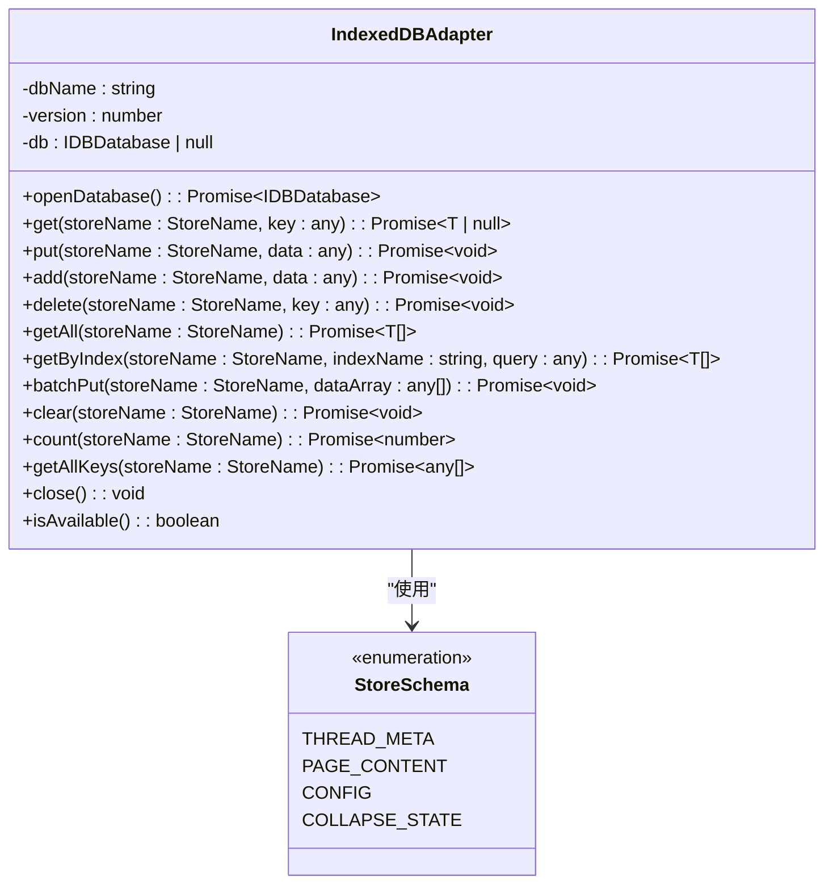

**图表来源**
- [src/storage/indexeddb-adapter.ts](file://src/storage/indexeddb-adapter.ts#L12-L348)

### 存储降级机制

系统具备智能的存储降级能力，当IndexedDB不可用时自动切换到GM存储：

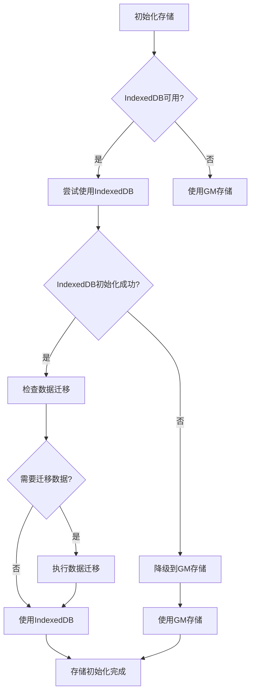

**图表来源**
- [src/storage/storage-manager.ts](file://src/storage/storage-manager.ts#L61-L85)

**章节来源**
- [src/storage/indexeddb-adapter.ts](file://src/storage/indexeddb-adapter.ts#L12-L348)
- [src/storage/storage-manager.ts](file://src/storage/storage-manager.ts#L47-L596)

## 缓存策略与过期机制

### 配置驱动的过期策略

系统通过`cacheExpireTime`配置参数控制缓存的有效期，支持多种时间选项：

| 配置值 | 时间范围 | 用途 |
|--------|----------|------|
| 3600000 | 1小时 | 测试和短期缓存 |
| 43200000 | 12小时 | 日常浏览缓存 |
| 86400000 | 24小时 | 默认缓存期限 |
| 604800000 | 7天 | 长期缓存 |
| -1 | 永久 | 不过期缓存 |

### 自动清理机制

系统实现了智能的自动清理机制，确保缓存容量不会无限增长：

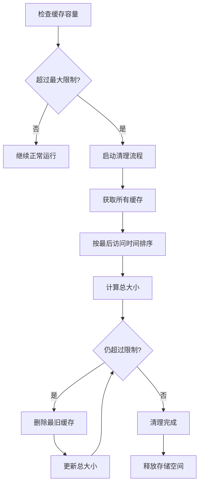

**图表来源**
- [src/storage/cache.ts](file://src/storage/cache.ts#L230-L284)

### 内存缓存优化

StorageManager实现了内存缓存机制，提升频繁访问数据的读取速度：

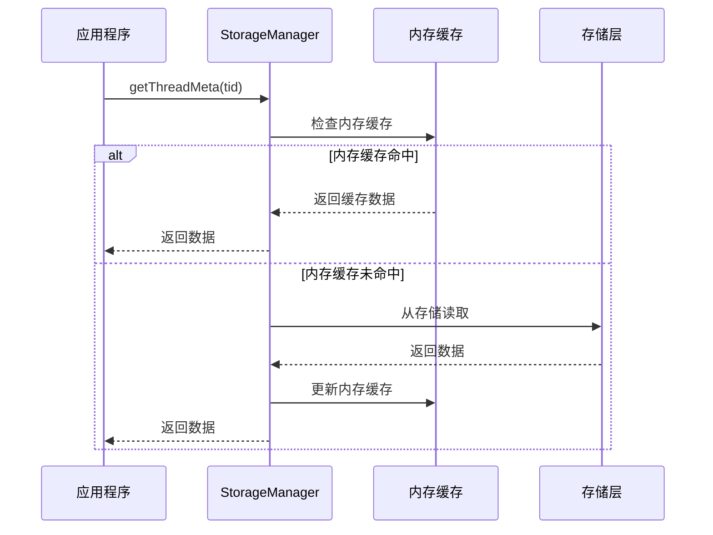

**图表来源**
- [src/storage/storage-manager.ts](file://src/storage/storage-manager.ts#L51-L52)

**章节来源**
- [src/storage/config.ts](file://src/storage/config.ts#L26-L105)
- [src/storage/cache.ts](file://src/storage/cache.ts#L230-L284)

## 性能优化与容量管理

### 缓存大小监控

系统提供了精确的缓存大小监控机制，实时跟踪存储使用情况：

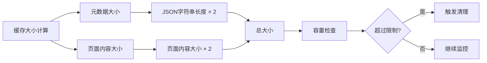

**图表来源**
- [src/storage/cache.ts](file://src/storage/cache.ts#L180-L204)

### 批量操作优化

IndexedDBAdapter支持批量操作，显著提升大量数据处理的性能：

| 操作类型 | 单次操作 | 批量操作 | 性能提升 |
|----------|----------|----------|----------|
| 写入 | put() | batchPut() | 10-50倍 |
| 删除 | delete() | clear() | 5-20倍 |
| 查询 | get() | getAll() | 3-15倍 |

### 数据迁移机制

系统具备智能的数据迁移能力，支持从GM存储平滑迁移到IndexedDB：

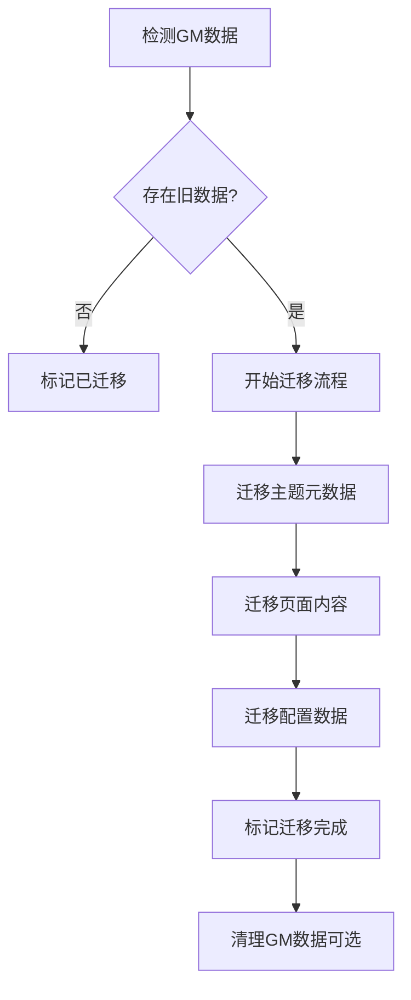

**图表来源**
- [src/storage/storage-manager.ts](file://src/storage/storage-manager.ts#L96-L170)

**章节来源**
- [src/storage/cache.ts](file://src/storage/cache.ts#L180-L204)
- [src/storage/storage-manager.ts](file://src/storage/storage-manager.ts#L96-L170)

## 系统集成与用户体验

### PageLoader集成

PageLoader与缓存系统深度集成，实现智能的缓存加载策略：

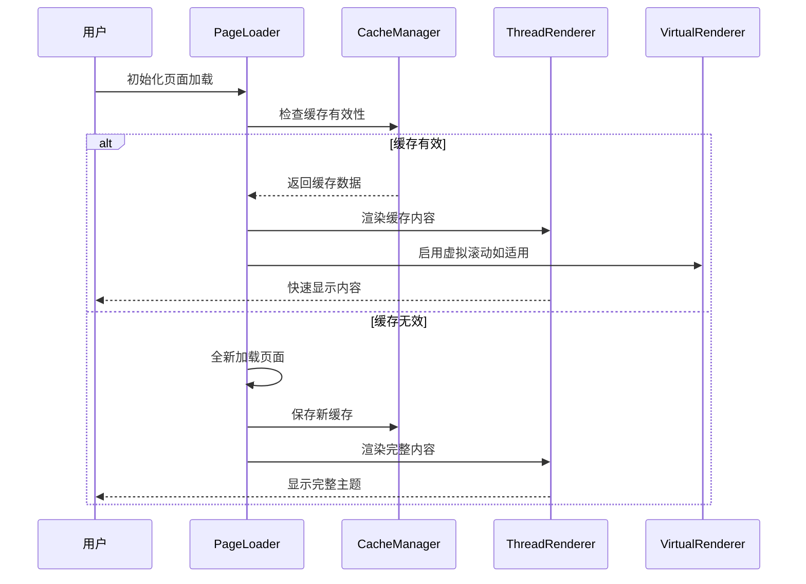

**图表来源**
- [src/core/page-loader.ts](file://src/core/page-loader.ts#L66-L78)

### 用户界面集成

ConfigPanel提供了直观的缓存管理界面，支持实时监控和手动清理：

| 功能特性 | 描述 | 用户价值 |
|----------|------|----------|
| 缓存统计 | 实时显示缓存使用情况 | 帮助用户了解存储占用 |
| 单个删除 | 可选择性删除特定帖子缓存 | 精确控制存储空间 |
| 批量清理 | 一键清空所有缓存 | 快速释放大量空间 |
| 容量警告 | 超出限制时的视觉提示 | 预防存储溢出 |

### 性能监控

系统内置性能监控机制，跟踪缓存操作的性能指标：

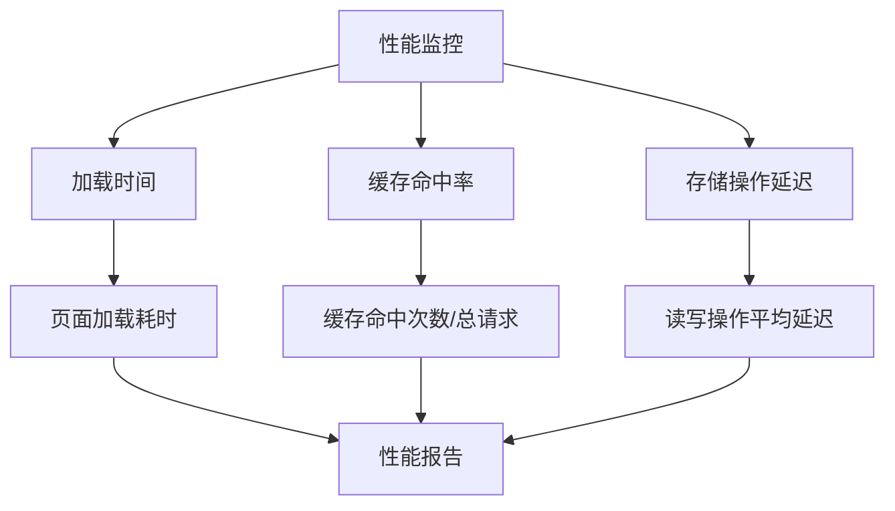

**图表来源**
- [src/ui/config-panel.ts](file://src/ui/config-panel.ts#L354-L468)

**章节来源**
- [src/core/page-loader.ts](file://src/core/page-loader.ts#L66-L78)
- [src/ui/config-panel.ts](file://src/ui/config-panel.ts#L24-L560)

## 故障排除指南

### 常见问题诊断

| 问题症状 | 可能原因 | 解决方案 |
|----------|----------|----------|
| 缓存无法加载 | 存储空间不足 | 清理缓存或增加容量限制 |
| 页面加载缓慢 | 缓存失效频繁 | 调整缓存过期时间 |
| 存储异常 | IndexedDB损坏 | 切换到GM存储模式 |
| 数据丢失 | 迁移失败 | 重新初始化存储 |

### 调试工具

系统提供了多种调试工具帮助开发者诊断问题：

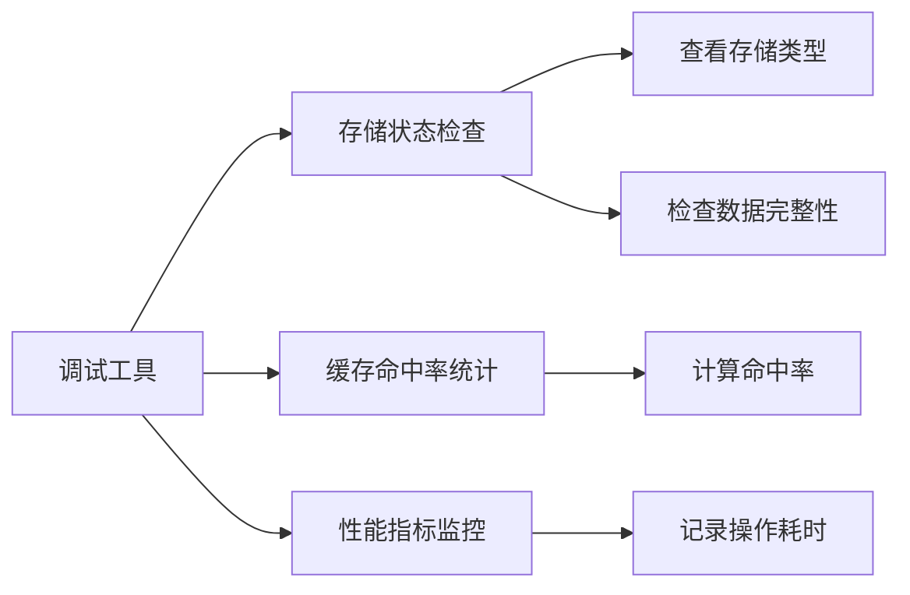

### 错误处理机制

系统实现了完善的错误处理机制，确保即使部分功能失败也不会影响整体运行：

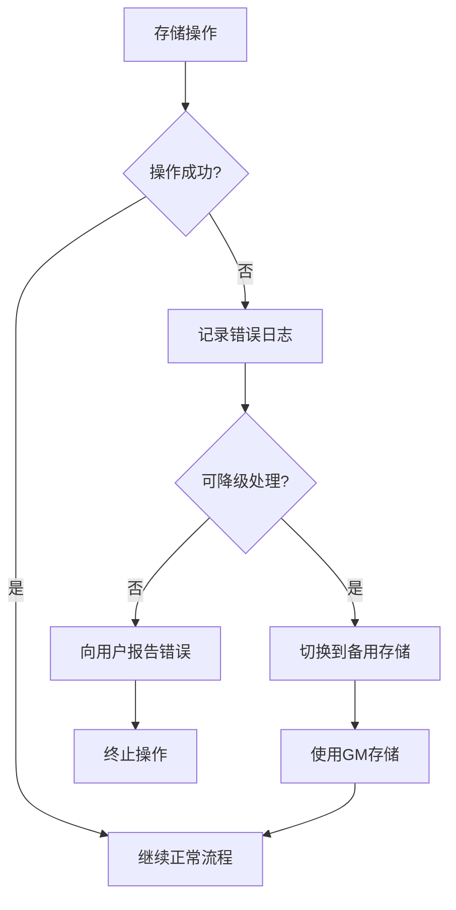

**图表来源**
- [src/storage/storage-manager.ts](file://src/storage/storage-manager.ts#L66-L80)

**章节来源**
- [src/storage/storage-manager.ts](file://src/storage/storage-manager.ts#L66-L80)
- [src/storage/cache.ts](file://src/storage/cache.ts#L230-L284)

## 总结

智能缓存系统通过精心设计的多层架构，实现了高效、可靠的存储解决方案。系统的主要优势包括：

1. **统一存储接口**：通过StorageManager提供透明的存储抽象，自动在IndexedDB和GM存储之间切换
2. **智能缓存策略**：基于配置的过期机制和自动清理功能，平衡性能和存储效率
3. **内存优化**：双重缓存机制提升频繁访问数据的读取速度
4. **容量管理**：精确的大小监控和自动清理确保系统稳定运行
5. **用户友好**：直观的配置界面和实时监控提升用户体验

该系统为NGA嵌套回复功能提供了坚实的数据基础，支持24小时内快速恢复的用户体验，同时具备良好的扩展性和维护性。通过合理的配置和监控，可以确保系统在各种使用场景下都能保持最佳性能。