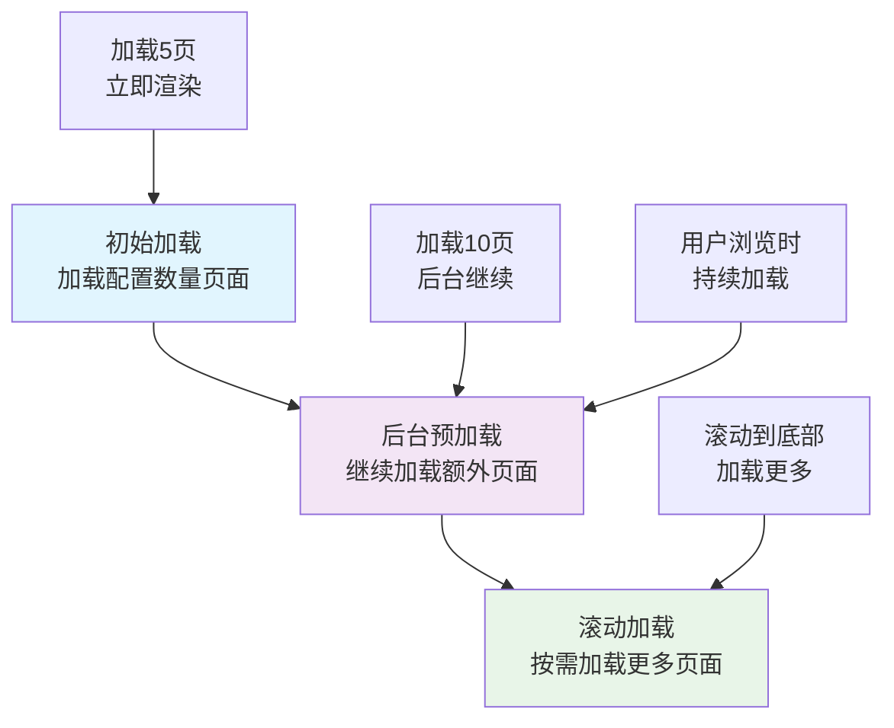
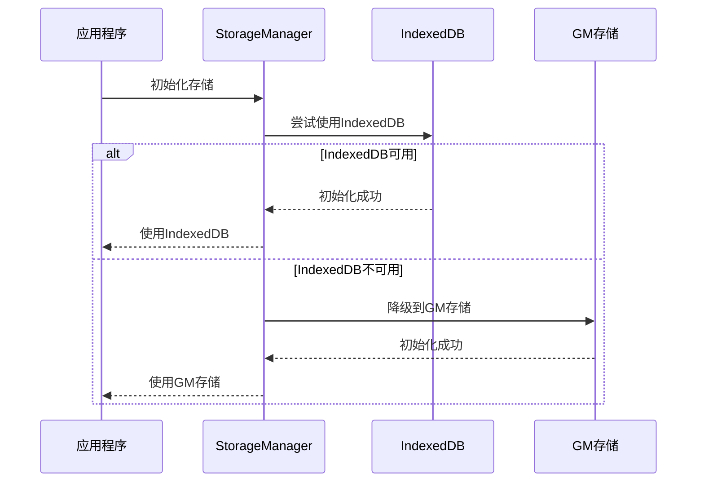
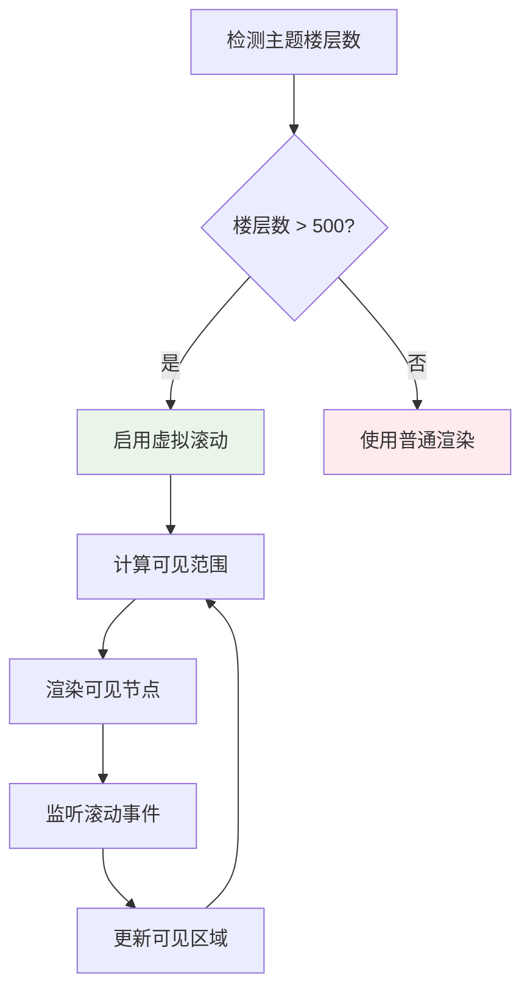
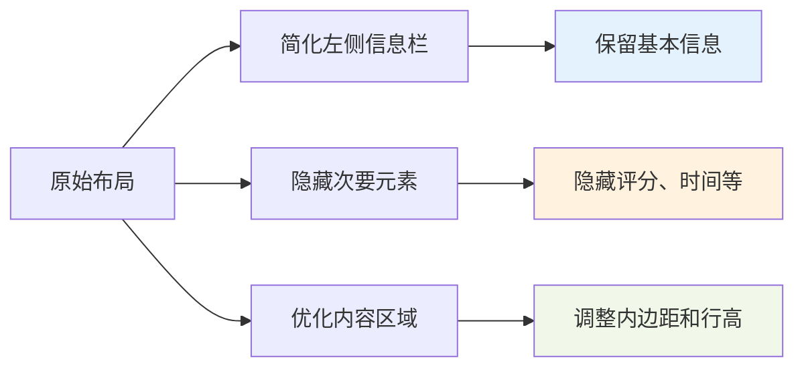
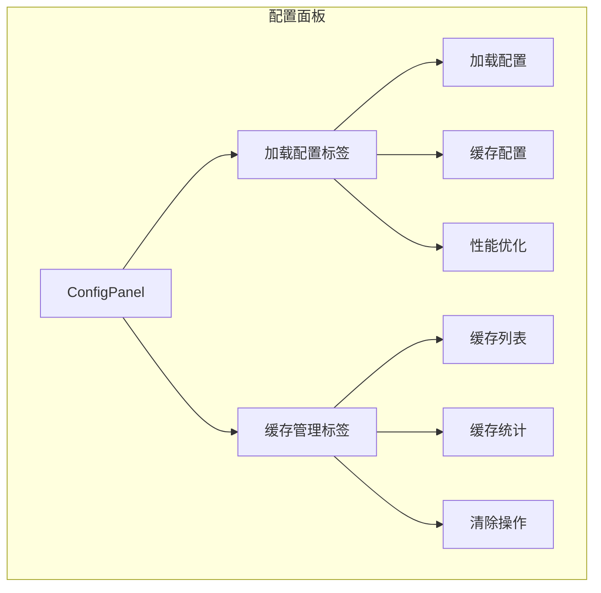
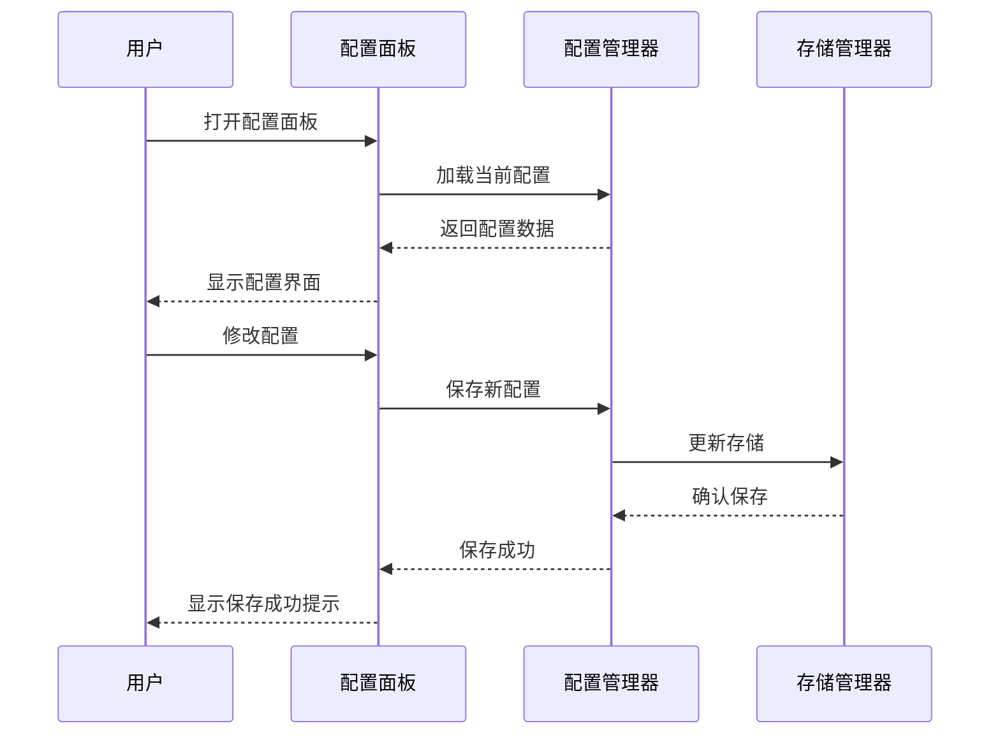
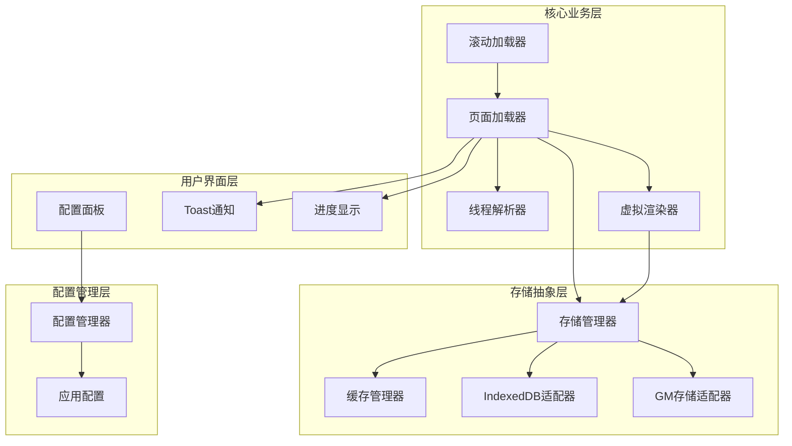
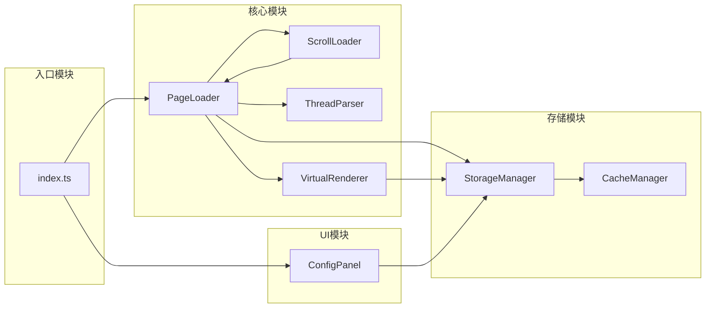
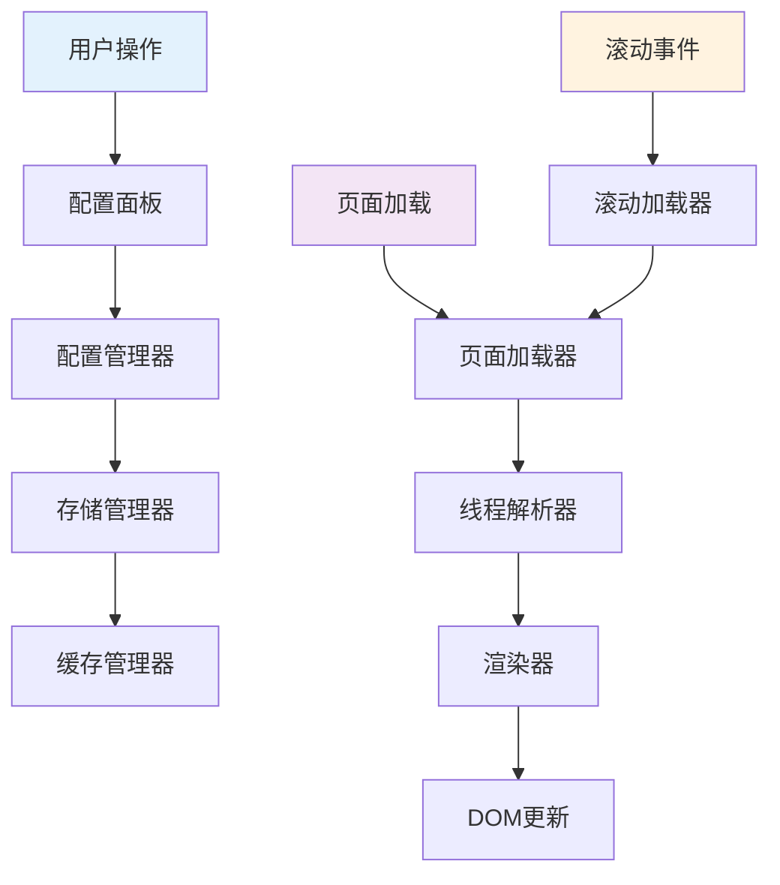
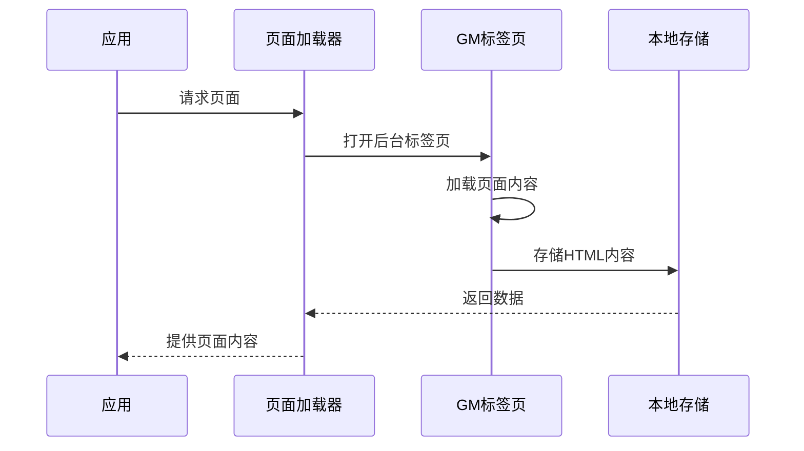

# 核心功能

<cite>
**本文档引用的文件**
- [page-loader.ts](file://src/core/page-loader.ts)
- [virtual-renderer.ts](file://src/core/virtual-renderer.ts)
- [config-panel.ts](file://src/ui/config-panel.ts)
- [cache.ts](file://src/storage/cache.ts)
- [storage-manager.ts](file://src/storage/storage-manager.ts)
- [thread-parser.ts](file://src/core/thread-parser.ts)
- [scroll-loader.ts](file://src/core/scroll-loader.ts)
- [config.ts](file://src/storage/config.ts)
- [index.d.ts](file://src/types/index.d.ts)
- [CLAUDE.md](file://CLAUDE.md)
</cite>

## 目录
1. [简介](#简介)
2. [渐进式加载系统](#渐进式加载系统)
3. [智能缓存系统](#智能缓存系统)
4. [虚拟滚动技术](#虚拟滚动技术)
5. [可视化配置面板](#可视化配置面板)
6. [系统架构概览](#系统架构概览)
7. [性能优化策略](#性能优化策略)
8. [总结](#总结)

## 简介

NGA嵌套回复扩展是一个基于TypeScript的Tampermonkey用户脚本，专门用于将NGA论坛的平面主题结构转换为嵌套回复（楼中楼）视图。该系统通过四个核心功能实现了卓越的性能和用户体验：

- **渐进式加载**：智能的三阶段加载策略，确保快速响应和流畅体验
- **智能缓存系统**：高效的存储架构，支持元数据和页面内容的双重缓存
- **虚拟滚动技术**：针对大主题的性能优化，仅渲染可见区域
- **可视化配置面板**：直观的用户界面，提供全面的系统控制

## 渐进式加载系统

### 三阶段工作流程

渐进式加载系统采用精心设计的三阶段策略，确保在不同场景下都能提供最佳的用户体验：



**图表来源**
- [page-loader.ts](file://src/core/page-loader.ts#L62-L80)
- [page-loader.ts](file://src/core/page-loader.ts#L207-L223)

### 初始加载阶段

初始加载阶段负责快速建立基础视图，采用以下策略：

1. **配置驱动加载**：根据`initialLoadPages`配置加载指定数量的页面
2. **即时渲染**：达到阈值后立即开始解析和渲染
3. **用户体验优先**：确保用户能在最短时间内看到内容

### 后台预加载机制

后台预加载确保用户在浏览过程中始终有新内容可用：

1. **异步加载**：在用户阅读时继续加载后续页面
2. **智能调度**：使用定时器控制加载节奏，避免影响当前浏览
3. **无缝衔接**：预加载完成后自动进入滚动加载模式

### 滚动加载策略

滚动加载提供按需加载能力，特别适合长主题：

1. **阈值触发**：距离底部一定距离时触发加载
2. **批量处理**：一次性加载多个页面，提高效率
3. **状态管理**：精确跟踪加载状态，避免重复加载

**章节来源**
- [page-loader.ts](file://src/core/page-loader.ts#L62-L80)
- [page-loader.ts](file://src/core/page-loader.ts#L207-L223)
- [scroll-loader.ts](file://src/core/scroll-loader.ts#L34-L44)

## 智能缓存系统

### 存储架构设计

智能缓存系统采用分层存储架构，支持多种存储后端：

```mermaid
graph TB
subgraph "存储管理层"
SM[StorageManager]
IDB[IndexedDB适配器]
GM[GM存储适配器]
end
subgraph "缓存类型"
TM[线程元数据<br/>NGA_THREAD_META_{tid}]
PC[页面内容<br/>NGA_PAGE_CONTENT_{tid}_{page}]
CFG[配置数据<br/>NGA_THREAD_CONFIG]
CS[折叠状态<br/>NGA_COLLAPSE_STATE_{tid}]
end
SM --> IDB
SM --> GM
IDB --> TM
IDB --> PC
IDB --> CFG
IDB --> CS
GM --> TM
GM --> PC
GM --> CFG
GM --> CS
```

**图表来源**
- [storage-manager.ts](file://src/storage/storage-manager.ts#L47-L91)
- [cache.ts](file://src/storage/cache.ts#L39-L46)

### 元数据缓存机制

线程元数据缓存包含以下关键信息：

| 字段 | 描述 | 存储键格式 |
|------|------|-----------|
| `tid` | 线程ID | `NGA_THREAD_META_{tid}` |
| `title` | 帖子标题 | JSON字符串 |
| `totalPages` | 总页数 | 数字 |
| `cachedPages` | 已缓存页面列表 | 数组 |
| `lastAccess` | 最后访问时间 | 时间戳 |
| `cacheTime` | 缓存创建时间 | 时间戳 |

### 页面内容缓存

页面内容缓存存储原始HTML数据，支持版本控制：

| 字段 | 描述 | 存储键格式 |
|------|------|-----------|
| `page` | 页面编号 | `NGA_PAGE_CONTENT_{tid}_{page}` |
| `rawHTML` | 原始HTML内容 | JSON字符串 |
| `timestamp` | 时间戳 | 时间戳 |

### 过期策略与自动清理

缓存系统实现了智能的过期管理和自动清理机制：

1. **时间过期**：支持1小时到永久的不同过期时间配置
2. **容量限制**：当缓存超过最大容量时自动清理最旧数据
3. **LRU算法**：基于最后访问时间的清理策略
4. **渐进式清理**：避免一次性清理造成性能问题

### 存储适配器切换

系统支持动态存储适配器切换：



**图表来源**
- [storage-manager.ts](file://src/storage/storage-manager.ts#L62-L91)

**章节来源**
- [cache.ts](file://src/storage/cache.ts#L39-L95)
- [storage-manager.ts](file://src/storage/storage-manager.ts#L175-L240)
- [storage-manager.ts](file://src/storage/storage-manager.ts#L337-L390)

## 虚拟滚动技术

### 自动启用机制

虚拟滚动技术在检测到主题超过500楼时自动启用，提供卓越的性能表现：



**图表来源**
- [virtual-renderer.ts](file://src/core/virtual-renderer.ts#L48-L52)
- [virtual-renderer.ts](file://src/core/virtual-renderer.ts#L74-L105)

### 虚拟滚动实现原理

虚拟滚动通过以下核心机制实现高性能渲染：

1. **扁平化节点树**：将嵌套的回复结构转换为线性数组
2. **固定高度估算**：为每个节点提供初始高度估算
3. **动态高度测量**：异步测量实际高度并更新布局
4. **视口裁剪**：只渲染当前可见区域的内容

### 渲染优化策略

虚拟渲染器采用多种优化策略：

| 优化技术 | 实现方式 | 性能收益 |
|----------|----------|----------|
| 缓冲区渲染 | 视口上下额外渲染10个节点 | 减少滚动停顿时长 |
| 异步高度测量 | requestAnimationFrame测量 | 避免阻塞主线程 |
| DOM碎片化 | DocumentFragment批量插入 | 减少重绘次数 |
| 样式优化 | CSS containment属性 | 提升渲染性能 |

### 布局优化

虚拟渲染器对回复布局进行了深度优化：



**图表来源**
- [virtual-renderer.ts](file://src/core/virtual-renderer.ts#L370-L416)

### 性能监控

虚拟渲染器内置性能监控功能：

1. **渲染状态追踪**：实时监控渲染状态和性能指标
2. **内存使用监控**：跟踪DOM节点数量和内存占用
3. **滚动性能分析**：分析滚动流畅度和帧率

**章节来源**
- [virtual-renderer.ts](file://src/core/virtual-renderer.ts#L48-L105)
- [virtual-renderer.ts](file://src/core/virtual-renderer.ts#L175-L331)
- [virtual-renderer.ts](file://src/core/virtual-renderer.ts#L470-L502)

## 可视化配置面板

### 双标签页设计

配置面板采用直观的双标签页设计，提供清晰的功能分区：



**图表来源**
- [config-panel.ts](file://src/ui/config-panel.ts#L37-L185)

### 加载配置管理

加载配置面板允许用户精细控制加载行为：

| 配置项 | 默认值 | 范围 | 影响 |
|--------|--------|------|------|
| 初始加载页数 | 5 | 1-50 | 达到此页数后立即开始转换 |
| 预加载页数 | 10 | 0-100 | 转换后继续后台加载的页数 |
| 页面读取间隔 | 1000ms | 500-5000ms | 每个页面读取的等待时间 |
| 虚拟滚动缓冲区 | 10 | 5-30 | 视口上下额外渲染的楼层数 |

### 缓存管理功能

缓存管理面板提供全面的缓存控制能力：

1. **缓存统计**：实时显示缓存使用情况和容量占比
2. **缓存列表**：展示所有缓存的帖子及其详细信息
3. **单个删除**：支持删除特定帖子的缓存
4. **批量清理**：一键清空所有缓存数据

### 用户交互设计

配置面板采用现代化的用户界面设计：



**图表来源**
- [config-panel.ts](file://src/ui/config-panel.ts#L268-L274)
- [config-panel.ts](file://src/ui/config-panel.ts#L291-L349)

### 实时反馈机制

配置面板提供即时的用户反馈：

1. **输入验证**：实时检查配置值的有效性
2. **保存确认**：配置保存成功后的视觉反馈
3. **错误提示**：配置错误时的友好提示信息
4. **状态同步**：配置变更后的实时状态更新

**章节来源**
- [config-panel.ts](file://src/ui/config-panel.ts#L37-L185)
- [config-panel.ts](file://src/ui/config-panel.ts#L291-L349)
- [config-panel.ts](file://src/ui/config-panel.ts#L354-L508)

## 系统架构概览

### 整体架构设计

系统采用模块化架构，各核心功能相互协作：



**图表来源**
- [page-loader.ts](file://src/core/page-loader.ts#L47-L52)
- [storage-manager.ts](file://src/storage/storage-manager.ts#L47-L91)

### 模块间依赖关系

各核心模块之间的依赖关系体现了清晰的职责分离：



**图表来源**
- [index.ts](file://src/index.ts#L355-L381)

### 数据流架构

系统遵循单向数据流原则，确保数据的一致性和可预测性：



**图表来源**
- [page-loader.ts](file://src/core/page-loader.ts#L62-L80)
- [scroll-loader.ts](file://src/core/scroll-loader.ts#L34-L44)

**章节来源**
- [index.ts](file://src/index.ts#L355-L381)
- [page-loader.ts](file://src/core/page-loader.ts#L47-L52)
- [storage-manager.ts](file://src/storage/storage-manager.ts#L47-L91)

## 性能优化策略

### 渐进式渲染优化

系统采用多种渐进式渲染策略提升性能：

1. **增量渲染**：将大型渲染任务分解为小批次处理
2. **防抖处理**：对频繁触发的操作进行防抖优化
3. **异步处理**：使用Promise和async/await实现非阻塞操作
4. **内存管理**：及时清理不再使用的DOM节点和事件监听器

### 缓存优化策略

缓存系统采用多层次优化策略：

| 优化技术 | 实现方式 | 性能收益 |
|----------|----------|----------|
| 内存缓存 | Map对象缓存热数据 | 减少重复查询 |
| 分层存储 | IndexedDB + GM存储 | 提升存储容量 |
| 智能清理 | LRU算法自动清理 | 控制内存占用 |
| 增量更新 | 只更新变化的数据 | 减少I/O操作 |

### 虚拟滚动性能优化

虚拟滚动技术结合多种性能优化手段：

1. **CSS containment**：使用containment属性隔离渲染区域
2. **will-change属性**：提前告知浏览器动画意图
3. **requestAnimationFrame**：在下一帧绘制时测量高度
4. **DocumentFragment**：批量DOM操作减少重绘

### 网络请求优化

系统在网络请求层面也进行了深度优化：



**图表来源**
- [page-loader.ts](file://src/core/page-loader.ts#L313-L335)

**章节来源**
- [page-loader.ts](file://src/core/page-loader.ts#L313-L335)
- [virtual-renderer.ts](file://src/core/virtual-renderer.ts#L420-L468)
- [storage-manager.ts](file://src/storage/storage-manager.ts#L62-L91)

## 总结

NGA嵌套回复扩展通过四个核心功能的完美结合，实现了卓越的性能和用户体验：

### 核心优势

1. **渐进式加载**：三阶段加载策略确保快速响应和流畅体验
2. **智能缓存**：高效的存储架构支持大规模数据缓存
3. **虚拟滚动**：针对大主题的性能优化技术
4. **可视化配置**：直观易用的用户界面

### 技术创新

- **自适应渲染**：根据内容规模自动选择最优渲染策略
- **智能缓存管理**：基于使用频率和容量的智能清理算法
- **模块化架构**：清晰的职责分离和良好的扩展性
- **性能监控**：内置的性能分析和优化建议

### 应用价值

该系统不仅解决了NGA论坛长主题浏览的性能问题，更为类似的应用提供了优秀的架构参考和实现范例。通过合理的技术选型和优化策略，成功地在浏览器环境中实现了接近原生应用的用户体验。