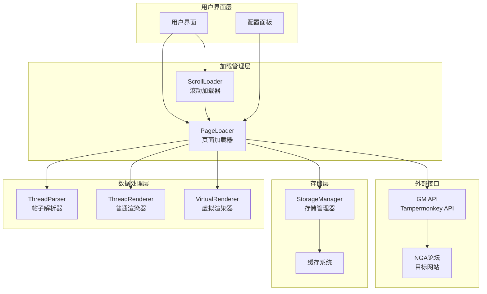
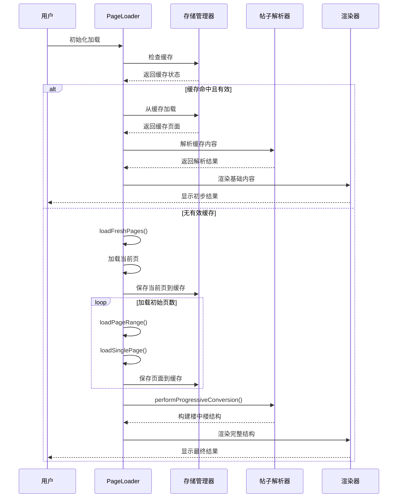
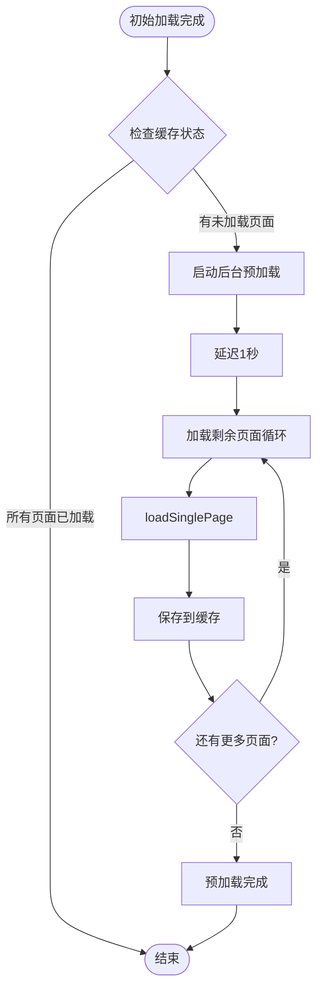
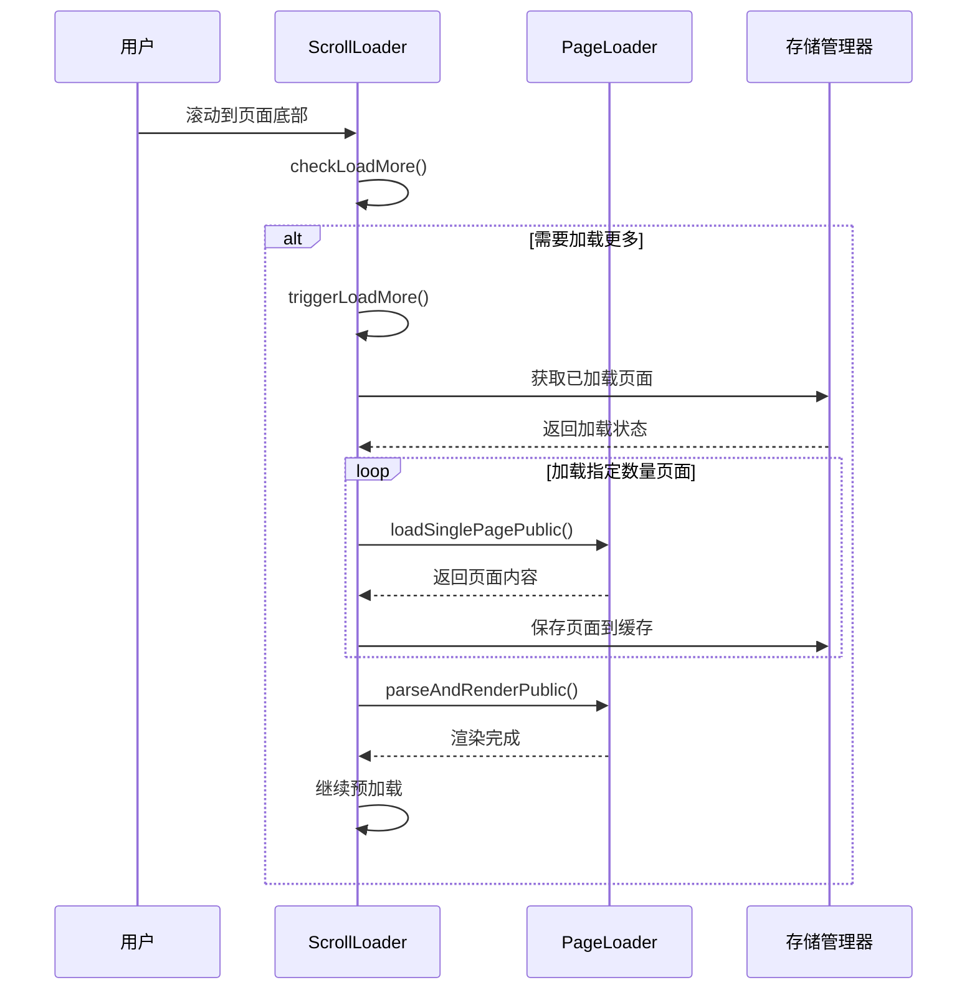
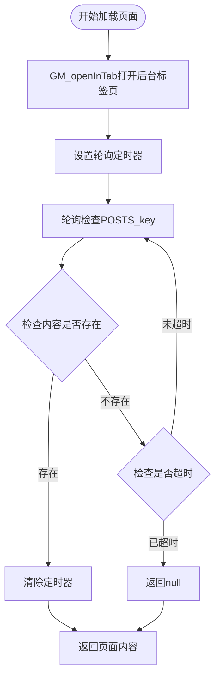
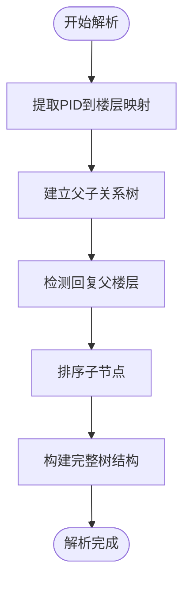
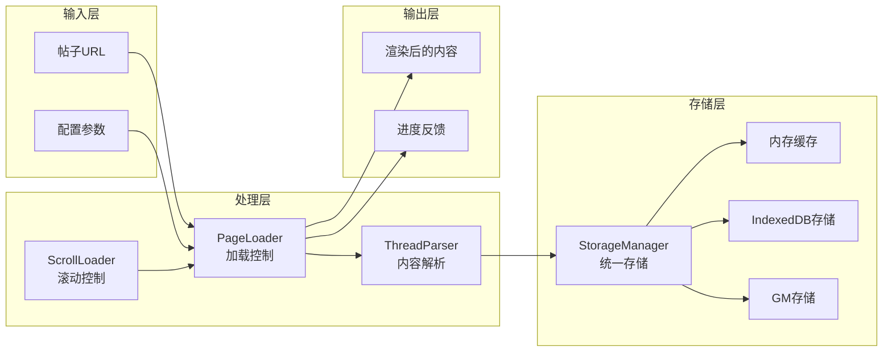
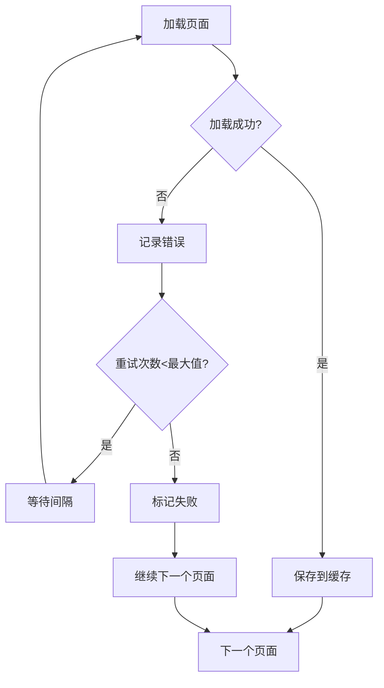
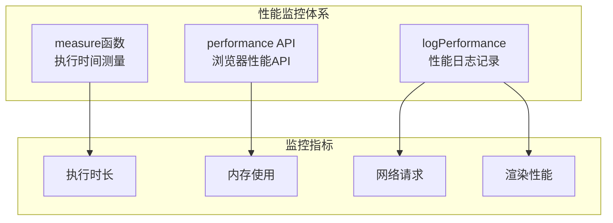

# 渐进式加载

<cite>
**本文档引用的文件**
- [page-loader.ts](file://src/core/page-loader.ts)
- [scroll-loader.ts](file://src/core/scroll-loader.ts)
- [thread-parser.ts](file://src/core/thread-parser.ts)
- [storage-manager.ts](file://src/storage/storage-manager.ts)
- [index.d.ts](file://src/types/index.d.ts)
- [performance.ts](file://src/utils/performance.ts)
- [helpers.ts](file://src/utils/helpers.ts)
- [config-panel.ts](file://src/ui/config-panel.ts)
</cite>

## 目录
1. [简介](#简介)
2. [系统架构概览](#系统架构概览)
3. [三阶段工作流程](#三阶段工作流程)
4. [核心组件详解](#核心组件详解)
5. [配置参数详解](#配置参数详解)
6. [数据流分析](#数据流分析)
7. [错误处理与容错机制](#错误处理与容错机制)
8. [性能优化策略](#性能优化策略)
9. [实际应用示例](#实际应用示例)
10. [总结](#总结)

## 简介

渐进式加载是一种高效的数据加载策略，旨在优化大型论坛帖子的加载体验。该系统通过智能的分阶段加载机制，确保用户能够快速获得基本内容，同时在后台持续加载完整数据，从而提供流畅的浏览体验。

该功能主要解决以下问题：
- 大型帖子的加载性能问题
- 用户体验的响应速度优化
- 内存使用的合理控制
- 网络资源的有效利用

## 系统架构概览

渐进式加载系统采用模块化设计，包含以下核心组件：



**图表来源**
- [page-loader.ts](file://src/core/page-loader.ts#L26-L58)
- [scroll-loader.ts](file://src/core/scroll-loader.ts#L17-L30)
- [storage-manager.ts](file://src/storage/storage-manager.ts#L47-L91)

## 三阶段工作流程

渐进式加载系统遵循严格的三阶段工作流程，确保最佳的用户体验：

### 第一阶段：初始加载（Initial Load）

初始加载阶段专注于快速提供用户可见的基本内容：



**图表来源**
- [page-loader.ts](file://src/core/page-loader.ts#L62-L79)
- [page-loader.ts](file://src/core/page-loader.ts#L168-L228)

### 第二阶段：后台预加载（Background Preload）

当初始加载完成后，系统会启动后台预加载机制：



**图表来源**
- [page-loader.ts](file://src/core/page-loader.ts#L150-L158)
- [page-loader.ts](file://src/core/page-loader.ts#L301-L308)

### 第三阶段：滚动加载（Scroll Load）

滚动加载响应用户的滚动行为，按需加载更多内容：



**图表来源**
- [scroll-loader.ts](file://src/core/scroll-loader.ts#L48-L83)
- [scroll-loader.ts](file://src/core/scroll-loader.ts#L119-L189)

**章节来源**
- [page-loader.ts](file://src/core/page-loader.ts#L62-L308)
- [scroll-loader.ts](file://src/core/scroll-loader.ts#L31-L189)

## 核心组件详解

### PageLoader 类详解

PageLoader 是渐进式加载的核心控制器，负责协调整个加载流程：

#### 主要方法分析

**initialize 方法**
- **功能**: 初始化加载器，根据缓存状态决定加载策略
- **实现**: 检查缓存有效性，决定是直接从缓存加载还是全新加载
- **关键特性**: 支持缓存失效检测和自动降级机制

**loadFreshPages 方法**
- **功能**: 执行全新的页面加载流程
- **实现**: 初始化元数据，加载当前页，然后批量加载后续页面
- **关键特性**: 支持初始加载页数配置，提供进度反馈

**loadPageRange 方法**
- **功能**: 批量加载指定范围的页面
- **实现**: 循环加载每个页面，支持页面间隔控制
- **关键特性**: 实现渐进式转换触发机制，支持错误恢复

**performProgressiveConversion 方法**
- **功能**: 执行渐进式转换，构建楼中楼结构
- **实现**: 移除分页元素，解析帖子关系，渲染最终结构
- **关键特性**: 支持首次转换标志，确保只执行一次转换

**loadRemainingPages 方法**
- **功能**: 在后台继续加载剩余页面
- **实现**: 异步加载所有未加载的页面
- **关键特性**: 使用延迟执行，避免阻塞主线程

#### loadSinglePage 方法实现

loadSinglePage 方法展示了系统如何通过后台标签页加载页面：



**图表来源**
- [page-loader.ts](file://src/core/page-loader.ts#L313-L335)

**章节来源**
- [page-loader.ts](file://src/core/page-loader.ts#L26-L590)

### ScrollLoader 类详解

ScrollLoader 负责响应用户的滚动行为，实现懒加载功能：

#### 核心功能

**滚动检测机制**
- 使用防抖技术减少频繁的滚动事件处理
- 计算滚动位置与页面底部的距离
- 支持自定义触发阈值（默认2个屏幕高度）

**懒加载触发逻辑**
- 检查是否已经达到加载条件
- 控制并发加载状态，防止重复请求
- 动态计算需要加载的页面范围

**预加载策略**
- 在当前加载完成后，继续预加载后续页面
- 支持预加载页数配置
- 使用延迟执行避免影响当前加载

**章节来源**
- [scroll-loader.ts](file://src/core/scroll-loader.ts#L17-L286)

### ThreadParser 类详解

ThreadParser 负责解析帖子的层级关系，构建楼中楼结构：

#### 解析算法



**图表来源**
- [thread-parser.ts](file://src/core/thread-parser.ts#L51-L116)

**章节来源**
- [thread-parser.ts](file://src/core/thread-parser.ts#L40-L258)

## 配置参数详解

系统提供了丰富的配置参数来调整加载行为：

| 参数名称 | 类型 | 默认值 | 描述 | 取值范围 |
|---------|------|--------|------|----------|
| initialLoadPages | number | 5 | 初始加载的页面数量，达到此数量后立即开始转换 | 1-50 |
| preloadPages | number | 10 | 转换展示后继续后台加载的页数 | 0-100 |
| pageLoadInterval | number | 1000 | 每个页面加载之间的间隔时间（毫秒） | 500-5000 |
| cacheExpireTime | number | 3600000 | 缓存过期时间（毫秒），-1表示永不过期 | -1或正整数 |
| maxCacheSize | number | 104857600 | 最大缓存大小（字节），100MB | 任意正整数 |
| useVirtualScroll | boolean | true | 是否启用虚拟滚动 | true/false |
| virtualScrollBufferSize | number | 10 | 虚拟滚动缓冲区大小 | 1-50 |

### 关键配置参数说明

**initialLoadPages（初始加载页数）**
- 影响用户体验的关键参数
- 较小值提供更快的初始响应
- 较大值提供更完整的预览

**preloadPages（预加载页数）**
- 平衡加载速度和资源消耗
- 较大值提供更好的连续性体验
- 较小值减少内存占用

**pageLoadInterval（页面加载间隔）**
- 避免对目标服务器造成过大压力
- 较长间隔减少网络冲突
- 较短间隔加快加载速度

**章节来源**
- [index.d.ts](file://src/types/index.d.ts#L22-L37)
- [config-panel.ts](file://src/ui/config-panel.ts#L81-L102)

## 数据流分析

渐进式加载系统的数据流体现了清晰的层次结构：



**图表来源**
- [page-loader.ts](file://src/core/page-loader.ts#L26-L58)
- [storage-manager.ts](file://src/storage/storage-manager.ts#L47-L91)

### 数据流向详解

1. **初始化阶段**: 从URL提取帖子ID，应用配置参数，初始化各组件
2. **加载阶段**: PageLoader协调各个组件，逐步加载和处理数据
3. **缓存阶段**: 将处理后的数据存储到合适的存储介质
4. **渲染阶段**: 通过ThreadParser构建数据结构，由渲染器显示
5. **交互阶段**: ScrollLoader响应用户操作，触发新的加载请求

**章节来源**
- [page-loader.ts](file://src/core/page-loader.ts#L62-L79)
- [storage-manager.ts](file://src/storage/storage-manager.ts#L175-L240)

## 错误处理与容错机制

系统实现了多层次的错误处理和容错机制：

### 页面加载失败处理



**图表来源**
- [page-loader.ts](file://src/core/page-loader.ts#L286-L289)

### 缓存失效处理

- **缓存验证**: 检查缓存时间戳和完整性
- **自动降级**: 缓存失效时自动切换到全新加载
- **数据修复**: 清理损坏的缓存数据

### 网络异常处理

- **超时控制**: 页面加载30秒超时机制
- **重试机制**: 自动重试失败的页面加载
- **优雅降级**: 单个页面失败不影响整体加载

### 存储异常处理

- **存储适配**: 自动在IndexedDB和GM存储间切换
- **数据迁移**: 支持从GM存储迁移到IndexedDB
- **容量管理**: 自动清理过期缓存

**章节来源**
- [page-loader.ts](file://src/core/page-loader.ts#L159-L162)
- [storage-manager.ts](file://src/storage/storage-manager.ts#L63-L84)

## 性能优化策略

系统采用了多种性能优化策略：

### 内存管理

- **分批处理**: 使用batchProcess函数分批处理大量数据
- **内存缓存**: 热数据优先缓存在内存中
- **LRU清理**: 基于最近使用时间清理缓存

### 网络优化

- **页面间隔**: 通过pageLoadInterval控制请求频率
- **后台加载**: 使用GM_openInTab实现非阻塞加载
- **并发控制**: 限制同时加载的页面数量

### 渲染优化

- **虚拟滚动**: 对于大型帖子启用虚拟滚动
- **增量渲染**: 支持增量渲染批次配置
- **防抖处理**: 使用防抖技术减少不必要的重绘

### 性能监控

系统内置了完整的性能监控体系：



**图表来源**
- [performance.ts](file://src/utils/performance.ts#L9-L32)

**章节来源**
- [performance.ts](file://src/utils/performance.ts#L131-L148)
- [storage-manager.ts](file://src/storage/storage-manager.ts#L440-L459)

## 实际应用示例

### 基本使用场景

```typescript
// 初始化PageLoader
const storageManager = new StorageManager();
const config = {
  initialLoadPages: 5,
  preloadPages: 10,
  pageLoadInterval: 1000,
  cacheExpireTime: 3600000
};

const pageLoader = new PageLoader(
  '123456', // 帖子ID
  storageManager,
  config,
  (message, loaded, total) => {
    console.log(`${message} (${loaded}/${total})`);
  }
);

// 初始化页面
await pageLoader.initialize(pageInfo, container);
```

### 滚动加载集成

```typescript
// 初始化ScrollLoader
const scrollLoader = new ScrollLoader(pageLoader, config);
scrollLoader.initialize(totalPages);

// 组件销毁时清理
window.addEventListener('beforeunload', () => {
  scrollLoader.destroy();
});
```

### 配置动态调整

```typescript
// 通过配置面板动态调整
const configPanel = new ConfigPanel(configManager, storageManager);
configPanel.togglePanel();

// 保存新配置
configPanel.saveConfig(overlay);
```

### 错误处理示例

```typescript
try {
  await pageLoader.initialize(pageInfo, container);
} catch (error) {
  console.error('加载失败:', error);
  // 显示错误提示给用户
  Toast.error('帖子加载失败，请稍后重试');
}
```

**章节来源**
- [page-loader.ts](file://src/core/page-loader.ts#L36-L58)
- [scroll-loader.ts](file://src/core/scroll-loader.ts#L26-L30)

## 总结

渐进式加载功能通过精心设计的三阶段工作流程，实现了大型论坛帖子的高效加载。系统的主要优势包括：

### 核心优势

1. **用户体验优化**: 快速提供基本内容，后续补充完整数据
2. **资源效率**: 智能缓存和预加载策略，减少重复加载
3. **系统稳定性**: 完善的错误处理和容错机制
4. **可配置性**: 丰富的配置参数满足不同需求
5. **性能监控**: 内置性能监控和优化建议

### 技术特色

- **模块化设计**: 清晰的职责分离和接口定义
- **异步处理**: 全面采用Promise和async/await模式
- **存储抽象**: 统一的存储接口支持多种存储后端
- **渲染优化**: 支持虚拟滚动和增量渲染

### 应用价值

该功能显著提升了大型帖子的加载性能和用户体验，特别适用于：
- 长篇技术讨论帖
- 大型活动报道
- 复杂问题解答
- 社区精华帖

通过合理的配置和使用，可以为用户提供流畅、高效的阅读体验，同时保持系统的稳定性和可维护性。