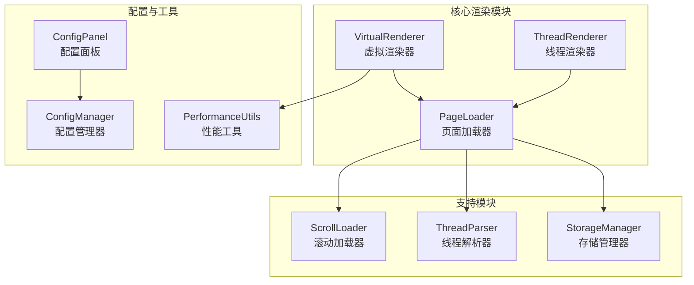
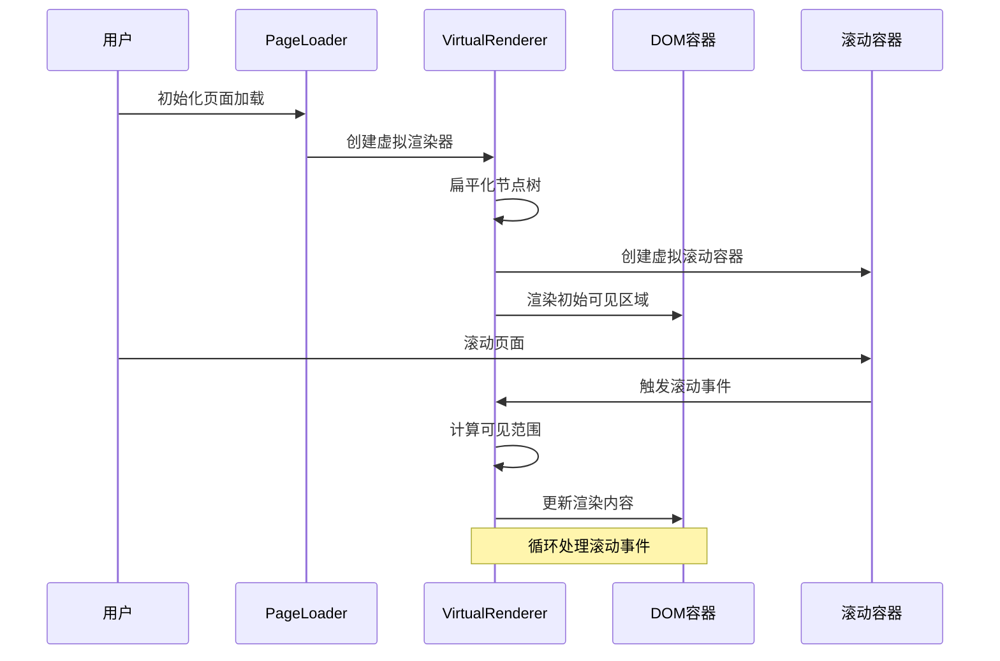
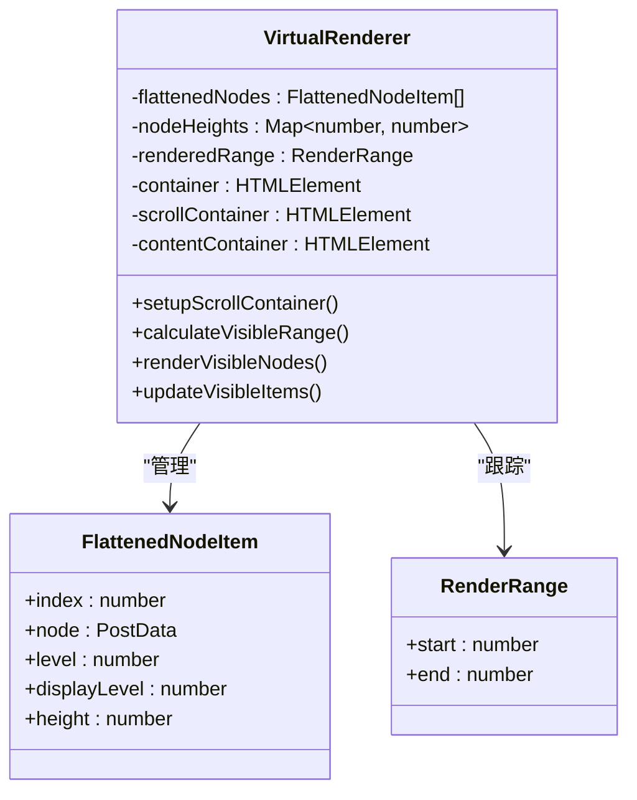
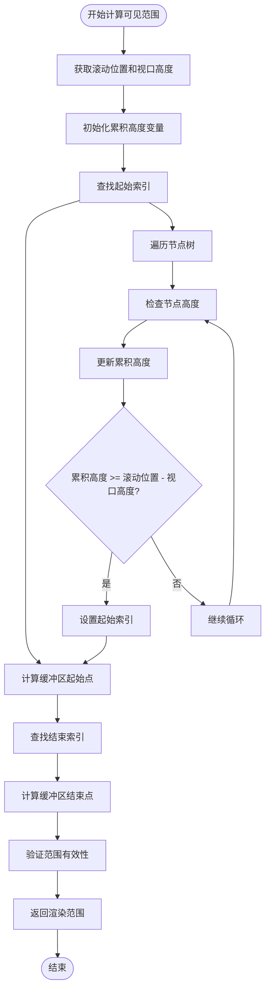
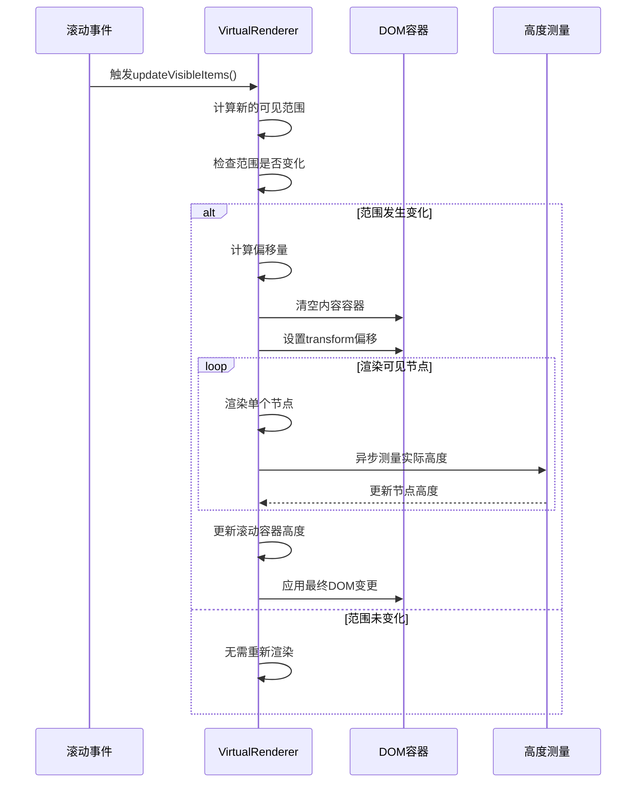
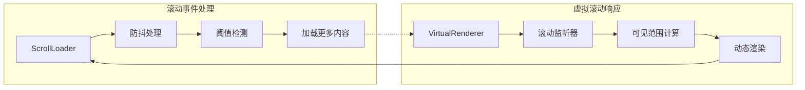
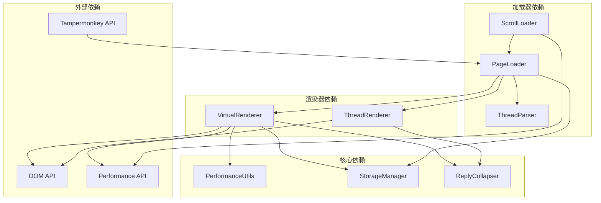

# 虚拟滚动

<cite>
**本文档中引用的文件**
- [virtual-renderer.ts](file://src/core/virtual-renderer.ts)
- [thread-renderer.ts](file://src/core/thread-renderer.ts)
- [page-loader.ts](file://src/core/page-loader.ts)
- [scroll-loader.ts](file://src/core/scroll-loader.ts)
- [index.d.ts](file://src/types/index.d.ts)
- [config.ts](file://src/storage/config.ts)
- [config-panel.ts](file://src/ui/config-panel.ts)
- [performance.ts](file://src/utils/performance.ts)
</cite>

## 目录
1. [简介](#简介)
2. [项目结构](#项目结构)
3. [核心组件](#核心组件)
4. [架构概览](#架构概览)
5. [详细组件分析](#详细组件分析)
6. [依赖关系分析](#依赖关系分析)
7. [性能考虑](#性能考虑)
8. [故障排除指南](#故障排除指南)
9. [结论](#结论)

## 简介

虚拟滚动是一种高性能的渲染技术，专门用于处理大量数据的场景。当帖子超过500楼时，系统会自动启用虚拟滚动功能，通过只渲染视口内的可见区域来显著提升性能。这种技术大幅减少了DOM节点数量，降低了内存占用，并提供了流畅的滚动体验。

虚拟滚动的核心思想是将无限的数据集映射到有限的可视区域内，通过智能的计算和动态更新机制，确保用户始终看到最新的内容，同时避免了传统渲染方式在处理大量数据时的性能瓶颈。

## 项目结构

该项目采用模块化架构，将虚拟滚动功能分解为多个专门的组件：



**图表来源**
- [virtual-renderer.ts](file://src/core/virtual-renderer.ts#L1-L502)
- [thread-renderer.ts](file://src/core/thread-renderer.ts#L1-L266)
- [page-loader.ts](file://src/core/page-loader.ts#L1-L590)

**章节来源**
- [virtual-renderer.ts](file://src/core/virtual-renderer.ts#L1-L502)
- [thread-renderer.ts](file://src/core/thread-renderer.ts#L1-L266)
- [page-loader.ts](file://src/core/page-loader.ts#L1-L590)

## 核心组件

### VirtualRenderer - 虚拟渲染器

VirtualRenderer是整个虚拟滚动系统的核心组件，负责将大量帖子数据转换为高效的虚拟化视图。它实现了以下关键功能：

- **扁平化节点树**：将嵌套的帖子结构转换为线性的节点列表
- **虚拟容器管理**：创建和维护虚拟滚动所需的DOM结构
- **可见区域计算**：精确计算当前视口内的可见节点范围
- **动态渲染更新**：根据滚动位置实时更新渲染内容
- **高度测量与调整**：异步测量实际高度并动态调整容器尺寸

### ThreadRenderer - 标准渲染器

ThreadRenderer提供传统的完整渲染模式，适用于较小规模的帖子。它保留了完整的DOM结构，确保所有内容都参与渲染和交互。

### PageLoader - 页面加载器

PageLoader负责协调渲染器的选择和初始化，根据配置决定使用哪种渲染模式。它还管理页面加载、缓存和预加载策略。

**章节来源**
- [virtual-renderer.ts](file://src/core/virtual-renderer.ts#L43-L106)
- [thread-renderer.ts](file://src/core/thread-renderer.ts#L25-L62)
- [page-loader.ts](file://src/core/page-loader.ts#L36-L57)

## 架构概览

虚拟滚动系统的整体架构体现了分层设计原则，每一层都有明确的职责分工：



**图表来源**
- [page-loader.ts](file://src/core/page-loader.ts#L48-L52)
- [virtual-renderer.ts](file://src/core/virtual-renderer.ts#L71-L106)
- [scroll-loader.ts](file://src/core/scroll-loader.ts#L34-L43)

## 详细组件分析

### VirtualRenderer核心机制

#### 1. 虚拟容器创建

VirtualRenderer通过创建特殊的DOM结构来实现虚拟滚动：



**图表来源**
- [virtual-renderer.ts](file://src/core/virtual-renderer.ts#L23-L37)
- [virtual-renderer.ts](file://src/core/virtual-renderer.ts#L49-L58)

#### 2. 可见项计算算法

虚拟滚动的核心是准确计算当前视口内的可见节点范围：



**图表来源**
- [virtual-renderer.ts](file://src/core/virtual-renderer.ts#L202-L233)

#### 3. 动态更新渲染内容

VirtualRenderer实现了高效的增量更新机制：



**图表来源**
- [virtual-renderer.ts](file://src/core/virtual-renderer.ts#L178-L275)

**章节来源**
- [virtual-renderer.ts](file://src/core/virtual-renderer.ts#L143-L175)
- [virtual-renderer.ts](file://src/core/virtual-renderer.ts#L178-L275)

### 与ScrollLoader的集成

虚拟滚动系统与滚动加载器紧密协作，提供无缝的用户体验：



**图表来源**
- [scroll-loader.ts](file://src/core/scroll-loader.ts#L34-L43)
- [virtual-renderer.ts](file://src/core/virtual-renderer.ts#L328-L346)

**章节来源**
- [scroll-loader.ts](file://src/core/scroll-loader.ts#L34-L43)
- [virtual-renderer.ts](file://src/core/virtual-renderer.ts#L328-L346)

### 配置系统

虚拟滚动功能提供了丰富的配置选项，允许用户根据需求进行个性化调整：

| 配置项 | 类型 | 默认值 | 描述 | 取值范围 |
|--------|------|--------|------|----------|
| `useVirtualScroll` | boolean | true | 是否启用虚拟滚动 | true/false |
| `virtualScrollBufferSize` | number | 10 | 视口上下额外渲染的楼层数 | 5-30 |

**章节来源**
- [config.ts](file://src/storage/config.ts#L40-L42)
- [config-panel.ts](file://src/ui/config-panel.ts#L135-L148)

## 依赖关系分析

虚拟滚动系统的依赖关系体现了清晰的分层架构：



**图表来源**
- [virtual-renderer.ts](file://src/core/virtual-renderer.ts#L1-L8)
- [page-loader.ts](file://src/core/page-loader.ts#L1-L8)
- [scroll-loader.ts](file://src/core/scroll-loader.ts#L1-L6)

**章节来源**
- [virtual-renderer.ts](file://src/core/virtual-renderer.ts#L1-L8)
- [page-loader.ts](file://src/core/page-loader.ts#L1-L8)
- [scroll-loader.ts](file://src/core/scroll-loader.ts#L1-L6)

## 性能考虑

### 内存占用优化

虚拟滚动在内存占用方面具有显著优势：

- **DOM节点数量**：传统渲染需要创建O(n)个DOM节点，而虚拟滚动只需要O(k)个，其中k是视口内可见的节点数
- **事件监听器**：虚拟滚动减少了大量事件监听器的创建和维护成本
- **垃圾回收**：动态销毁不可见的节点，减轻垃圾回收压力

### 渲染性能提升

虚拟滚动通过多种机制提升渲染性能：

- **批量DOM操作**：使用DocumentFragment进行批量DOM更新
- **防抖处理**：滚动事件采用防抖机制，减少频繁的重新渲染
- **异步高度测量**：利用requestAnimationFrame异步测量节点高度
- **CSS硬件加速**：使用transform属性触发动画硬件加速

### 缓冲区配置策略

缓冲区大小直接影响性能和用户体验：

- **小缓冲区（5-10）**：内存占用最小，但滚动可能不够流畅
- **中等缓冲区（10-20）**：平衡性能和流畅度，适合大多数场景
- **大缓冲区（20-30）**：最流畅的滚动体验，但内存占用较高

## 故障排除指南

### 常见问题及解决方案

#### 1. 虚拟滚动未启用

**症状**：即使帖子超过500楼，仍然使用标准渲染模式

**原因分析**：
- 配置中禁用了虚拟滚动功能
- 浏览器不支持必要的API

**解决方案**：
```typescript
// 检查配置
const config = configManager.getConfig();
console.log('虚拟滚动状态:', config.useVirtualScroll);

// 检查浏览器兼容性
const hasPerformanceAPI = typeof performance !== 'undefined';
const hasRAF = typeof requestAnimationFrame !== 'undefined';
```

#### 2. 滚动卡顿或不流畅

**症状**：滚动过程中出现明显的卡顿或延迟

**原因分析**：
- 缓冲区大小设置不当
- 节点高度测量异常
- DOM操作过于频繁

**解决方案**：
- 调整`virtualScrollBufferSize`参数
- 检查网络连接和页面加载状态
- 启用性能监控查看具体瓶颈

#### 3. 内存泄漏

**症状**：长时间使用后浏览器内存占用持续增长

**原因分析**：
- 事件监听器未正确清理
- DOM节点未及时释放
- 缓存数据过多

**解决方案**：
- 确保调用`destroy()`方法清理资源
- 定期清理过期缓存
- 监控内存使用情况

**章节来源**
- [virtual-renderer.ts](file://src/core/virtual-renderer.ts#L473-L477)
- [performance.ts](file://src/utils/performance.ts#L9-L32)

## 结论

虚拟滚动技术为NGA嵌套回复系统带来了革命性的性能提升。通过智能的虚拟化渲染机制，系统能够在处理数千楼的长帖时保持流畅的用户体验，同时显著降低内存占用和CPU消耗。

### 主要优势

1. **性能卓越**：将DOM节点数量从O(n)降低到O(k)，其中k是视口内可见节点数
2. **内存友好**：大幅减少内存占用，避免浏览器卡顿和崩溃
3. **用户体验**：提供流畅的滚动体验，支持复杂的嵌套结构
4. **可配置性强**：丰富的配置选项满足不同用户的需求
5. **渐进增强**：与现有系统完美集成，无需大规模重构

### 技术创新点

- **智能缓冲区管理**：动态调整视口外的渲染节点数量
- **异步高度测量**：利用requestAnimationFrame进行非阻塞的高度计算
- **事件防抖机制**：防止频繁的重新渲染影响性能
- **模块化设计**：清晰的职责分离便于维护和扩展

虚拟滚动功能的成功实现证明了现代前端技术在处理复杂应用场景中的强大能力，为类似项目提供了宝贵的参考经验。随着Web技术的不断发展，虚拟滚动将在更多场景中发挥重要作用，为用户提供更加流畅和高效的浏览体验。