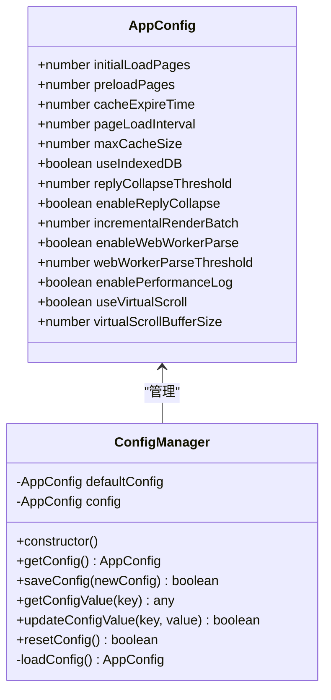
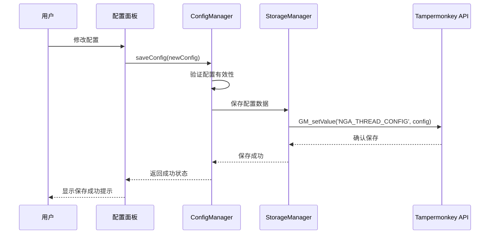
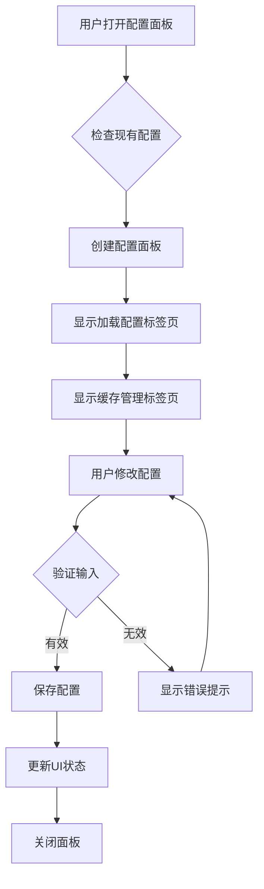
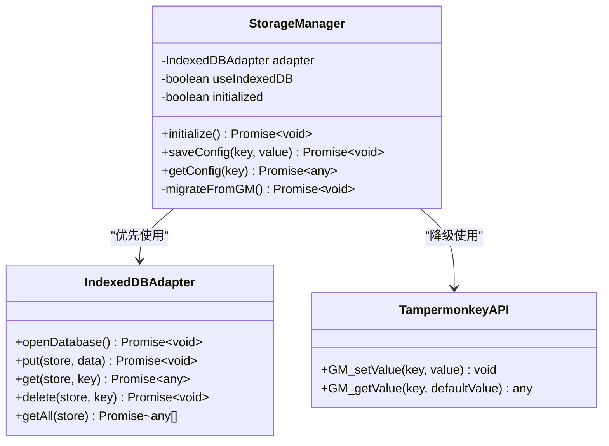
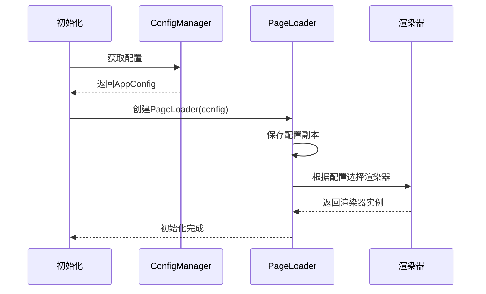
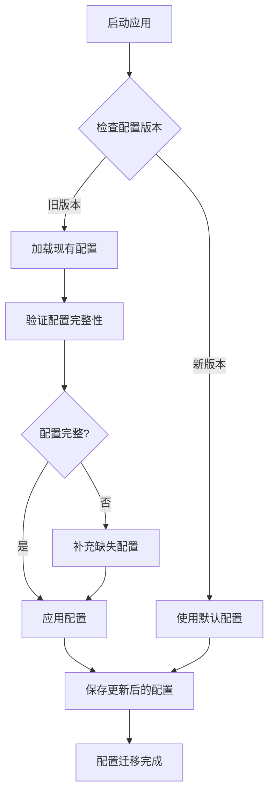

# 配置管理

<cite>
**本文档中引用的文件**
- [src/storage/config.ts](file://src/storage/config.ts)
- [src/ui/config-panel.ts](file://src/ui/config-panel.ts)
- [src/storage/storage-manager.ts](file://src/storage/storage-manager.ts)
- [src/types/index.d.ts](file://src/types/index.d.ts)
- [src/core/page-loader.ts](file://src/core/page-loader.ts)
- [src/index.ts](file://src/index.ts)
- [src/core/virtual-renderer.ts](file://src/core/virtual-renderer.ts)
- [src/core/thread-parser.ts](file://src/core/thread-parser.ts)
- [src/ui/reply-collapser.ts](file://src/ui/reply-collapser.ts)
</cite>

## 目录
1. [简介](#简介)
2. [配置数据模型](#配置数据模型)
3. [配置管理架构](#配置管理架构)
4. [用户界面设计](#用户界面设计)
5. [配置持久化机制](#配置持久化机制)
6. [核心模块集成](#核心模块集成)
7. [配置版本管理](#配置版本管理)
8. [最佳实践指南](#最佳实践指南)
9. [故障排除](#故障排除)
10. [总结](#总结)

## 简介

NGA楼中楼脚本采用了一套完整的配置管理系统，允许用户通过可视化界面自定义脚本行为。该系统基于TypeScript实现，提供了灵活的配置选项，涵盖了页面加载策略、缓存管理、性能优化等多个方面。配置系统的核心设计理念是易用性与性能的平衡，同时确保向后兼容性和安全性。

## 配置数据模型

### AppConfig接口定义

配置系统的核心是`AppConfig`接口，它定义了所有可配置的参数及其类型约束：



**图表来源**
- [src/storage/config.ts](file://src/storage/config.ts#L6-L21)
- [src/storage/config.ts](file://src/storage/config.ts#L26-L105)

### 配置项详解

| 配置项 | 类型 | 默认值 | 取值范围 | 描述 |
|--------|------|--------|----------|------|
| `initialLoadPages` | number | 5 | 1-50 | 初始加载页数，达到此页数后立即开始转换展示 |
| `preloadPages` | number | 10 | 0-100 | 转换展示后继续后台加载的页数 |
| `cacheExpireTime` | number | 86400000 | 3600000-604800000/-1 | 缓存有效期（毫秒），-1表示永久缓存 |
| `pageLoadInterval` | number | 1000 | 500-5000 | 每个页面读取的等待时间（毫秒） |
| `maxCacheSize` | number | 52428800 | 10485760-209715200 | 最大缓存容量（字节），10-200MB |
| `useIndexedDB` | boolean | true | true/false | 是否启用IndexedDB存储 |
| `replyCollapseThreshold` | number | 3 | 1-10 | 楼中楼折叠阈值，超过此数量的回复将被折叠 |
| `enableReplyCollapse` | boolean | true | true/false | 是否启用楼中楼折叠功能 |
| `incrementalRenderBatch` | number | 3 | 1-10 | 增量渲染的批次大小（页数） |
| `enableWebWorkerParse` | boolean | false | true/false | 是否启用Web Worker进行解析（实验性） |
| `webWorkerParseThreshold` | number | 800 | 100-2000 | 启用Web Worker的帖子数量阈值 |
| `enablePerformanceLog` | boolean | false | true/false | 是否启用性能日志（调试用） |
| `useVirtualScroll` | boolean | true | true/false | 是否启用虚拟滚动（性能优化） |
| `virtualScrollBufferSize` | number | 10 | 5-30 | 虚拟滚动缓冲区大小（视口上下额外渲染的楼层数） |

**章节来源**
- [src/storage/config.ts](file://src/storage/config.ts#L27-L43)

## 配置管理架构

### ConfigManager类设计

配置管理器采用单例模式，负责配置的加载、保存、验证和管理：



**图表来源**
- [src/storage/config.ts](file://src/storage/config.ts#L65-L75)
- [src/ui/config-panel.ts](file://src/ui/config-panel.ts#L291-L348)

### 配置加载流程

配置系统在初始化时会按以下顺序加载配置：

1. **尝试加载已保存配置**：从Tampermonkey存储中读取`NGA_THREAD_CONFIG`键值
2. **解析配置数据**：将JSON字符串解析为AppConfig对象
3. **合并默认配置**：使用默认配置作为后备方案
4. **验证配置有效性**：确保配置值在合理范围内
5. **应用配置**：将最终配置应用于各个模块

**章节来源**
- [src/storage/config.ts](file://src/storage/config.ts#L51-L62)

## 用户界面设计

### ConfigPanel组件架构

配置面板采用响应式设计，提供直观的配置界面：



**图表来源**
- [src/ui/config-panel.ts](file://src/ui/config-panel.ts#L37-L263)

### 标签页设计

配置面板分为两个主要标签页：

#### 加载配置标签页
- **初始加载页数**：数字输入框，范围1-50
- **预加载页数**：数字输入框，范围0-100  
- **页面读取间隔**：数字输入框，范围500-5000毫秒
- **缓存有效期**：下拉选择框，提供多个预设选项
- **缓存容量限制**：下拉选择框，提供多个容量选项

#### 缓存管理标签页
- **缓存统计信息**：显示当前缓存使用情况
- **缓存列表**：展示所有缓存的帖子信息
- **操作按钮**：刷新、清空全部缓存等功能

**章节来源**
- [src/ui/config-panel.ts](file://src/ui/config-panel.ts#L68-L184)

### 输入验证机制

配置面板实现了严格的输入验证：

```typescript
// 示例验证规则
if (initialLoadPages < 1 || initialLoadPages > 50) {
    Toast.error('初始加载页数必须在1-50之间');
    return;
}

if (pageLoadInterval < 500 || pageLoadInterval > 5000) {
    Toast.error('页面读取间隔必须在500-5000毫秒之间');
    return;
}

if (virtualScrollBufferSize < 5 || virtualScrollBufferSize > 30) {
    Toast.error('虚拟滚动缓冲区大小必须在5-30之间');
    return;
}
```

**章节来源**
- [src/ui/config-panel.ts](file://src/ui/config-panel.ts#L313-L331)

## 配置持久化机制

### StorageManager集成

配置系统通过StorageManager实现跨存储适配：



**图表来源**
- [src/storage/storage-manager.ts](file://src/storage/storage-manager.ts#L47-L596)

### 数据迁移机制

系统支持从旧版GM存储迁移到IndexedDB：

1. **检测迁移状态**：检查是否已完成迁移
2. **读取旧数据**：从GM存储读取缓存索引和配置
3. **批量迁移**：逐个迁移帖子元数据和页面内容
4. **保存配置**：将配置数据迁移到新存储
5. **标记完成**：记录迁移状态避免重复迁移

**章节来源**
- [src/storage/storage-manager.ts](file://src/storage/storage-manager.ts#L96-L170)

### 版本兼容性处理

配置系统通过以下机制确保版本兼容性：

- **默认值覆盖**：缺失的配置项使用默认值
- **类型转换**：自动处理数值类型的转换
- **字段映射**：支持配置字段的重命名和废弃
- **渐进式升级**：逐步引入新配置项而不破坏现有功能

## 核心模块集成

### PageLoader中的配置应用

PageLoader类接收配置并在初始化过程中应用：



**图表来源**
- [src/core/page-loader.ts](file://src/core/page-loader.ts#L36-L52)
- [src/index.ts](file://src/index.ts#L344-L356)

### 虚拟滚动配置

虚拟滚动功能通过以下配置项控制：

- **useVirtualScroll**：决定是否启用虚拟滚动
- **virtualScrollBufferSize**：控制视口上下额外渲染的楼层数

```typescript
// 虚拟滚动配置示例
const useVirtualScroll = config.useVirtualScroll !== false;
this.renderer = useVirtualScroll
    ? new VirtualRenderer(config, storageManager)
    : new ThreadRenderer(config, storageManager);
```

**章节来源**
- [src/core/page-loader.ts](file://src/core/page-loader.ts#L48-L52)
- [src/core/virtual-renderer.ts](file://src/core/virtual-renderer.ts#L62-L66)

### 楼中楼折叠配置

折叠功能通过以下配置项控制：

- **enableReplyCollapse**：启用/禁用折叠功能
- **replyCollapseThreshold**：设置折叠阈值

```typescript
// 折叠配置示例
if (config.enableReplyCollapse && node.children.length >= config.replyCollapseThreshold) {
    // 应用折叠逻辑
}
```

**章节来源**
- [src/ui/reply-collapser.ts](file://src/ui/reply-collapser.ts#L197-L208)

### 性能优化配置

系统支持多种性能优化配置：

- **增量渲染**：通过`incrementalRenderBatch`控制批次大小
- **Web Worker解析**：通过`enableWebWorkerParse`和`webWorkerParseThreshold`控制
- **缓存策略**：通过`cacheExpireTime`和`maxCacheSize`控制

**章节来源**
- [src/core/page-loader.ts](file://src/core/page-loader.ts#L38-L40)

## 配置版本管理

### 向后兼容性策略

配置系统采用渐进式升级策略：

1. **新增配置项**：新版本可以添加新的配置项，不影响旧版本
2. **默认值保护**：缺失的配置项使用合理的默认值
3. **类型安全**：通过TypeScript确保配置类型的正确性
4. **验证机制**：运行时验证配置值的有效性

### 配置迁移流程

当系统检测到配置格式变更时，会执行以下迁移流程：



### 配置备份与恢复

系统提供配置备份和恢复功能：

- **自动备份**：每次配置更改都会创建备份
- **手动导出**：用户可以导出当前配置
- **导入恢复**：支持从备份文件恢复配置
- **重置功能**：提供一键重置为默认配置

**章节来源**
- [src/storage/config.ts](file://src/storage/config.ts#L92-L102)

## 最佳实践指南

### 安全添加新配置项

当需要添加新的配置项时，请遵循以下步骤：

1. **定义类型**：在`AppConfig`接口中添加新字段
2. **设置默认值**：在`defaultConfig`中提供合理的默认值
3. **更新验证**：在配置面板中添加相应的输入控件
4. **测试兼容性**：确保新配置项与旧版本兼容
5. **文档更新**：更新相关文档和注释

```typescript
// 示例：添加新配置项
interface AppConfig {
    // ... 现有配置项
    newFeatureEnabled: boolean; // 新增配置项
    newFeatureThreshold: number;
}

class ConfigManager {
    private defaultConfig: AppConfig = {
        // ... 现有配置
        newFeatureEnabled: false, // 默认值
        newFeatureThreshold: 100,
    };
}
```

### 性能优化建议

1. **合理设置缓存大小**：根据用户设备性能调整`maxCacheSize`
2. **优化加载间隔**：根据网络状况调整`pageLoadInterval`
3. **虚拟滚动配置**：对于长帖子，适当增加`virtualScrollBufferSize`
4. **Web Worker使用**：对于大型帖子，启用`enableWebWorkerParse`

### 用户体验优化

1. **渐进式加载**：合理设置`initialLoadPages`和`preloadPages`
2. **响应式设计**：确保配置面板在不同屏幕尺寸下的可用性
3. **即时反馈**：配置更改后立即生效，提供视觉反馈
4. **错误处理**：优雅处理配置验证失败的情况

## 故障排除

### 常见问题及解决方案

#### 配置无法保存
**症状**：修改配置后重启后恢复为默认值
**原因**：Tampermonkey权限不足或存储空间已满
**解决方案**：
1. 检查Tampermonkey权限设置
2. 清理浏览器缓存和存储
3. 重新安装脚本

#### 配置加载失败
**症状**：脚本启动时使用默认配置而非保存的配置
**原因**：配置数据损坏或格式错误
**解决方案**：
1. 使用配置面板的重置功能
2. 检查浏览器控制台错误信息
3. 重新配置相关参数

#### 性能问题
**症状**：启用某些配置后页面响应变慢
**原因**：配置参数设置不当
**解决方案**：
1. 减少`maxCacheSize`值
2. 增加`pageLoadInterval`间隔
3. 禁用实验性功能如Web Worker解析

### 调试工具

配置系统提供了内置的调试功能：

- **性能日志**：通过`enablePerformanceLog`启用详细性能信息
- **配置验证**：实时验证配置输入的有效性
- **错误报告**：记录配置相关的错误信息

**章节来源**
- [src/storage/config.ts](file://src/storage/config.ts#L39-L40)

## 总结

NGA楼中楼脚本的配置管理系统是一个设计精良的模块化系统，具有以下特点：

1. **类型安全**：基于TypeScript的强类型定义确保配置的正确性
2. **用户友好**：直观的可视化界面降低使用门槛
3. **性能优化**：多种配置选项支持不同场景的性能需求
4. **向后兼容**：完善的版本管理机制保证升级的平滑性
5. **扩展性强**：模块化设计便于添加新的配置选项

该配置系统不仅满足了用户个性化需求，还为开发者提供了清晰的扩展路径。通过合理的配置管理，用户可以根据自己的使用习惯和设备性能优化脚本行为，获得最佳的浏览体验。