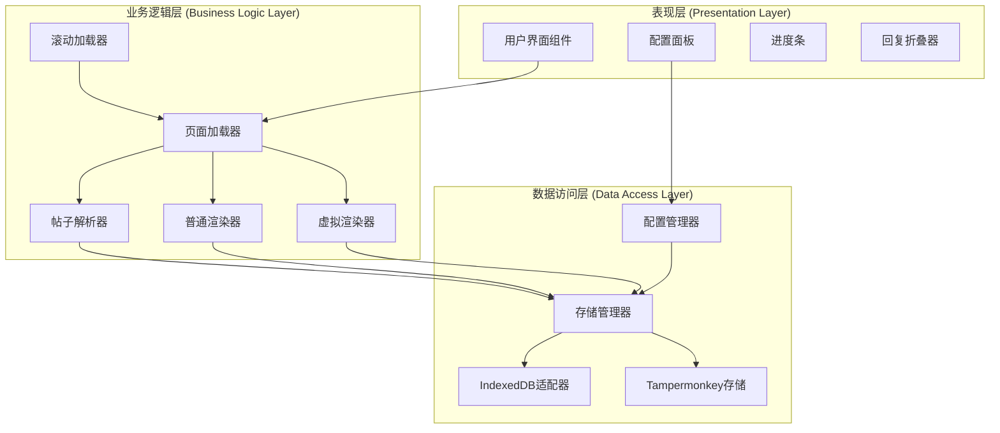
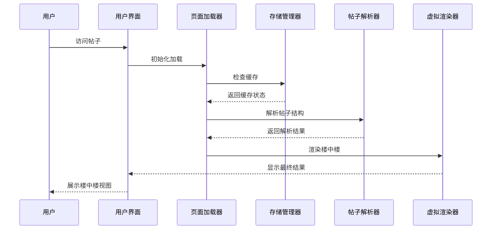
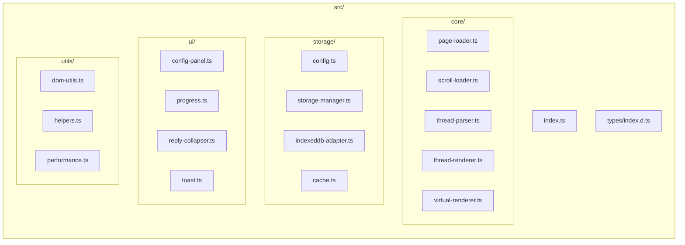
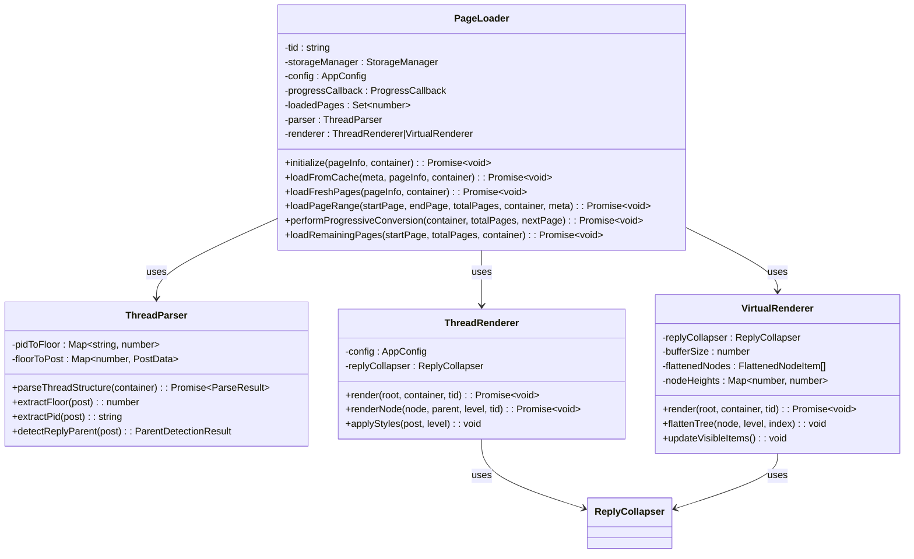
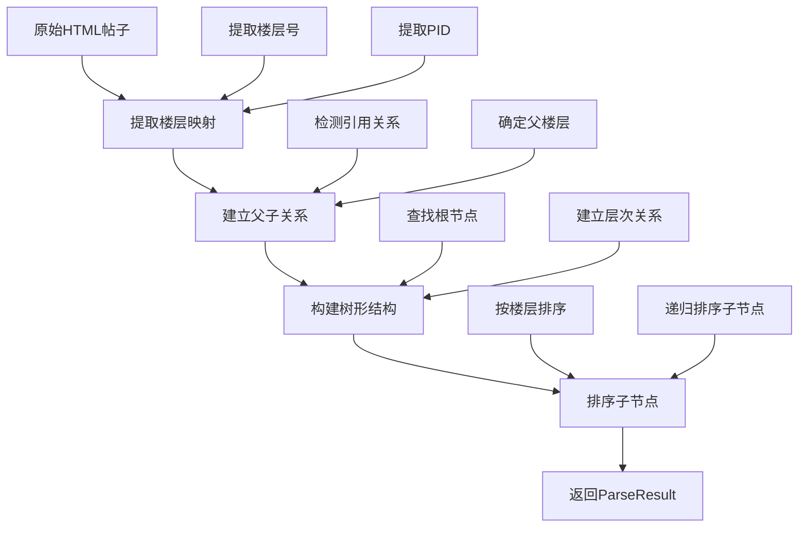
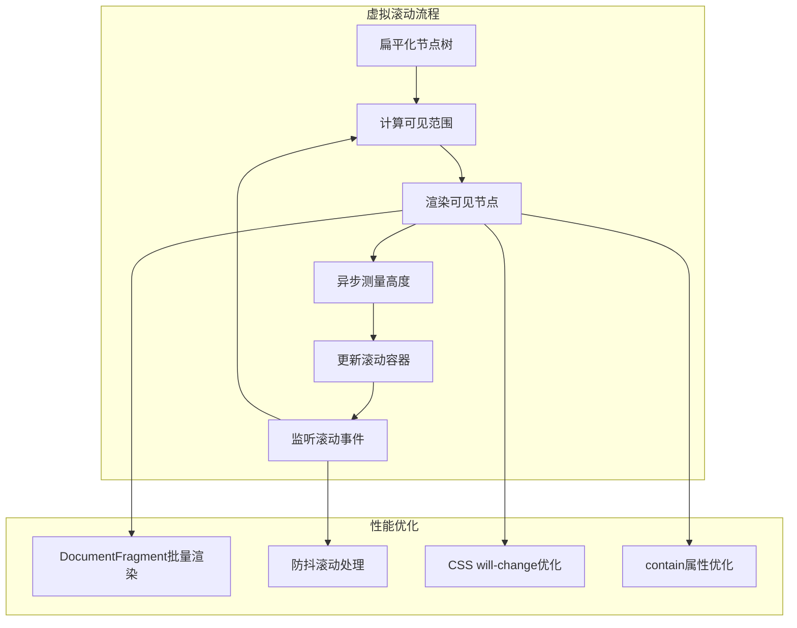
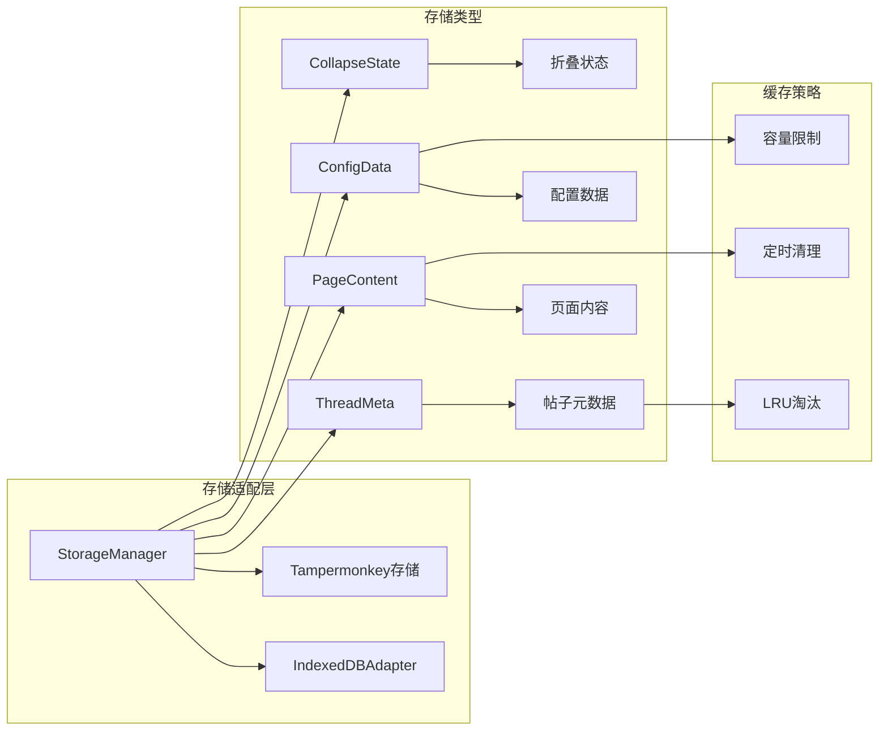
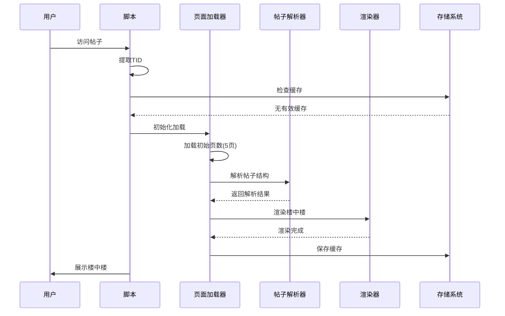
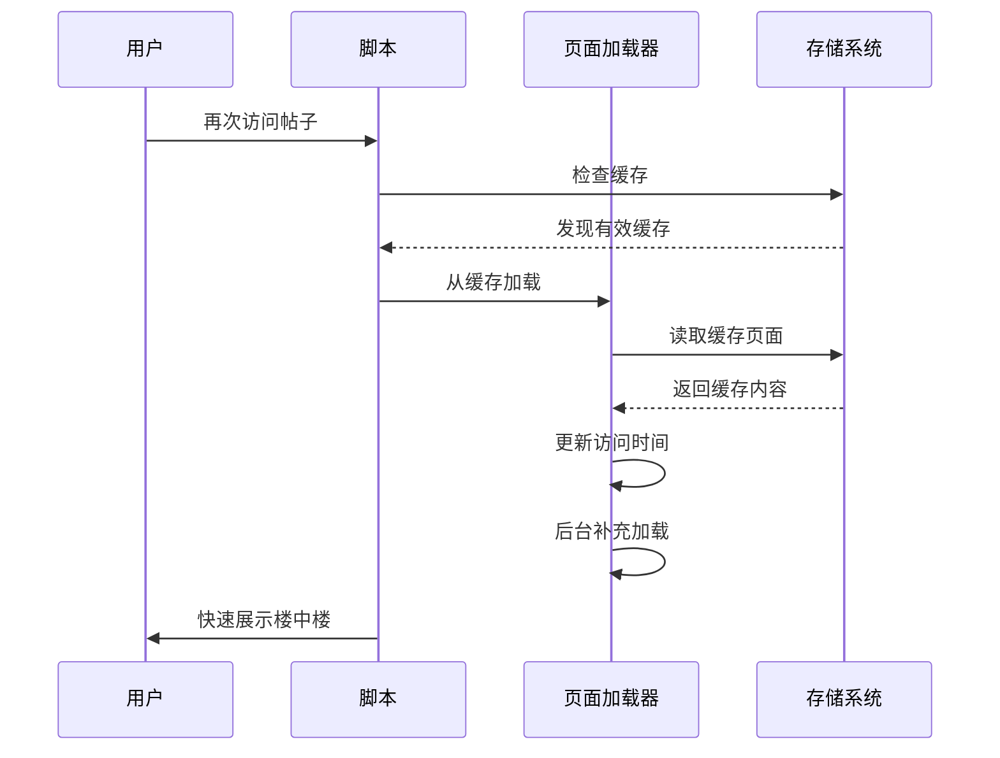
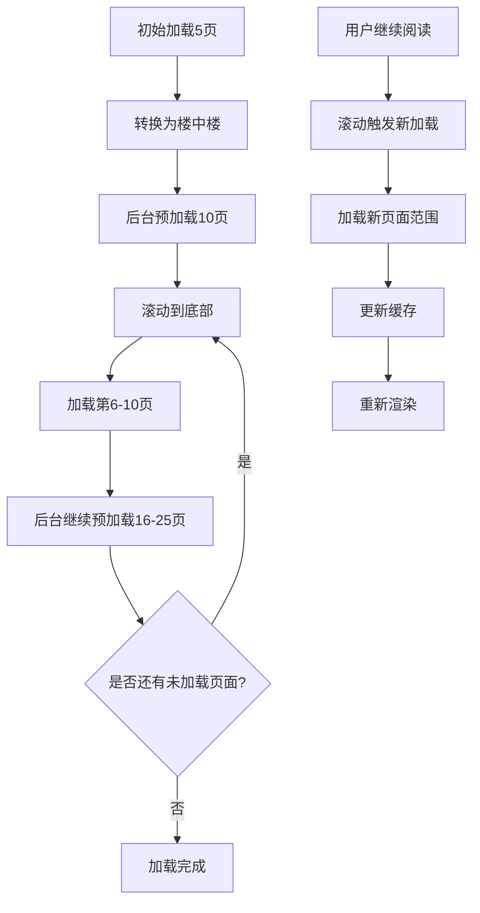

# 项目概述

<cite>
**本文档中引用的文件**
- [README.md](file://README.md)
- [package.json](file://package.json)
- [src/index.ts](file://src/index.ts)
- [src/types/index.d.ts](file://src/types/index.d.ts)
- [src/core/page-loader.ts](file://src/core/page-loader.ts)
- [src/core/scroll-loader.ts](file://src/core/scroll-loader.ts)
- [src/core/thread-parser.ts](file://src/core/thread-parser.ts)
- [src/core/thread-renderer.ts](file://src/core/thread-renderer.ts)
- [src/core/virtual-renderer.ts](file://src/core/virtual-renderer.ts)
- [src/storage/config.ts](file://src/storage/config.ts)
- [src/storage/storage-manager.ts](file://src/storage/storage-manager.ts)
- [src/ui/config-panel.ts](file://src/ui/config-panel.ts)
- [src/utils/helpers.ts](file://src/utils/helpers.ts)
- [vite.config.ts](file://vite.config.ts)
- [tsconfig.json](file://tsconfig.json)
</cite>

## 目录
1. [项目简介](#项目简介)
2. [核心特性](#核心特性)
3. [技术架构](#技术架构)
4. [项目结构](#项目结构)
5. [核心模块分析](#核心模块分析)
6. [工作流程](#工作流程)
7. [性能优化](#性能优化)
8. [使用指南](#使用指南)
9. [总结](#总结)

## 项目简介

NGA楼中楼脚本是一个基于TypeScript的Tampermonkey用户脚本，专为NGA论坛设计，旨在将传统的平面主题结构转换为嵌套回复（楼中楼）形式，显著提升大型帖子的浏览体验。该项目采用现代化的TypeScript开发，结合Vite构建工具，实现了渐进式加载、智能缓存、虚拟滚动和可视化配置管理等先进功能。

### 项目定位

作为一款专业的浏览器扩展脚本，该工具专注于解决NGA论坛中大型帖子浏览效率低下的问题。通过将分散的楼层回复重新组织为层次化的楼中楼结构，用户可以更直观地理解讨论脉络，特别是在处理数千楼层的长篇帖子时，效果尤为显著。

**章节来源**
- [README.md](file://README.md#L1-L10)
- [package.json](file://package.json#L1-L10)

## 核心特性

### 🚀 渐进式加载系统

**快速展示机制**：脚本在加载指定页数（默认5页）后立即转换显示，无需等待所有页面加载完成，显著提升首屏加载速度。

**后台预加载策略**：用户阅读过程中，脚本在后台持续加载更多页面，确保内容的连续性和流畅性。

**智能配置管理**：支持自定义初始加载页数（1-50页）和预加载页数（0-100页），满足不同场景需求。

### 💾 智能缓存系统

**自动缓存机制**：已加载的页面自动缓存到本地，支持24小时、12小时、7天、1小时等多种有效期配置。

**快速恢复功能**：24小时内重新打开帖子，秒速展示缓存内容，大幅提升用户体验。

**可视化管理界面**：提供直观的缓存管理界面，支持查看所有缓存帖子、删除不需要的缓存、设置缓存有效期。

### ⚡ 虚拟滚动技术

**自动启用机制**：当帖子超过500楼时，自动切换到虚拟滚动模式，大幅减少内存占用。

**性能优化策略**：只渲染可见区域的楼层，避免一次性加载大量DOM节点导致的浏览器卡顿。

**灵活缓冲配置**：可配置缓冲区大小（5-30），在性能和流畅度之间取得最佳平衡。

### 🎨 可视化配置面板

**悬浮入口设计**：页面右下角的齿轮图标，点击即可打开配置面板，操作便捷。

**双标签页界面**：加载配置和缓存管理两个独立标签页，功能清晰分离。

**实时统计显示**：动态显示缓存使用情况、帖子数量、容量占用等关键指标。

**Toast提示反馈**：提供即时的操作反馈，提升用户体验。

**章节来源**
- [README.md](file://README.md#L8-L30)

## 技术架构

### 分层设计架构

项目采用经典的三层架构设计，实现了清晰的职责分离和良好的可维护性：

**图表来源**
- [src/index.ts](file://src/index.ts#L1-L20)
- [src/core/page-loader.ts](file://src/core/page-loader.ts#L1-L50)
- [src/storage/storage-manager.ts](file://src/storage/storage-manager.ts#L1-L50)

### 核心交互关系

各层之间的交互遵循依赖倒置原则，上层依赖于抽象接口，而不是具体的实现：

**图表来源**
- [src/core/page-loader.ts](file://src/core/page-loader.ts#L60-L100)
- [src/core/thread-parser.ts](file://src/core/thread-parser.ts#L48-L115)
- [src/core/virtual-renderer.ts](file://src/core/virtual-renderer.ts#L70-L105)

**章节来源**
- [src/index.ts](file://src/index.ts#L275-L381)
- [src/core/page-loader.ts](file://src/core/page-loader.ts#L26-L58)

## 项目结构

### 目录组织

项目采用模块化的目录结构，每个功能模块都有明确的职责分工：

**图表来源**
- [src/index.ts](file://src/index.ts#L1-L10)
- [src/types/index.d.ts](file://src/types/index.d.ts#L1-L50)

### 文件职责说明

| 目录 | 文件 | 职责描述 |
|------|------|----------|
| **core** | page-loader.ts | 页面加载控制器，管理多页面加载策略和缓存 |
| | scroll-loader.ts | 滚动加载管理器，处理无限滚动和懒加载 |
| | thread-parser.ts | 帖子解析器，构建楼中楼关系树 |
| | thread-renderer.ts | 普通渲染器，处理标准楼中楼渲染 |
| | virtual-renderer.ts | 虚拟渲染器，实现高性能虚拟滚动 |
| **storage** | config.ts | 配置管理器，处理用户配置持久化 |
| | storage-manager.ts | 存储管理器，统一存储接口和适配 |
| | indexeddb-adapter.ts | IndexedDB适配器，提供数据库操作 |
| | cache.ts | 缓存管理工具，处理缓存策略 |
| **ui** | config-panel.ts | 配置面板，提供可视化配置界面 |
| | progress.ts | 进度条组件，显示加载状态 |
| | reply-collapser.ts | 回复折叠器，管理楼中楼折叠状态 |
| | toast.ts | 提示组件，提供用户反馈 |
| **utils** | dom-utils.ts | DOM操作工具集 |
| | helpers.ts | 通用辅助函数 |
| | performance.ts | 性能监控和优化工具 |

**章节来源**
- [src/index.ts](file://src/index.ts#L1-L10)
- [src/types/index.d.ts](file://src/types/index.d.ts#L1-L149)

## 核心模块分析

### 页面加载器 (PageLoader)

页面加载器是整个系统的核心控制器，负责协调各个子系统的协作：

**图表来源**
- [src/core/page-loader.ts](file://src/core/page-loader.ts#L26-L58)
- [src/core/thread-parser.ts](file://src/core/thread-parser.ts#L40-L60)
- [src/core/thread-renderer.ts](file://src/core/thread-renderer.ts#L25-L35)
- [src/core/virtual-renderer.ts](file://src/core/virtual-renderer.ts#L43-L69)

#### 核心功能特性

**缓存优先策略**：优先检查本地缓存，命中则直接加载缓存内容，24小时内重新打开帖子可实现秒速展示。

**渐进式转换机制**：达到配置的初始加载页数后立即开始转换为楼中楼形式，无需等待所有页面加载完成。

**智能预加载算法**：后台持续加载更多页面，确保内容的连续性和流畅性。

**异常处理机制**：完善的错误处理和降级策略，确保系统稳定性。

**章节来源**
- [src/core/page-loader.ts](file://src/core/page-loader.ts#L60-L160)

### 帖子解析器 (ThreadParser)

帖子解析器负责从原始HTML中提取帖子结构，构建完整的楼中楼关系树：

**图表来源**
- [src/core/thread-parser.ts](file://src/core/thread-parser.ts#L48-L115)

#### 解析算法特点

**双向映射机制**：同时维护PID到楼层和楼层到帖子的双向映射，提高查询效率。

**引用检测算法**：智能识别帖子中的引用关系，准确确定父子楼层关系。

**层次结构构建**：递归构建完整的树形结构，支持任意深度的嵌套回复。

**性能优化策略**：使用Map数据结构进行快速查找，时间复杂度O(n)。

**章节来源**
- [src/core/thread-parser.ts](file://src/core/thread-parser.ts#L48-L115)

### 虚拟渲染器 (VirtualRenderer)

虚拟渲染器针对大型帖子（500+楼层）提供高性能渲染解决方案：

**图表来源**
- [src/core/virtual-renderer.ts](file://src/core/virtual-renderer.ts#L70-L105)
- [src/core/virtual-renderer.ts](file://src/core/virtual-renderer.ts#L178-L275)

#### 虚拟滚动优势

**内存占用优化**：只渲染可见区域的节点，DOM节点数量从O(n)降低到O(k)，其中k为视口可见节点数。

**滚动性能提升**：使用transform替代position，避免重排重绘，滚动更加流畅。

**自适应高度**：异步测量实际高度，确保渲染精度。

**缓冲区机制**：视口上下额外渲染一定数量的节点，避免滚动时出现空白。

**章节来源**
- [src/core/virtual-renderer.ts](file://src/core/virtual-renderer.ts#L43-L105)

### 存储管理系统

存储管理系统提供统一的存储抽象，支持多种存储方案：

**图表来源**
- [src/storage/storage-manager.ts](file://src/storage/storage-manager.ts#L47-L90)
- [src/storage/config.ts](file://src/storage/config.ts#L6-L21)

**章节来源**
- [src/storage/storage-manager.ts](file://src/storage/storage-manager.ts#L47-L170)
- [src/storage/config.ts](file://src/storage/config.ts#L26-L105)

## 工作流程

### 首次访问帖子流程

**图表来源**
- [src/index.ts](file://src/index.ts#L275-L381)
- [src/core/page-loader.ts](file://src/core/page-loader.ts#L60-L160)

### 再次访问帖子流程

**图表来源**
- [src/core/page-loader.ts](file://src/core/page-loader.ts#L67-L160)

### 长帖子阅读流程

对于大型帖子（100+页），系统采用渐进式加载策略：

**图表来源**
- [src/core/page-loader.ts](file://src/core/page-loader.ts#L230-L300)
- [src/core/scroll-loader.ts](file://src/core/scroll-loader.ts#L48-L135)

**章节来源**
- [README.md](file://README.md#L53-L72)
- [src/core/page-loader.ts](file://src/core/page-loader.ts#L60-L300)

## 性能优化

### 内存管理策略

**DOM节点优化**：通过虚拟滚动技术，将DOM节点数量控制在合理范围内，避免内存溢出。

**缓存策略优化**：采用LRU算法和容量限制，自动清理过期缓存，防止存储空间被过度占用。

**懒加载机制**：只在需要时才加载和渲染内容，减少初始加载时间和内存占用。

### 网络优化

**并发加载**：同时加载多个页面，充分利用网络带宽。

**超时控制**：设置30秒超时机制，避免单个页面加载失败影响整体体验。

**失败容错**：单个页面加载失败不会中断整个加载过程。

### 渲染性能优化

**批量DOM操作**：使用DocumentFragment进行批量DOM操作，减少重绘重排。

**防抖处理**：对滚动事件进行防抖处理，每100ms最多触发一次重新渲染。

**CSS优化**：使用will-change属性和contain属性优化渲染性能。

**章节来源**
- [README.md](file://README.md#L75-L93)
- [src/core/virtual-renderer.ts](file://src/core/virtual-renderer.ts#L328-L346)

## 使用指南

### 安装步骤

1. **安装Tampermonkey扩展**：在浏览器中安装Tampermonkey扩展程序
2. **安装脚本**：访问Greasy Fork或其他可信源安装NGA楼中楼脚本
3. **访问帖子**：打开任意NGA帖子，脚本自动运行

### 基本使用

**配置面板入口**：页面右下角的齿轮图标，点击打开配置面板

**加载配置**：
- 初始加载页数：建议3-10页，平衡加载速度和内容完整性
- 预加载页数：建议5-20页，确保阅读流畅性
- 页面读取间隔：建议1000-3000毫秒，避免过于频繁的请求

**缓存管理**：
- 查看缓存列表：了解已缓存的帖子信息
- 清理缓存：释放存储空间，定期清理过期缓存
- 设置有效期：根据使用习惯选择合适的缓存时间

### 高级功能

**虚拟滚动**：对于500+楼层的帖子，自动启用虚拟滚动，显著提升性能

**折叠功能**：可配置回复折叠阈值，隐藏深层嵌套的回复

**性能监控**：启用性能日志，查看详细的性能指标

**章节来源**
- [README.md](file://README.md#L33-L66)

## 总结

NGA楼中楼脚本是一个技术先进、功能完备的浏览器扩展，通过模块化的设计和现代化的技术栈，成功解决了NGA论坛大型帖子浏览效率低下的问题。

### 技术亮点

**现代化架构**：采用TypeScript开发，配合Vite构建工具，确保代码质量和开发效率。

**智能缓存系统**：多层次的缓存策略，结合智能过期管理和容量控制，提供优秀的用户体验。

**高性能渲染**：虚拟滚动技术的应用，使得处理数千楼层的帖子成为可能。

**用户友好设计**：直观的配置面板和丰富的自定义选项，满足不同用户的需求。

### 应用价值

对于NGA论坛用户而言，该脚本显著提升了大型帖子的浏览体验，特别是对于技术讨论、游戏攻略等长篇帖子，能够帮助用户更好地理解和参与讨论。

对于开发者而言，该项目展示了如何利用现代前端技术解决实际问题，提供了良好的学习和参考价值。

**章节来源**
- [README.md](file://README.md#L1-L166)
- [package.json](file://package.json#L1-L33)